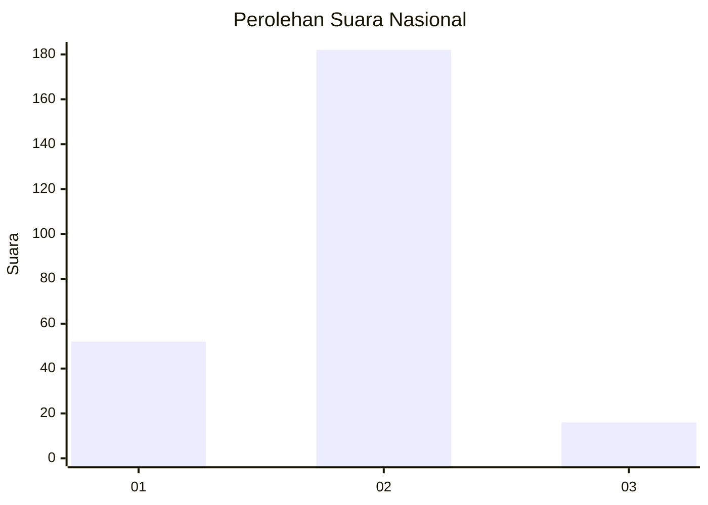

# Hasil

## Grafik

## Tabel

| No. | Nama Paslon    | Suara | Suara (raw) | Persentase |
|:--- |:-------------- | -----:| -----------:| ----------:|
| 1   | ANIES MUHAIMIN | 52    | [52][p-1]   | 20,80      |
| 2   | PRABOWO GIBRAN | 182   | [182][p-2]  | 72,80      |
| 3   | GANJAR MAHFUD  | 16    | [16][p-3]   | 6,40       |

[p-1]: https://github.com/gigit-pemilu/pemilu-2024/blob/main/pilpres/hitung-suara/sub/64-kalimantan-timur/sub/03-berau/sub/05-tanjung-redeb/sub/1003-sungai-bedungun/sub/001-tps/sub/paslon-1.txt
[p-2]: https://github.com/gigit-pemilu/pemilu-2024/blob/main/pilpres/hitung-suara/sub/64-kalimantan-timur/sub/03-berau/sub/05-tanjung-redeb/sub/1003-sungai-bedungun/sub/001-tps/sub/paslon-2.txt
[p-3]: https://github.com/gigit-pemilu/pemilu-2024/blob/main/pilpres/hitung-suara/sub/64-kalimantan-timur/sub/03-berau/sub/05-tanjung-redeb/sub/1003-sungai-bedungun/sub/001-tps/sub/paslon-3.txt

## Foto C Plano

https://sirekap-obj-formc.kpu.go.id/eb46/pemilu/ppwp/64/03/05/10/03/6403051003001-20240215-001230--0a97a31f-531e-48b6-8a93-3a90c4bcab67.jpg

https://sirekap-obj-formc.kpu.go.id/eb46/pemilu/ppwp/64/03/05/10/03/6403051003001-20240215-001341--5f42af4d-eb81-433a-ad37-80e2629507a9.jpg

https://sirekap-obj-formc.kpu.go.id/eb46/pemilu/ppwp/64/03/05/10/03/6403051003001-20240215-001416--eafd0c2e-1e1c-4ac7-a1f0-515df1d7c79b.jpg

## Metadata

| Key        | Value               |
| ---------- | ------------------- |
| Time Stamp | 2024-02-15 23:29:50 |

