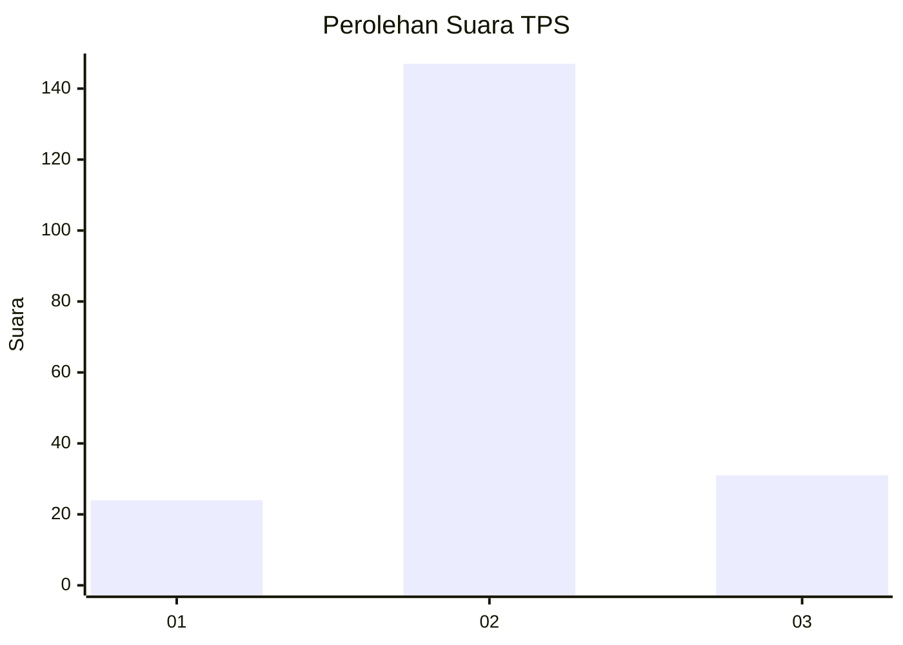
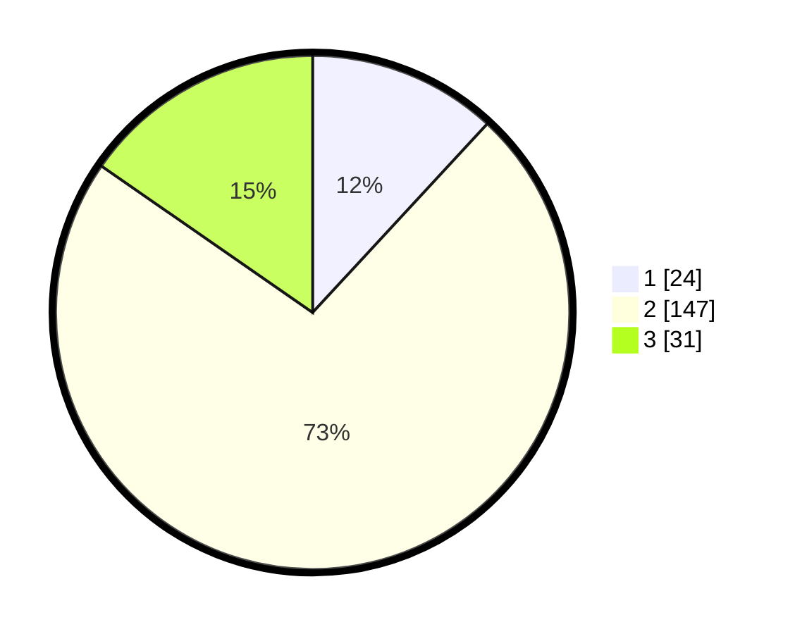

# Hasil

## Grafik

## Tabel

| No. | Nama Paslon    | Suara | Suara (raw) | Persentase |
|:--- |:-------------- | -----:| -----------:| ----------:|
| 1   | ANIES MUHAIMIN | 24    | [24][p-1]   | 11,88      |
| 2   | PRABOWO GIBRAN | 147   | [147][p-2]  | 72,77      |
| 3   | GANJAR MAHFUD  | 31    | [31][p-3]   | 15,35      |

[p-1]: https://github.com/gigit-pemilu/pemilu-2024-64-kalimantan-timur/blob/main/pilpres/hitung-suara/sub/64-kalimantan-timur/sub/03-berau/sub/05-tanjung-redeb/sub/1003-sungai-bedungun/sub/002-tps/sub/paslon-1.txt
[p-2]: https://github.com/gigit-pemilu/pemilu-2024-64-kalimantan-timur/blob/main/pilpres/hitung-suara/sub/64-kalimantan-timur/sub/03-berau/sub/05-tanjung-redeb/sub/1003-sungai-bedungun/sub/002-tps/sub/paslon-2.txt
[p-3]: https://github.com/gigit-pemilu/pemilu-2024-64-kalimantan-timur/blob/main/pilpres/hitung-suara/sub/64-kalimantan-timur/sub/03-berau/sub/05-tanjung-redeb/sub/1003-sungai-bedungun/sub/002-tps/sub/paslon-3.txt

## Foto C Plano

https://sirekap-obj-formc.kpu.go.id/bcb6/pemilu/ppwp/64/03/05/10/03/6403051003002-20240214-232758--a743df4d-bf5c-4a3a-b0eb-1f2eeefe5864.jpg

https://sirekap-obj-formc.kpu.go.id/bcb6/pemilu/ppwp/64/03/05/10/03/6403051003002-20240214-232833--5f41e1a8-d0d5-4d06-9451-0af0e52fc1f4.jpg

https://sirekap-obj-formc.kpu.go.id/bcb6/pemilu/ppwp/64/03/05/10/03/6403051003002-20240214-232834--8ce69592-5930-442a-862f-23e7f4844bc4.jpg

## Metadata

| Key        | Value               |
| ---------- | ------------------- |
| Time Stamp | 2024-02-15 15:00:29 |

