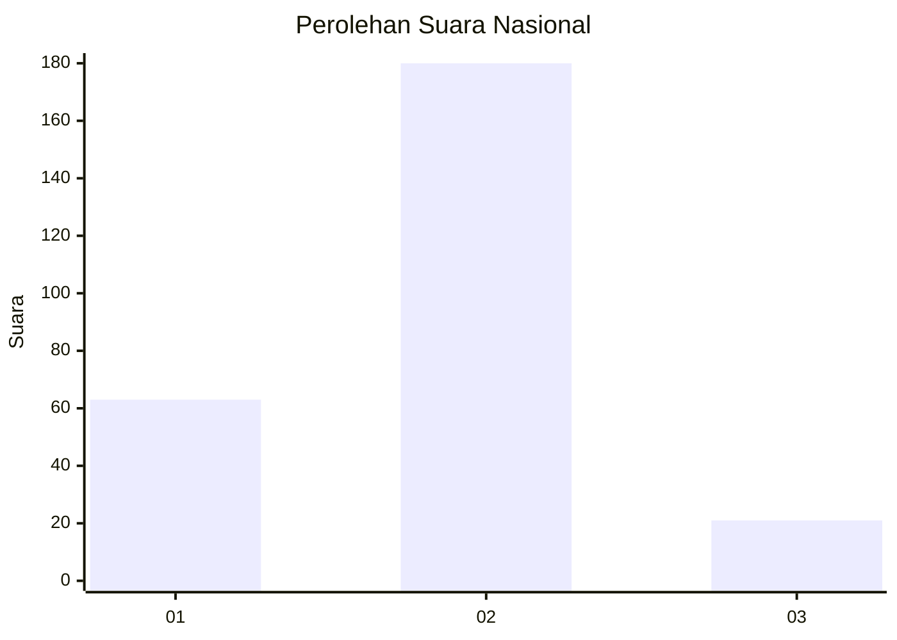
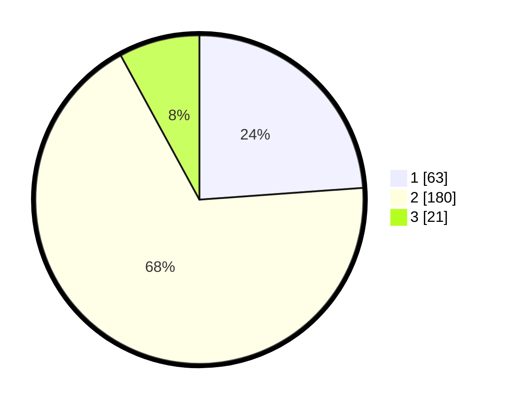

# Hasil

## Grafik

## Tabel

| No. | Nama Paslon    | Suara | Suara (raw) | Persentase |
|:--- |:-------------- | -----:| -----------:| ----------:|
| 1   | ANIES MUHAIMIN | 63    | [63][p-1]   | 23,86      |
| 2   | PRABOWO GIBRAN | 180   | [180][p-2]  | 68,18      |
| 3   | GANJAR MAHFUD  | 21    | [21][p-3]   | 7,95       |

[p-1]: https://github.com/gigit-pemilu/pemilu-2024/blob/main/pilpres/hitung-suara/sub/64-kalimantan-timur/sub/03-berau/sub/05-tanjung-redeb/sub/1006-gayam/sub/012-tps/sub/paslon-1.txt
[p-2]: https://github.com/gigit-pemilu/pemilu-2024/blob/main/pilpres/hitung-suara/sub/64-kalimantan-timur/sub/03-berau/sub/05-tanjung-redeb/sub/1006-gayam/sub/012-tps/sub/paslon-2.txt
[p-3]: https://github.com/gigit-pemilu/pemilu-2024/blob/main/pilpres/hitung-suara/sub/64-kalimantan-timur/sub/03-berau/sub/05-tanjung-redeb/sub/1006-gayam/sub/012-tps/sub/paslon-3.txt

## Foto C Plano

https://sirekap-obj-formc.kpu.go.id/7359/pemilu/ppwp/64/03/05/10/06/6403051006012-20240215-013434--35ba031c-02b1-4631-a3bd-2d54d371ee31.jpg

https://sirekap-obj-formc.kpu.go.id/7359/pemilu/ppwp/64/03/05/10/06/6403051006012-20240215-012542--377bf01e-48c8-457a-a9df-e24fe5e9db90.jpg

https://sirekap-obj-formc.kpu.go.id/7359/pemilu/ppwp/64/03/05/10/06/6403051006012-20240215-021825--72af30c8-c7ad-4786-8a68-7d75697ce1cd.jpg

## Metadata

| Key        | Value               |
| ---------- | ------------------- |
| Time Stamp | 2024-02-25 14:00:00 |

