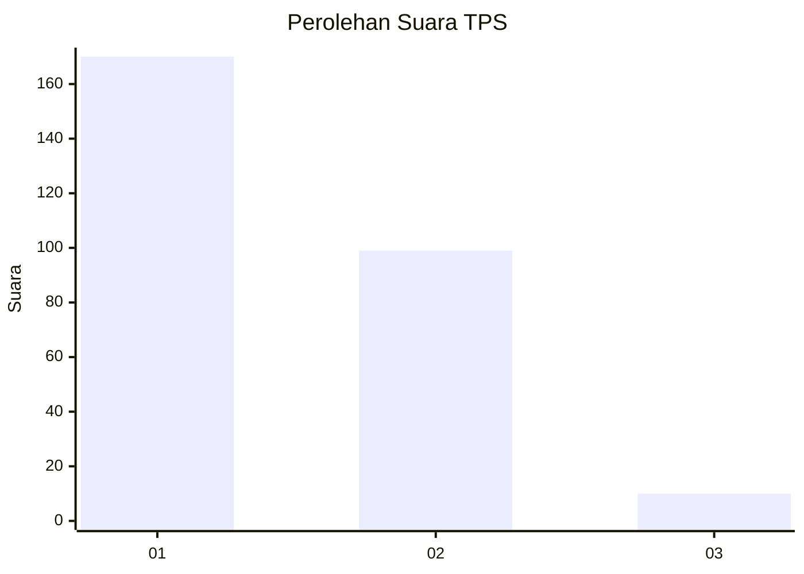
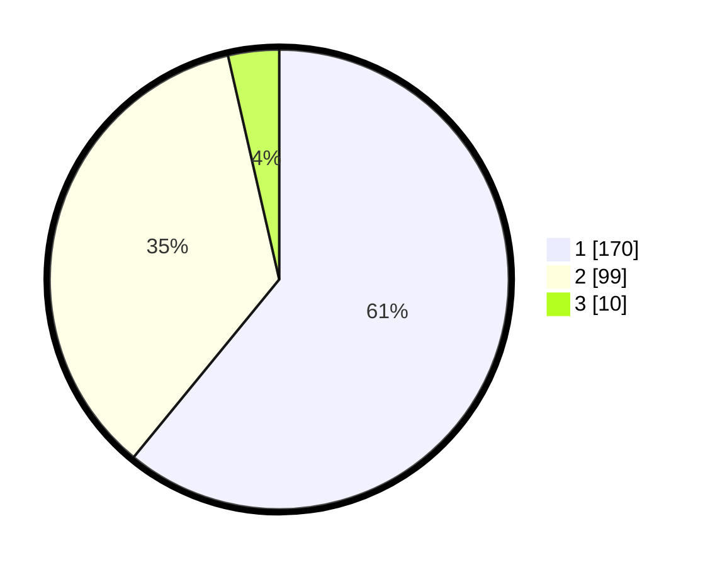

# Hasil

## Grafik

## Tabel

| No. | Nama Paslon    | Suara | Suara (raw) | Persentase |
|:--- |:-------------- | -----:| -----------:| ----------:|
| 1   | ANIES MUHAIMIN | 170   | [170][p-1]  | 60,93      |
| 2   | PRABOWO GIBRAN | 99    | [99][p-2]   | 35,48      |
| 3   | GANJAR MAHFUD  | 10    | [10][p-3]   | 3,58       |

[p-1]: https://github.com/gigit-pemilu/pemilu-2024-64-kalimantan-timur/blob/main/pilpres/hitung-suara/sub/64-kalimantan-timur/sub/03-berau/sub/05-tanjung-redeb/sub/1008-gunung-panjang/sub/015-tps/sub/paslon-1.txt
[p-2]: https://github.com/gigit-pemilu/pemilu-2024-64-kalimantan-timur/blob/main/pilpres/hitung-suara/sub/64-kalimantan-timur/sub/03-berau/sub/05-tanjung-redeb/sub/1008-gunung-panjang/sub/015-tps/sub/paslon-2.txt
[p-3]: https://github.com/gigit-pemilu/pemilu-2024-64-kalimantan-timur/blob/main/pilpres/hitung-suara/sub/64-kalimantan-timur/sub/03-berau/sub/05-tanjung-redeb/sub/1008-gunung-panjang/sub/015-tps/sub/paslon-3.txt

## Foto C Plano

https://sirekap-obj-formc.kpu.go.id/483a/pemilu/ppwp/64/03/05/10/08/6403051008015-20240220-194451--9b194839-babc-4222-9d2f-9516e27a6339.jpg

https://sirekap-obj-formc.kpu.go.id/483a/pemilu/ppwp/64/03/05/10/08/6403051008015-20240220-194613--f146ce3a-fa78-4fa0-9bfc-becb418d1287.jpg

https://sirekap-obj-formc.kpu.go.id/483a/pemilu/ppwp/64/03/05/10/08/6403051008015-20240220-194658--95de3855-460f-4052-8566-68be0008ad9b.jpg

## Metadata

| Key        | Value               |
| ---------- | ------------------- |
| Time Stamp | 2024-02-25 17:00:00 |

