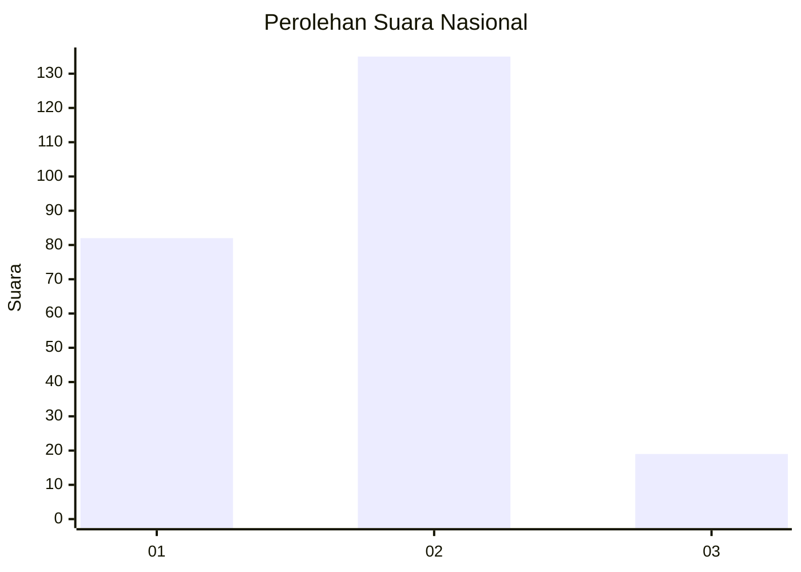
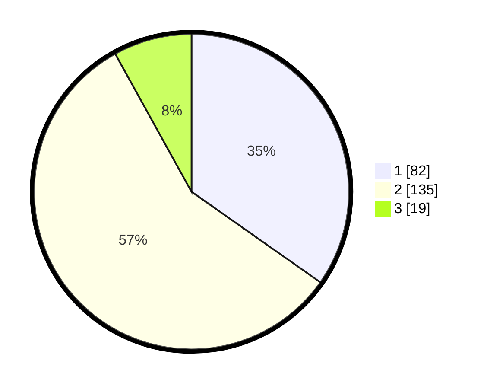

# Hasil

## Grafik

## Tabel

| No. | Nama Paslon    | Suara | Suara (raw) | Persentase |
|:--- |:-------------- | -----:| -----------:| ----------:|
| 1   | ANIES MUHAIMIN | 82    | [82][p-1]   | 34,75      |
| 2   | PRABOWO GIBRAN | 135   | [135][p-2]  | 57,20      |
| 3   | GANJAR MAHFUD  | 19    | [19][p-3]   | 8,05       |

[p-1]: https://github.com/gigit-pemilu/pemilu-2024/blob/main/pilpres/hitung-suara/sub/64-kalimantan-timur/sub/03-berau/sub/06-gunung-tabur/sub/1003-gunung-tabur/sub/006-tps/sub/paslon-1.txt
[p-2]: https://github.com/gigit-pemilu/pemilu-2024/blob/main/pilpres/hitung-suara/sub/64-kalimantan-timur/sub/03-berau/sub/06-gunung-tabur/sub/1003-gunung-tabur/sub/006-tps/sub/paslon-2.txt
[p-3]: https://github.com/gigit-pemilu/pemilu-2024/blob/main/pilpres/hitung-suara/sub/64-kalimantan-timur/sub/03-berau/sub/06-gunung-tabur/sub/1003-gunung-tabur/sub/006-tps/sub/paslon-3.txt

## Foto C Plano

https://sirekap-obj-formc.kpu.go.id/e902/pemilu/ppwp/64/03/06/10/03/6403061003006-20240215-004102--9a91b8fc-f2db-48c4-b22c-5fb9ec2078cf.jpg

https://sirekap-obj-formc.kpu.go.id/e902/pemilu/ppwp/64/03/06/10/03/6403061003006-20240215-004616--237a9248-4cb2-420e-a597-035fec902760.jpg

https://sirekap-obj-formc.kpu.go.id/e902/pemilu/ppwp/64/03/06/10/03/6403061003006-20240215-004508--5f008ac8-6115-4bf2-8ba7-90976b5aa3b0.jpg

## Metadata

| Key        | Value               |
| ---------- | ------------------- |
| Time Stamp | 2024-02-16 00:00:26 |

