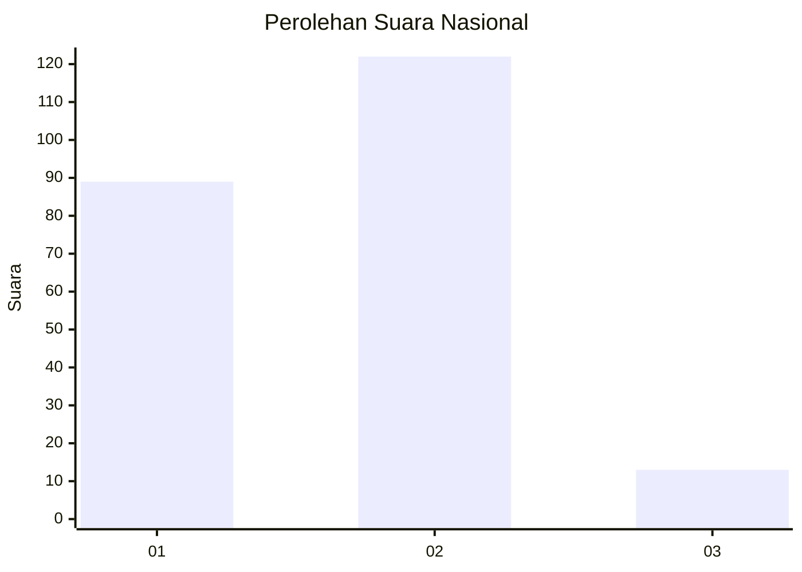
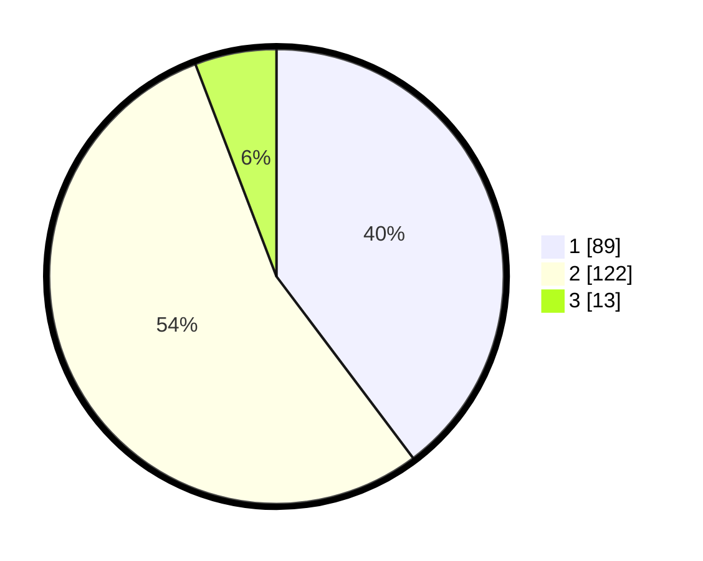

# Hasil

## Grafik

## Tabel

| No. | Nama Paslon    | Suara | Suara (raw) | Persentase |
|:--- |:-------------- | -----:| -----------:| ----------:|
| 1   | ANIES MUHAIMIN | 89    | [89][p-1]   | 39,73      |
| 2   | PRABOWO GIBRAN | 122   | [122][p-2]  | 54,46      |
| 3   | GANJAR MAHFUD  | 13    | [13][p-3]   | 5,80       |

[p-1]: https://github.com/gigit-pemilu/pemilu-2024/blob/main/pilpres/hitung-suara/sub/64-kalimantan-timur/sub/03-berau/sub/06-gunung-tabur/sub/1003-gunung-tabur/sub/007-tps/sub/paslon-1.txt
[p-2]: https://github.com/gigit-pemilu/pemilu-2024/blob/main/pilpres/hitung-suara/sub/64-kalimantan-timur/sub/03-berau/sub/06-gunung-tabur/sub/1003-gunung-tabur/sub/007-tps/sub/paslon-2.txt
[p-3]: https://github.com/gigit-pemilu/pemilu-2024/blob/main/pilpres/hitung-suara/sub/64-kalimantan-timur/sub/03-berau/sub/06-gunung-tabur/sub/1003-gunung-tabur/sub/007-tps/sub/paslon-3.txt

## Foto C Plano

https://sirekap-obj-formc.kpu.go.id/0949/pemilu/ppwp/64/03/06/10/03/6403061003007-20240215-041235--37835828-ad7e-41ed-865a-83b656918b51.jpg

https://sirekap-obj-formc.kpu.go.id/0949/pemilu/ppwp/64/03/06/10/03/6403061003007-20240215-041602--08f183a5-d66e-4dd2-95a8-bec26c2f0d37.jpg

https://sirekap-obj-formc.kpu.go.id/0949/pemilu/ppwp/64/03/06/10/03/6403061003007-20240215-041812--dd207427-f12b-4719-b91b-53021fac5dd8.jpg

## Metadata

| Key        | Value               |
| ---------- | ------------------- |
| Time Stamp | 2024-02-25 21:00:00 |

