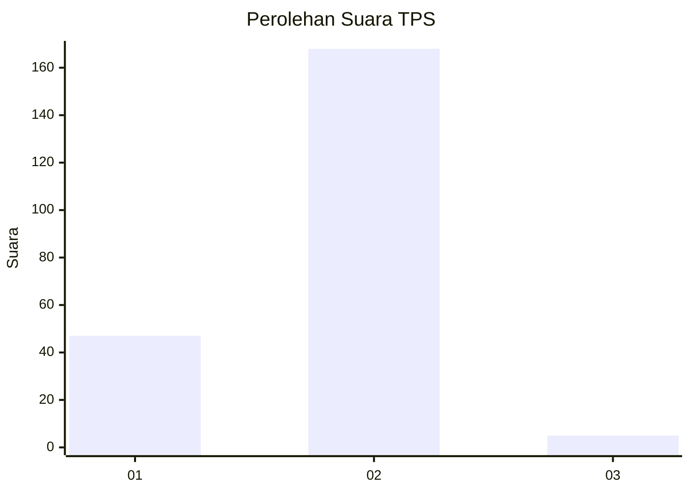
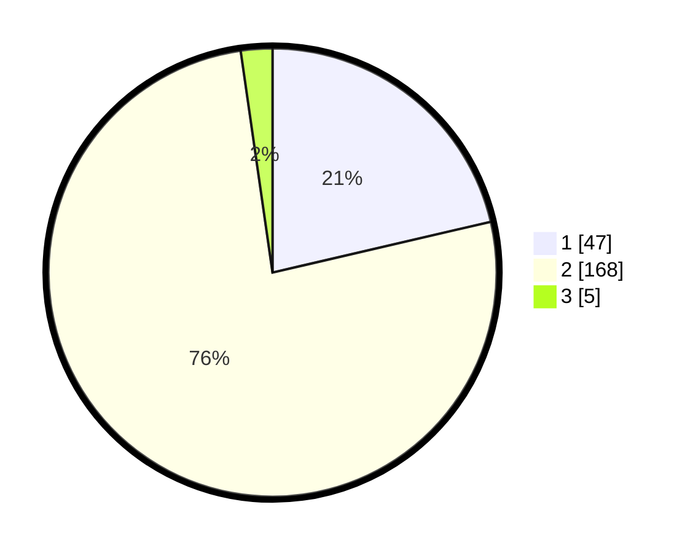

# Hasil

## Grafik

## Tabel

| No. | Nama Paslon    | Suara | Suara (raw) | Persentase |
|:--- |:-------------- | -----:| -----------:| ----------:|
| 1   | ANIES MUHAIMIN | 47    | [47][p-1]   | 21,36      |
| 2   | PRABOWO GIBRAN | 168   | [168][p-2]  | 76,36      |
| 3   | GANJAR MAHFUD  | 5     | [5][p-3]    | 2,27       |

[p-1]: https://github.com/gigit-pemilu/pemilu-2024-64-kalimantan-timur/blob/main/pilpres/hitung-suara/sub/64-kalimantan-timur/sub/03-berau/sub/07-pulau-derawan/sub/2001-pegat-batumbuk/sub/002-tps/sub/paslon-1.txt
[p-2]: https://github.com/gigit-pemilu/pemilu-2024-64-kalimantan-timur/blob/main/pilpres/hitung-suara/sub/64-kalimantan-timur/sub/03-berau/sub/07-pulau-derawan/sub/2001-pegat-batumbuk/sub/002-tps/sub/paslon-2.txt
[p-3]: https://github.com/gigit-pemilu/pemilu-2024-64-kalimantan-timur/blob/main/pilpres/hitung-suara/sub/64-kalimantan-timur/sub/03-berau/sub/07-pulau-derawan/sub/2001-pegat-batumbuk/sub/002-tps/sub/paslon-3.txt

## Foto C Plano

https://sirekap-obj-formc.kpu.go.id/8995/pemilu/ppwp/64/03/07/20/01/6403072001002-20240215-065154--66c25060-e53f-4d55-a8b3-3212beb13308.jpg

https://sirekap-obj-formc.kpu.go.id/8995/pemilu/ppwp/64/03/07/20/01/6403072001002-20240215-070516--51923d36-814a-4e66-81c8-d4ebb3f73c9c.jpg

https://sirekap-obj-formc.kpu.go.id/8995/pemilu/ppwp/64/03/07/20/01/6403072001002-20240215-060800--607eeb69-387f-42af-bd5b-53f0978a96e8.jpg

## Metadata

| Key        | Value               |
| ---------- | ------------------- |
| Time Stamp | 2024-02-16 00:30:27 |

