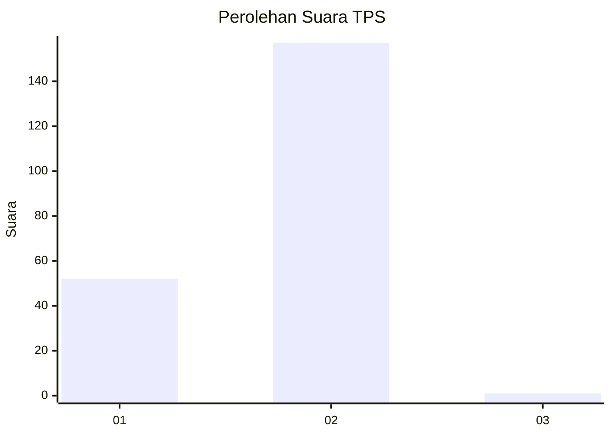
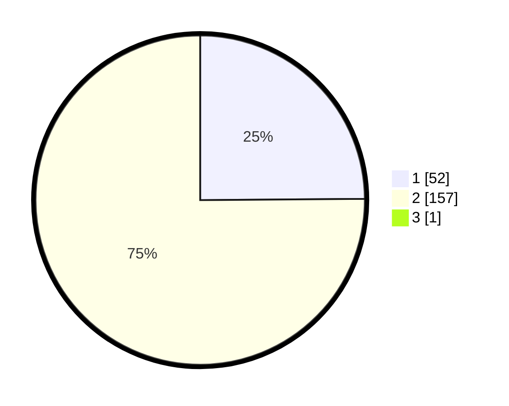

# Hasil

## Grafik

## Tabel

| No. | Nama Paslon    | Suara | Suara (raw) | Persentase |
|:--- |:-------------- | -----:| -----------:| ----------:|
| 1   | ANIES MUHAIMIN | 52    | [52][p-1]   | 24,76      |
| 2   | PRABOWO GIBRAN | 157   | [157][p-2]  | 74,76      |
| 3   | GANJAR MAHFUD  | 1     | [1][p-3]    | 0,48       |

[p-1]: https://github.com/gigit-pemilu/pemilu-2024-64-kalimantan-timur/blob/main/pilpres/hitung-suara/sub/64-kalimantan-timur/sub/03-berau/sub/07-pulau-derawan/sub/2001-pegat-batumbuk/sub/003-tps/sub/paslon-1.txt
[p-2]: https://github.com/gigit-pemilu/pemilu-2024-64-kalimantan-timur/blob/main/pilpres/hitung-suara/sub/64-kalimantan-timur/sub/03-berau/sub/07-pulau-derawan/sub/2001-pegat-batumbuk/sub/003-tps/sub/paslon-2.txt
[p-3]: https://github.com/gigit-pemilu/pemilu-2024-64-kalimantan-timur/blob/main/pilpres/hitung-suara/sub/64-kalimantan-timur/sub/03-berau/sub/07-pulau-derawan/sub/2001-pegat-batumbuk/sub/003-tps/sub/paslon-3.txt

## Foto C Plano

https://sirekap-obj-formc.kpu.go.id/e81e/pemilu/ppwp/64/03/07/20/01/6403072001003-20240215-113223--422a37a8-5683-4d0d-ab7e-382794eed686.jpg

https://sirekap-obj-formc.kpu.go.id/e81e/pemilu/ppwp/64/03/07/20/01/6403072001003-20240215-113319--9cf658f2-22dd-43c2-9cea-8487ed229711.jpg

https://sirekap-obj-formc.kpu.go.id/e81e/pemilu/ppwp/64/03/07/20/01/6403072001003-20240215-113417--bce18e4c-9716-4d0b-bd20-ec7b7e756e23.jpg

## Metadata

| Key        | Value               |
| ---------- | ------------------- |
| Time Stamp | 2024-02-16 00:30:27 |

