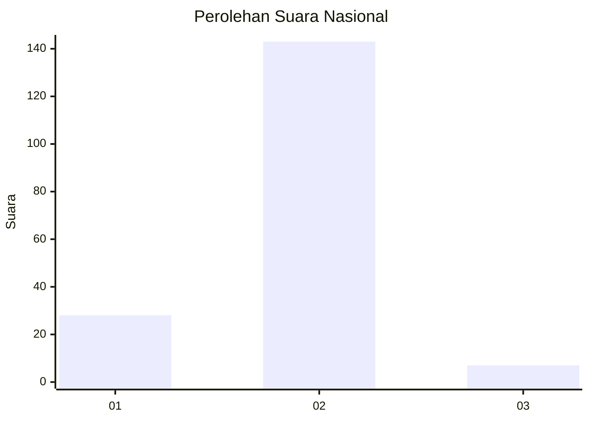
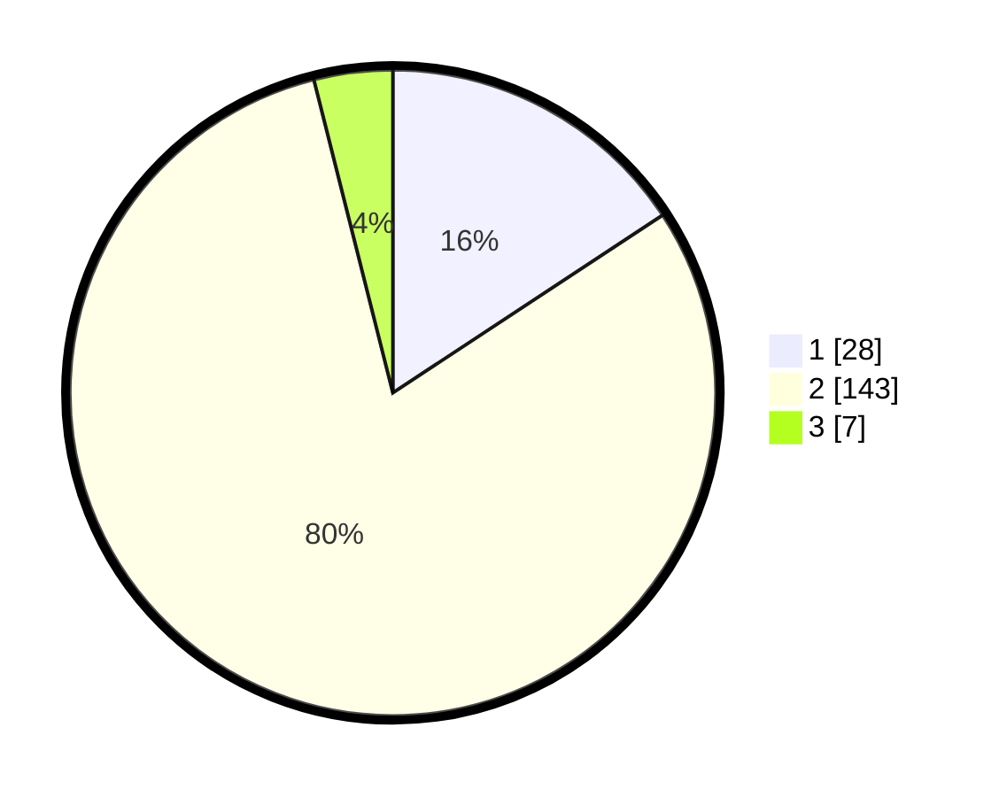

# Hasil

## Grafik

## Tabel

| No. | Nama Paslon    | Suara | Suara (raw) | Persentase |
|:--- |:-------------- | -----:| -----------:| ----------:|
| 1   | ANIES MUHAIMIN | 28    | [28][p-1]   | 15,73      |
| 2   | PRABOWO GIBRAN | 143   | [143][p-2]  | 80,34      |
| 3   | GANJAR MAHFUD  | 7     | [7][p-3]    | 3,93       |

[p-1]: https://github.com/gigit-pemilu/pemilu-2024/blob/main/pilpres/hitung-suara/sub/64-kalimantan-timur/sub/03-berau/sub/07-pulau-derawan/sub/2002-teluk-semanting/sub/002-tps/sub/paslon-1.txt
[p-2]: https://github.com/gigit-pemilu/pemilu-2024/blob/main/pilpres/hitung-suara/sub/64-kalimantan-timur/sub/03-berau/sub/07-pulau-derawan/sub/2002-teluk-semanting/sub/002-tps/sub/paslon-2.txt
[p-3]: https://github.com/gigit-pemilu/pemilu-2024/blob/main/pilpres/hitung-suara/sub/64-kalimantan-timur/sub/03-berau/sub/07-pulau-derawan/sub/2002-teluk-semanting/sub/002-tps/sub/paslon-3.txt

## Foto C Plano

https://sirekap-obj-formc.kpu.go.id/1e33/pemilu/ppwp/64/03/07/20/02/6403072002002-20240217-112307--d0f28414-832e-47fd-b5ba-d43e6303dcd4.jpg

https://sirekap-obj-formc.kpu.go.id/1e33/pemilu/ppwp/64/03/07/20/02/6403072002002-20240217-111844--75b2381e-100b-4606-b554-65b11c21f6cb.jpg

https://sirekap-obj-formc.kpu.go.id/1e33/pemilu/ppwp/64/03/07/20/02/6403072002002-20240217-112459--7d1e1eeb-35f5-4a32-a2f7-b778006182a0.jpg

## Metadata

| Key        | Value               |
| ---------- | ------------------- |
| Time Stamp | 2024-02-19 06:16:00 |

