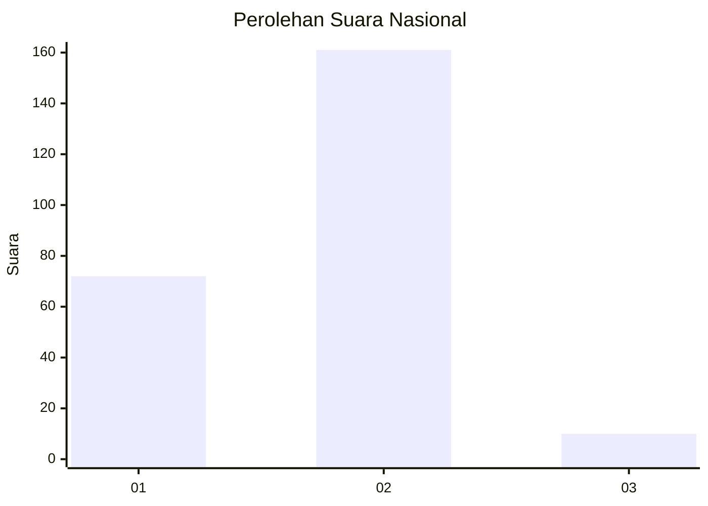
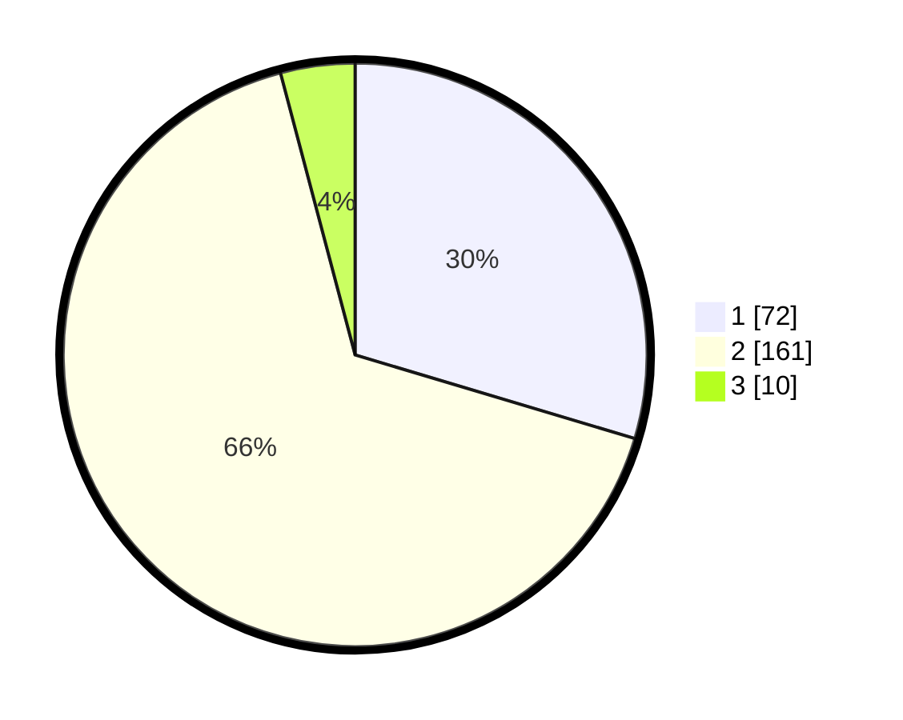

# Hasil

## Grafik

## Tabel

| No. | Nama Paslon    | Suara | Suara (raw) | Persentase |
|:--- |:-------------- | -----:| -----------:| ----------:|
| 1   | ANIES MUHAIMIN | 72    | [72][p-1]   | 29,63      |
| 2   | PRABOWO GIBRAN | 161   | [161][p-2]  | 66,26      |
| 3   | GANJAR MAHFUD  | 10    | [10][p-3]   | 4,12       |

[p-1]: https://github.com/gigit-pemilu/pemilu-2024/blob/main/pilpres/hitung-suara/sub/64-kalimantan-timur/sub/03-berau/sub/08-biduk-biduk/sub/2001-biduk-biduk/sub/001-tps/sub/paslon-1.txt
[p-2]: https://github.com/gigit-pemilu/pemilu-2024/blob/main/pilpres/hitung-suara/sub/64-kalimantan-timur/sub/03-berau/sub/08-biduk-biduk/sub/2001-biduk-biduk/sub/001-tps/sub/paslon-2.txt
[p-3]: https://github.com/gigit-pemilu/pemilu-2024/blob/main/pilpres/hitung-suara/sub/64-kalimantan-timur/sub/03-berau/sub/08-biduk-biduk/sub/2001-biduk-biduk/sub/001-tps/sub/paslon-3.txt

## Foto C Plano

https://sirekap-obj-formc.kpu.go.id/9e59/pemilu/ppwp/64/03/08/20/01/6403082001001-20240214-212605--28a86d99-e049-4650-adf8-3255a5d71f82.jpg

https://sirekap-obj-formc.kpu.go.id/9e59/pemilu/ppwp/64/03/08/20/01/6403082001001-20240214-212618--4293eee2-ca08-4c75-be98-5c60b61d2f1c.jpg

https://sirekap-obj-formc.kpu.go.id/9e59/pemilu/ppwp/64/03/08/20/01/6403082001001-20240214-212636--1cf72226-1f75-4b6a-97df-af079ca4524c.jpg

## Metadata

| Key        | Value               |
| ---------- | ------------------- |
| Time Stamp | 2024-02-16 01:00:27 |

