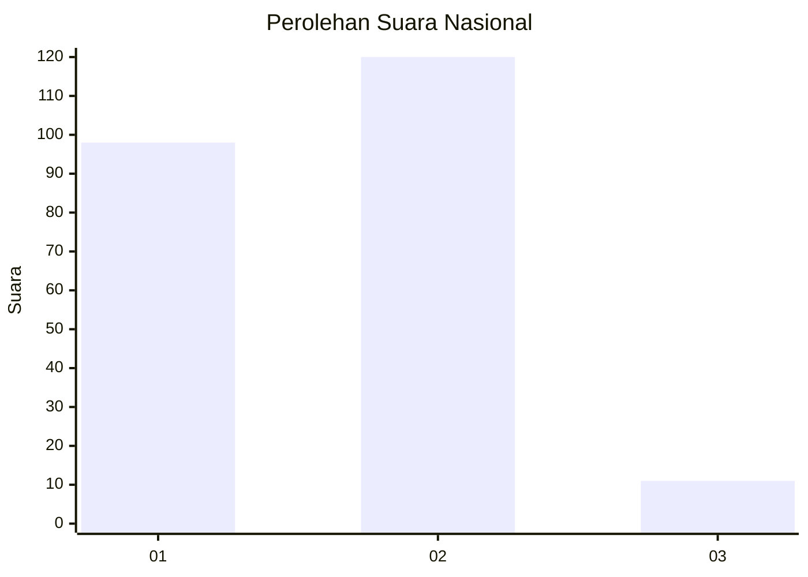
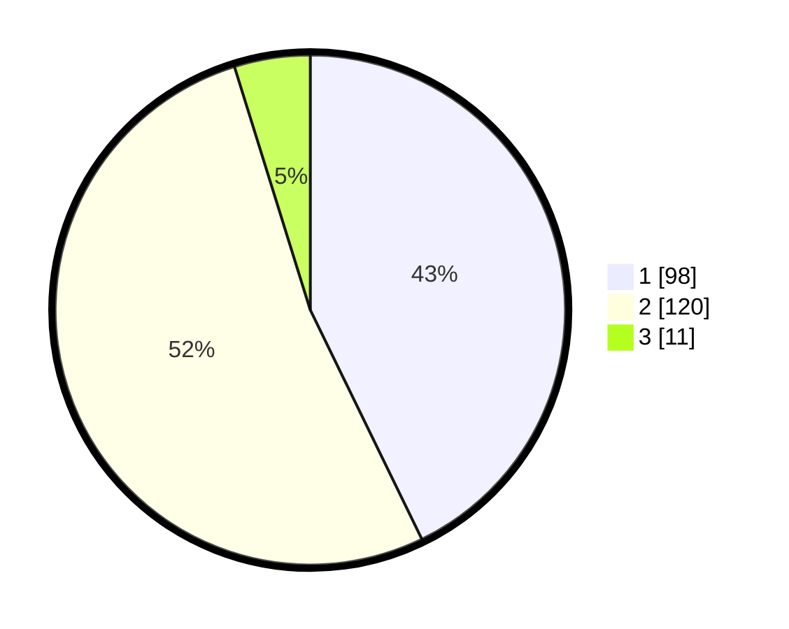

# Hasil

## Grafik

## Tabel

| No. | Nama Paslon    | Suara | Suara (raw) | Persentase |
|:--- |:-------------- | -----:| -----------:| ----------:|
| 1   | ANIES MUHAIMIN | 98    | [98][p-1]   | 42,79      |
| 2   | PRABOWO GIBRAN | 120   | [120][p-2]  | 52,40      |
| 3   | GANJAR MAHFUD  | 11    | [11][p-3]   | 4,80       |

[p-1]: https://github.com/gigit-pemilu/pemilu-2024/blob/main/pilpres/hitung-suara/sub/64-kalimantan-timur/sub/03-berau/sub/08-biduk-biduk/sub/2001-biduk-biduk/sub/002-tps/sub/paslon-1.txt
[p-2]: https://github.com/gigit-pemilu/pemilu-2024/blob/main/pilpres/hitung-suara/sub/64-kalimantan-timur/sub/03-berau/sub/08-biduk-biduk/sub/2001-biduk-biduk/sub/002-tps/sub/paslon-2.txt
[p-3]: https://github.com/gigit-pemilu/pemilu-2024/blob/main/pilpres/hitung-suara/sub/64-kalimantan-timur/sub/03-berau/sub/08-biduk-biduk/sub/2001-biduk-biduk/sub/002-tps/sub/paslon-3.txt

## Foto C Plano

https://sirekap-obj-formc.kpu.go.id/4655/pemilu/ppwp/64/03/08/20/01/6403082001002-20240217-130853--9de1b6d8-fcdf-4f66-8101-5bdcd7c1475e.jpg

https://sirekap-obj-formc.kpu.go.id/4655/pemilu/ppwp/64/03/08/20/01/6403082001002-20240217-130927--7cee1c0f-9f14-47c3-8ec2-177baa644b80.jpg

https://sirekap-obj-formc.kpu.go.id/4655/pemilu/ppwp/64/03/08/20/01/6403082001002-20240217-131659--fbffc391-f8de-408f-87a3-ef430909cca4.jpg

## Metadata

| Key        | Value               |
| ---------- | ------------------- |
| Time Stamp | 2024-02-17 13:37:34 |

