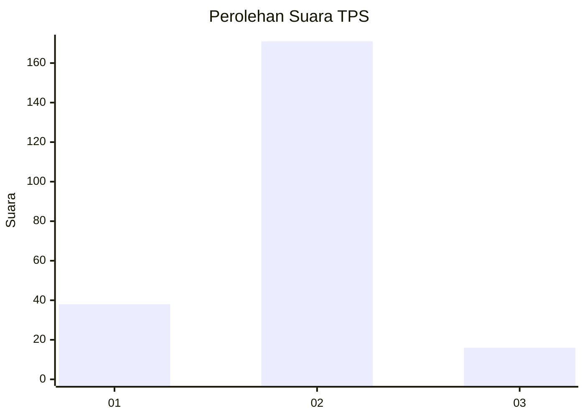
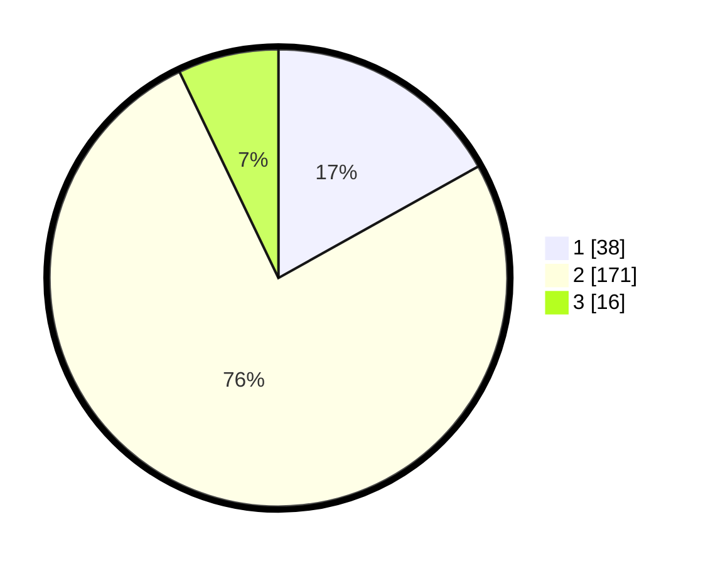

# Hasil

## Grafik

## Tabel

| No. | Nama Paslon    | Suara | Suara (raw) | Persentase |
|:--- |:-------------- | -----:| -----------:| ----------:|
| 1   | ANIES MUHAIMIN | 38    | [38][p-1]   | 16,89      |
| 2   | PRABOWO GIBRAN | 171   | [171][p-2]  | 76,00      |
| 3   | GANJAR MAHFUD  | 16    | [16][p-3]   | 7,11       |

[p-1]: https://github.com/gigit-pemilu/pemilu-2024-64-kalimantan-timur/blob/main/pilpres/hitung-suara/sub/64-kalimantan-timur/sub/03-berau/sub/09-teluk-bayur/sub/1002-teluk-bayur/sub/001-tps/sub/paslon-1.txt
[p-2]: https://github.com/gigit-pemilu/pemilu-2024-64-kalimantan-timur/blob/main/pilpres/hitung-suara/sub/64-kalimantan-timur/sub/03-berau/sub/09-teluk-bayur/sub/1002-teluk-bayur/sub/001-tps/sub/paslon-2.txt
[p-3]: https://github.com/gigit-pemilu/pemilu-2024-64-kalimantan-timur/blob/main/pilpres/hitung-suara/sub/64-kalimantan-timur/sub/03-berau/sub/09-teluk-bayur/sub/1002-teluk-bayur/sub/001-tps/sub/paslon-3.txt

## Foto C Plano

https://sirekap-obj-formc.kpu.go.id/1c8c/pemilu/ppwp/64/03/09/10/02/6403091002001-20240214-205335--49cc6f48-31d9-4c24-9061-88c43cf8f9b1.jpg

https://sirekap-obj-formc.kpu.go.id/1c8c/pemilu/ppwp/64/03/09/10/02/6403091002001-20240214-205405--b58b4ec9-e4d6-46a5-bbba-3afb891b8c53.jpg

https://sirekap-obj-formc.kpu.go.id/1c8c/pemilu/ppwp/64/03/09/10/02/6403091002001-20240214-205454--e540e970-8873-41d8-bacb-7f01f81ff2d2.jpg

## Metadata

| Key        | Value               |
| ---------- | ------------------- |
| Time Stamp | 2024-02-25 16:00:00 |

