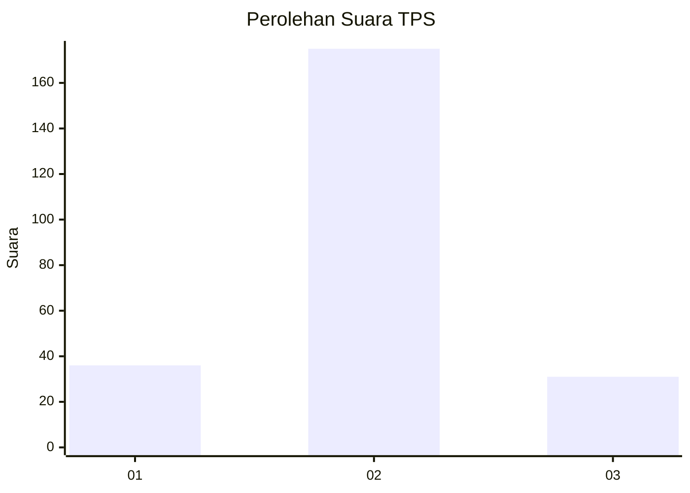
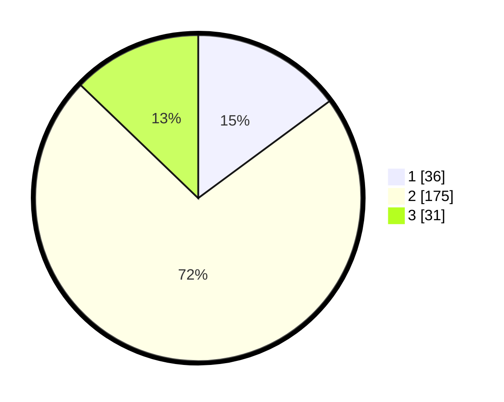

# Hasil

## Grafik

## Tabel

| No. | Nama Paslon    | Suara | Suara (raw) | Persentase |
|:--- |:-------------- | -----:| -----------:| ----------:|
| 1   | ANIES MUHAIMIN | 36    | [36][p-1]   | 14,88      |
| 2   | PRABOWO GIBRAN | 175   | [175][p-2]  | 72,31      |
| 3   | GANJAR MAHFUD  | 31    | [31][p-3]   | 12,81      |

[p-1]: https://github.com/gigit-pemilu/pemilu-2024-64-kalimantan-timur/blob/main/pilpres/hitung-suara/sub/64-kalimantan-timur/sub/03-berau/sub/09-teluk-bayur/sub/1002-teluk-bayur/sub/003-tps/sub/paslon-1.txt
[p-2]: https://github.com/gigit-pemilu/pemilu-2024-64-kalimantan-timur/blob/main/pilpres/hitung-suara/sub/64-kalimantan-timur/sub/03-berau/sub/09-teluk-bayur/sub/1002-teluk-bayur/sub/003-tps/sub/paslon-2.txt
[p-3]: https://github.com/gigit-pemilu/pemilu-2024-64-kalimantan-timur/blob/main/pilpres/hitung-suara/sub/64-kalimantan-timur/sub/03-berau/sub/09-teluk-bayur/sub/1002-teluk-bayur/sub/003-tps/sub/paslon-3.txt

## Foto C Plano

https://sirekap-obj-formc.kpu.go.id/e708/pemilu/ppwp/64/03/09/10/02/6403091002003-20240214-212046--ea1091ac-71e6-46d2-bba7-521e9896ab9e.jpg

https://sirekap-obj-formc.kpu.go.id/e708/pemilu/ppwp/64/03/09/10/02/6403091002003-20240214-225403--225d91f7-0da6-4f9f-b5fe-8dedf71bc451.jpg

https://sirekap-obj-formc.kpu.go.id/e708/pemilu/ppwp/64/03/09/10/02/6403091002003-20240214-225526--9e6bc5ee-cadf-489a-ad17-8da921a16616.jpg

## Metadata

| Key        | Value               |
| ---------- | ------------------- |
| Time Stamp | 2024-02-15 23:29:50 |

