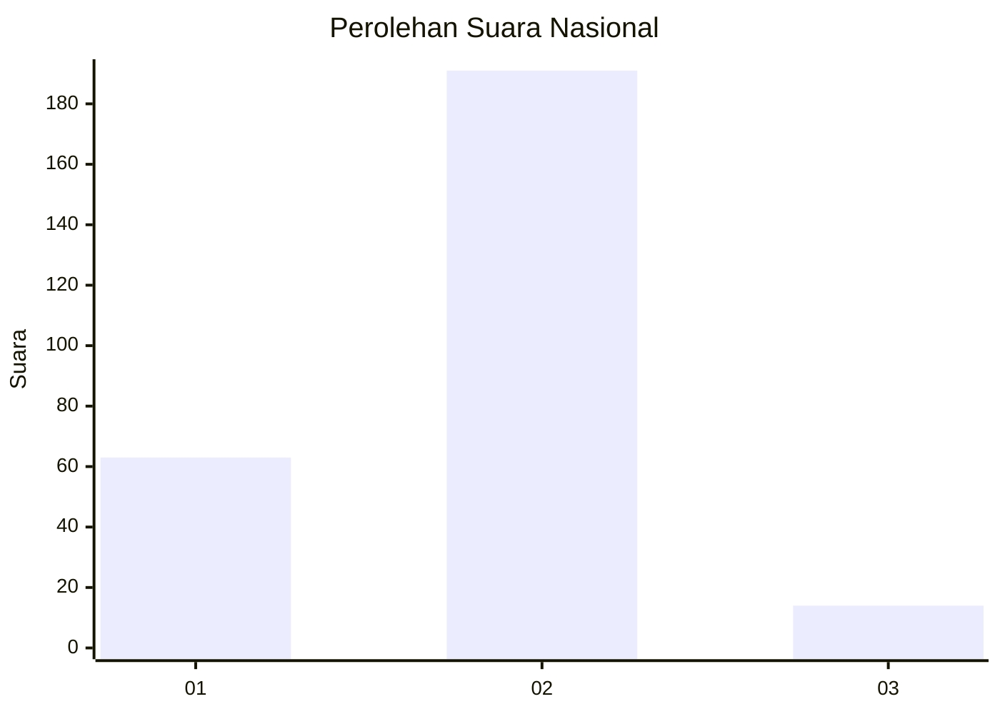
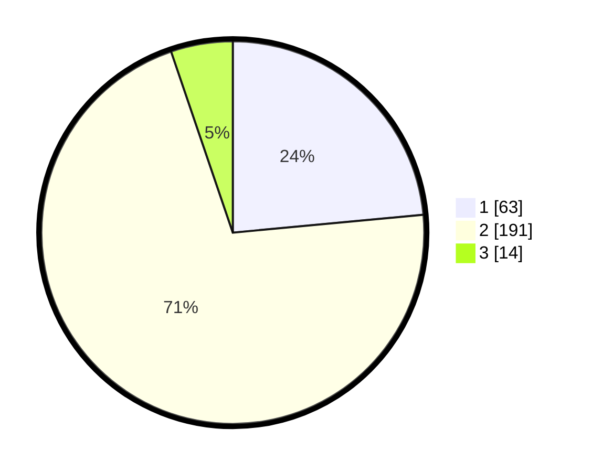

# Hasil

## Grafik

## Tabel

| No. | Nama Paslon    | Suara | Suara (raw) | Persentase |
|:--- |:-------------- | -----:| -----------:| ----------:|
| 1   | ANIES MUHAIMIN | 63    | [63][p-1]   | 23,51      |
| 2   | PRABOWO GIBRAN | 191   | [191][p-2]  | 71,27      |
| 3   | GANJAR MAHFUD  | 14    | [14][p-3]   | 5,22       |

[p-1]: https://github.com/gigit-pemilu/pemilu-2024/blob/main/pilpres/hitung-suara/sub/64-kalimantan-timur/sub/03-berau/sub/09-teluk-bayur/sub/1002-teluk-bayur/sub/005-tps/sub/paslon-1.txt
[p-2]: https://github.com/gigit-pemilu/pemilu-2024/blob/main/pilpres/hitung-suara/sub/64-kalimantan-timur/sub/03-berau/sub/09-teluk-bayur/sub/1002-teluk-bayur/sub/005-tps/sub/paslon-2.txt
[p-3]: https://github.com/gigit-pemilu/pemilu-2024/blob/main/pilpres/hitung-suara/sub/64-kalimantan-timur/sub/03-berau/sub/09-teluk-bayur/sub/1002-teluk-bayur/sub/005-tps/sub/paslon-3.txt

## Foto C Plano

https://sirekap-obj-formc.kpu.go.id/8364/pemilu/ppwp/64/03/09/10/02/6403091002005-20240221-082952--b8fee587-9d60-4515-87ca-22a894e153ba.jpg

https://sirekap-obj-formc.kpu.go.id/8364/pemilu/ppwp/64/03/09/10/02/6403091002005-20240221-083440--e56b616d-a0a7-437b-a683-48ab30c48faf.jpg

https://sirekap-obj-formc.kpu.go.id/8364/pemilu/ppwp/64/03/09/10/02/6403091002005-20240221-083740--c98305f1-24a2-42a2-858f-523804bc33a6.jpg

## Metadata

| Key        | Value               |
| ---------- | ------------------- |
| Time Stamp | 2024-02-21 09:00:00 |

