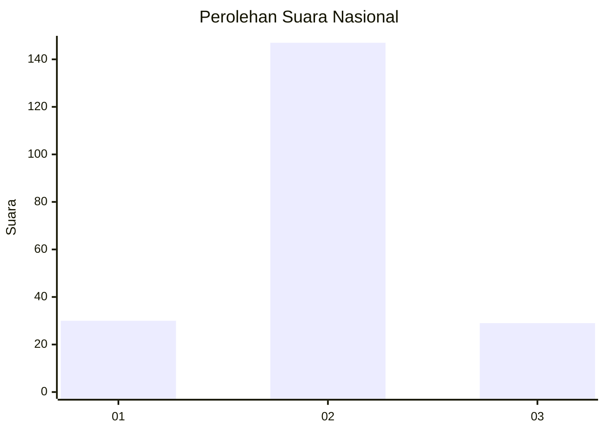

# Hasil

## Grafik

## Tabel

| No. | Nama Paslon    | Suara | Suara (raw) | Persentase |
|:--- |:-------------- | -----:| -----------:| ----------:|
| 1   | ANIES MUHAIMIN | 30    | [30][p-1]   | 14,56      |
| 2   | PRABOWO GIBRAN | 147   | [147][p-2]  | 71,36      |
| 3   | GANJAR MAHFUD  | 29    | [29][p-3]   | 14,08      |

[p-1]: https://github.com/gigit-pemilu/pemilu-2024/blob/main/pilpres/hitung-suara/sub/64-kalimantan-timur/sub/03-berau/sub/10-tabalar/sub/2003-tubaan/sub/001-tps/sub/paslon-1.txt
[p-2]: https://github.com/gigit-pemilu/pemilu-2024/blob/main/pilpres/hitung-suara/sub/64-kalimantan-timur/sub/03-berau/sub/10-tabalar/sub/2003-tubaan/sub/001-tps/sub/paslon-2.txt
[p-3]: https://github.com/gigit-pemilu/pemilu-2024/blob/main/pilpres/hitung-suara/sub/64-kalimantan-timur/sub/03-berau/sub/10-tabalar/sub/2003-tubaan/sub/001-tps/sub/paslon-3.txt

## Foto C Plano

https://sirekap-obj-formc.kpu.go.id/b1ae/pemilu/ppwp/64/03/10/20/03/6403102003001-20240220-105247--e0606511-d7b3-4949-8801-f1477735f81e.jpg

https://sirekap-obj-formc.kpu.go.id/b1ae/pemilu/ppwp/64/03/10/20/03/6403102003001-20240220-105332--9c514016-d710-4627-891f-df9a6560ebfe.jpg

https://sirekap-obj-formc.kpu.go.id/b1ae/pemilu/ppwp/64/03/10/20/03/6403102003001-20240220-105415--2b47c9e6-c9aa-4461-a22a-8f6624def556.jpg

## Metadata

| Key        | Value               |
| ---------- | ------------------- |
| Time Stamp | 2024-02-20 15:00:00 |

