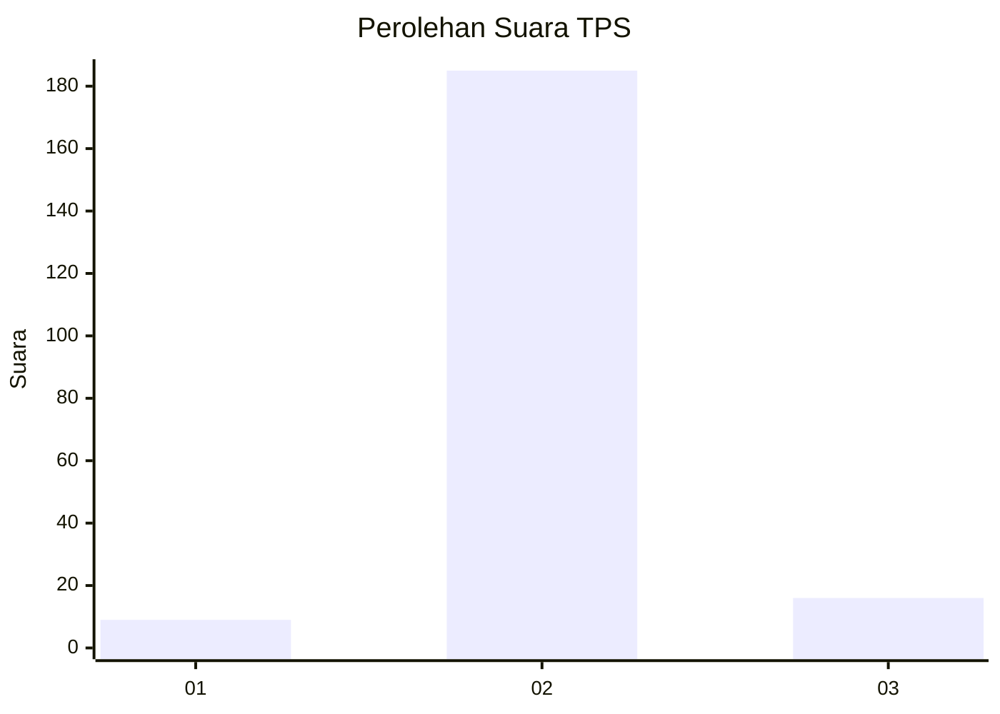
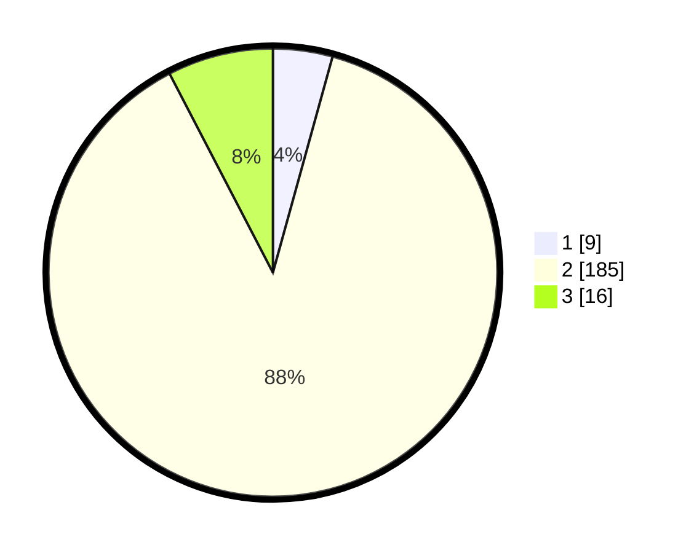

# Hasil

## Grafik

## Tabel

| No. | Nama Paslon    | Suara | Suara (raw) | Persentase |
|:--- |:-------------- | -----:| -----------:| ----------:|
| 1   | ANIES MUHAIMIN | 9     | [9][p-1]    | 4,29       |
| 2   | PRABOWO GIBRAN | 185   | [185][p-2]  | 88,10      |
| 3   | GANJAR MAHFUD  | 16    | [16][p-3]   | 7,62       |

[p-1]: https://github.com/gigit-pemilu/pemilu-2024-64-kalimantan-timur/blob/main/pilpres/hitung-suara/sub/64-kalimantan-timur/sub/03-berau/sub/11-maratua/sub/2001-bohe-silian/sub/001-tps/sub/paslon-1.txt
[p-2]: https://github.com/gigit-pemilu/pemilu-2024-64-kalimantan-timur/blob/main/pilpres/hitung-suara/sub/64-kalimantan-timur/sub/03-berau/sub/11-maratua/sub/2001-bohe-silian/sub/001-tps/sub/paslon-2.txt
[p-3]: https://github.com/gigit-pemilu/pemilu-2024-64-kalimantan-timur/blob/main/pilpres/hitung-suara/sub/64-kalimantan-timur/sub/03-berau/sub/11-maratua/sub/2001-bohe-silian/sub/001-tps/sub/paslon-3.txt

## Foto C Plano

https://sirekap-obj-formc.kpu.go.id/1a8b/pemilu/ppwp/64/03/11/20/01/6403112001001-20240218-092925--9ceb3f3a-cda6-425b-9fa4-5bfe91ece1dd.jpg

https://sirekap-obj-formc.kpu.go.id/1a8b/pemilu/ppwp/64/03/11/20/01/6403112001001-20240218-093010--f731b91d-c8be-4592-92e7-197325c83c8f.jpg

https://sirekap-obj-formc.kpu.go.id/1a8b/pemilu/ppwp/64/03/11/20/01/6403112001001-20240218-093149--056dc322-56e5-4fc0-8429-89cffd121eaf.jpg

## Metadata

| Key        | Value               |
| ---------- | ------------------- |
| Time Stamp | 2024-02-19 06:16:00 |

