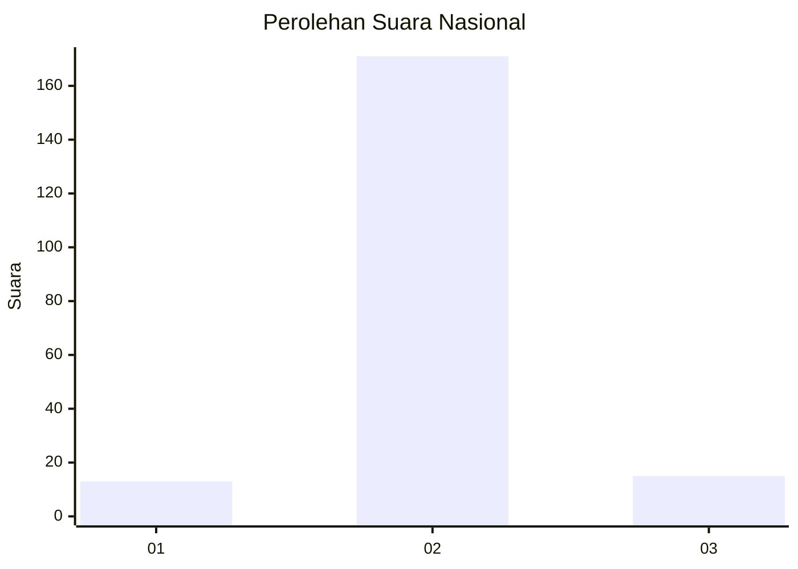
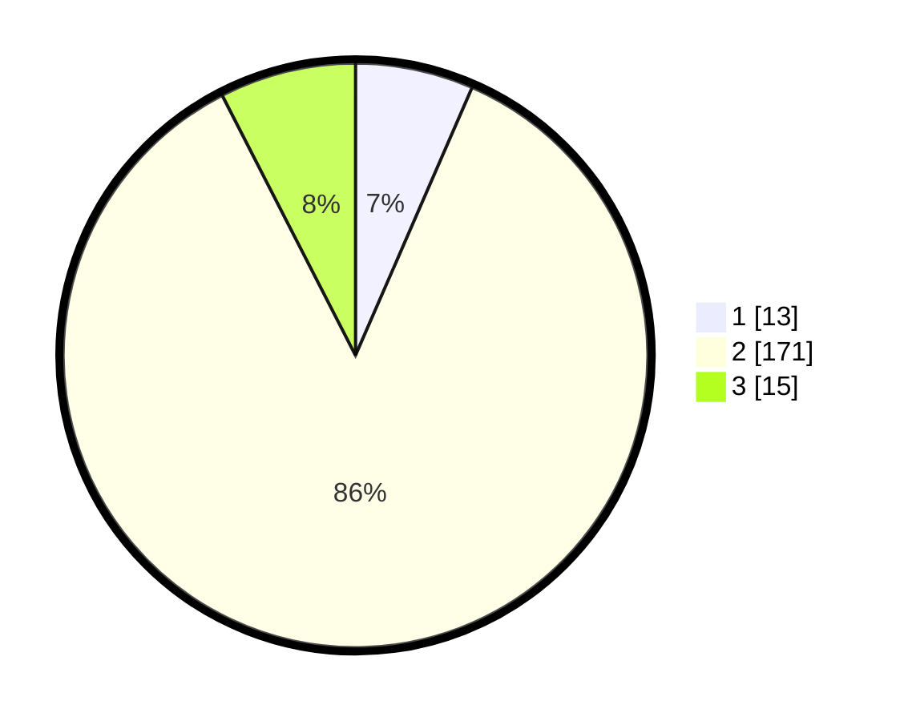

# Hasil

## Grafik

## Tabel

| No. | Nama Paslon    | Suara | Suara (raw) | Persentase |
|:--- |:-------------- | -----:| -----------:| ----------:|
| 1   | ANIES MUHAIMIN | 13    | [13][p-1]   | 6,53       |
| 2   | PRABOWO GIBRAN | 171   | [171][p-2]  | 85,93      |
| 3   | GANJAR MAHFUD  | 15    | [15][p-3]   | 7,54       |

[p-1]: https://github.com/gigit-pemilu/pemilu-2024/blob/main/pilpres/hitung-suara/sub/64-kalimantan-timur/sub/03-berau/sub/11-maratua/sub/2001-bohe-silian/sub/002-tps/sub/paslon-1.txt
[p-2]: https://github.com/gigit-pemilu/pemilu-2024/blob/main/pilpres/hitung-suara/sub/64-kalimantan-timur/sub/03-berau/sub/11-maratua/sub/2001-bohe-silian/sub/002-tps/sub/paslon-2.txt
[p-3]: https://github.com/gigit-pemilu/pemilu-2024/blob/main/pilpres/hitung-suara/sub/64-kalimantan-timur/sub/03-berau/sub/11-maratua/sub/2001-bohe-silian/sub/002-tps/sub/paslon-3.txt

## Foto C Plano

https://sirekap-obj-formc.kpu.go.id/846f/pemilu/ppwp/64/03/11/20/01/6403112001002-20240218-102017--1e781765-14d4-4a8a-9425-67e2e175847d.jpg

https://sirekap-obj-formc.kpu.go.id/846f/pemilu/ppwp/64/03/11/20/01/6403112001002-20240218-102145--fc60d043-9ce6-41d0-b0db-8d988ff53cbd.jpg

https://sirekap-obj-formc.kpu.go.id/846f/pemilu/ppwp/64/03/11/20/01/6403112001002-20240218-102329--a0c1a0e0-5534-4c4c-8fff-0e5cba718e05.jpg

## Metadata

| Key        | Value               |
| ---------- | ------------------- |
| Time Stamp | 2024-02-19 06:16:00 |

