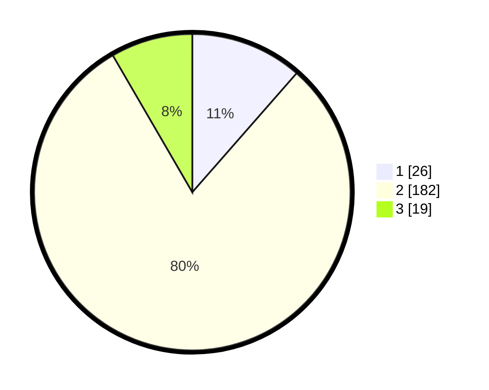

# Hasil

## Grafik

## Tabel

| No. | Nama Paslon    | Suara | Suara (raw) | Persentase |
|:--- |:-------------- | -----:| -----------:| ----------:|
| 1   | ANIES MUHAIMIN | 26    | [26][p-1]   | 11,45      |
| 2   | PRABOWO GIBRAN | 182   | [182][p-2]  | 80,18      |
| 3   | GANJAR MAHFUD  | 19    | [19][p-3]   | 8,37       |

[p-1]: https://github.com/gigit-pemilu/pemilu-2024-64-kalimantan-timur/blob/main/pilpres/hitung-suara/sub/64-kalimantan-timur/sub/03-berau/sub/11-maratua/sub/2001-bohe-silian/sub/003-tps/sub/paslon-1.txt
[p-2]: https://github.com/gigit-pemilu/pemilu-2024-64-kalimantan-timur/blob/main/pilpres/hitung-suara/sub/64-kalimantan-timur/sub/03-berau/sub/11-maratua/sub/2001-bohe-silian/sub/003-tps/sub/paslon-2.txt
[p-3]: https://github.com/gigit-pemilu/pemilu-2024-64-kalimantan-timur/blob/main/pilpres/hitung-suara/sub/64-kalimantan-timur/sub/03-berau/sub/11-maratua/sub/2001-bohe-silian/sub/003-tps/sub/paslon-3.txt

## Foto C Plano

https://sirekap-obj-formc.kpu.go.id/272e/pemilu/ppwp/64/03/11/20/01/6403112001003-20240218-104051--305f362b-230b-4a90-9c69-cfb04d9eef54.jpg

https://sirekap-obj-formc.kpu.go.id/272e/pemilu/ppwp/64/03/11/20/01/6403112001003-20240218-104238--772faa10-14d5-4d91-8ed7-75fa8325485b.jpg

https://sirekap-obj-formc.kpu.go.id/272e/pemilu/ppwp/64/03/11/20/01/6403112001003-20240218-104355--0cc07278-9d93-4023-bb24-30b3ec8519ee.jpg

## Metadata

| Key        | Value               |
| ---------- | ------------------- |
| Time Stamp | 2024-02-19 06:16:00 |

