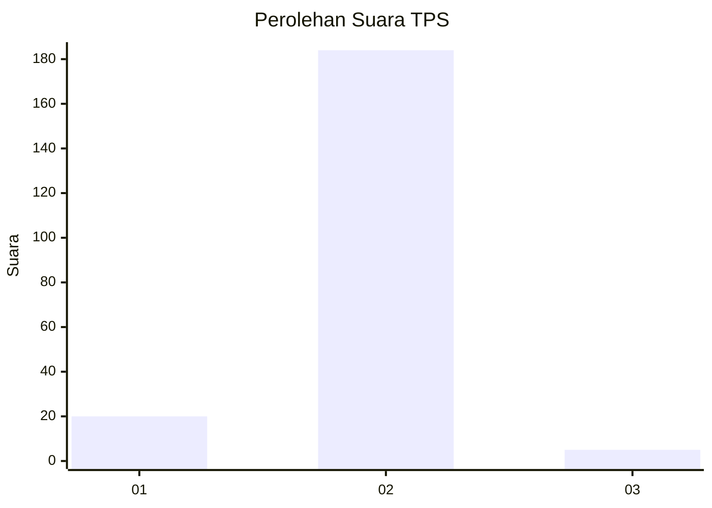
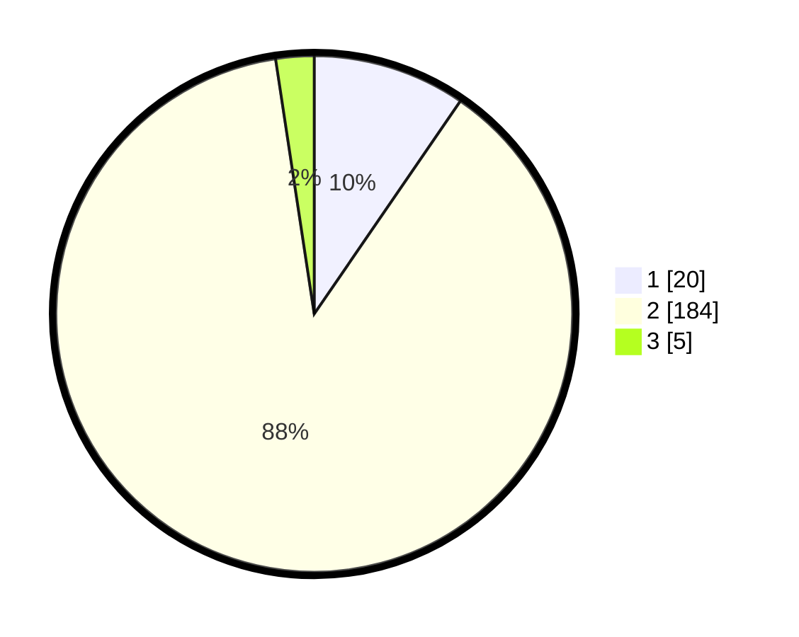

# Hasil

## Grafik

## Tabel

| No. | Nama Paslon    | Suara | Suara (raw) | Persentase |
|:--- |:-------------- | -----:| -----------:| ----------:|
| 1   | ANIES MUHAIMIN | 20    | [20][p-1]   | 9,57       |
| 2   | PRABOWO GIBRAN | 184   | [184][p-2]  | 88,04      |
| 3   | GANJAR MAHFUD  | 5     | [5][p-3]    | 2,39       |

[p-1]: https://github.com/gigit-pemilu/pemilu-2024-64-kalimantan-timur/blob/main/pilpres/hitung-suara/sub/64-kalimantan-timur/sub/03-berau/sub/11-maratua/sub/2002-payung-payung/sub/002-tps/sub/paslon-1.txt
[p-2]: https://github.com/gigit-pemilu/pemilu-2024-64-kalimantan-timur/blob/main/pilpres/hitung-suara/sub/64-kalimantan-timur/sub/03-berau/sub/11-maratua/sub/2002-payung-payung/sub/002-tps/sub/paslon-2.txt
[p-3]: https://github.com/gigit-pemilu/pemilu-2024-64-kalimantan-timur/blob/main/pilpres/hitung-suara/sub/64-kalimantan-timur/sub/03-berau/sub/11-maratua/sub/2002-payung-payung/sub/002-tps/sub/paslon-3.txt

## Foto C Plano

https://sirekap-obj-formc.kpu.go.id/105d/pemilu/ppwp/64/03/11/20/02/6403112002002-20240214-194250--bad1bce8-a8f6-420a-9017-339c2b57eed6.jpg

https://sirekap-obj-formc.kpu.go.id/105d/pemilu/ppwp/64/03/11/20/02/6403112002002-20240214-194309--da88d3c9-983d-488b-9de9-394d33bacaed.jpg

https://sirekap-obj-formc.kpu.go.id/105d/pemilu/ppwp/64/03/11/20/02/6403112002002-20240218-112113--77e3f9da-bd7e-424a-8c43-5ba54f2bb0dd.jpg

## Metadata

| Key        | Value               |
| ---------- | ------------------- |
| Time Stamp | 2024-02-24 22:31:28 |

