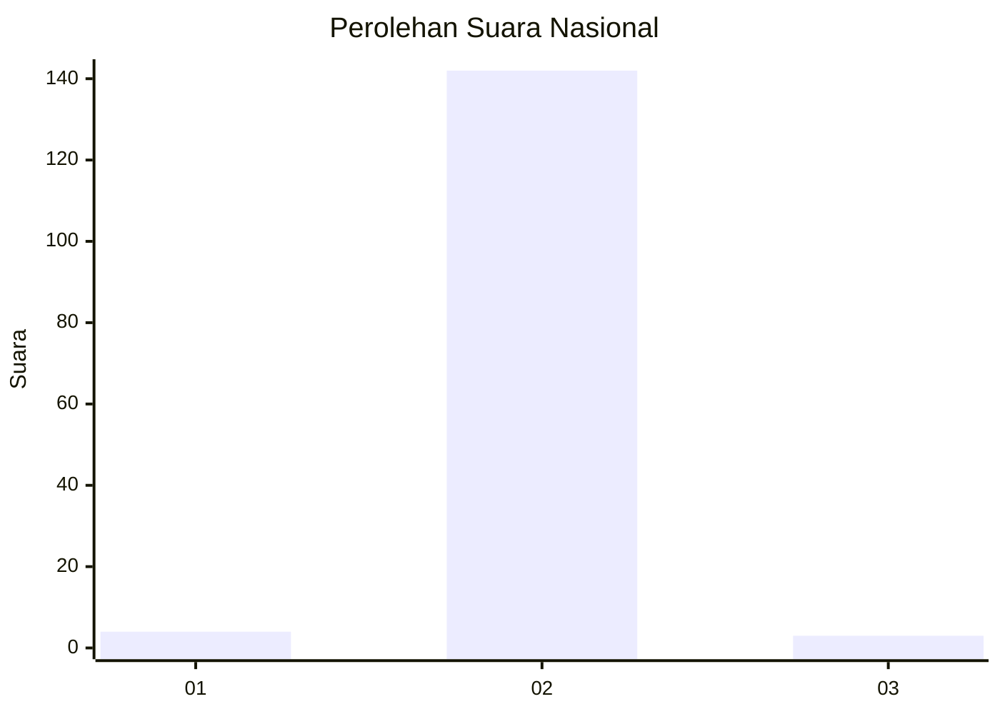
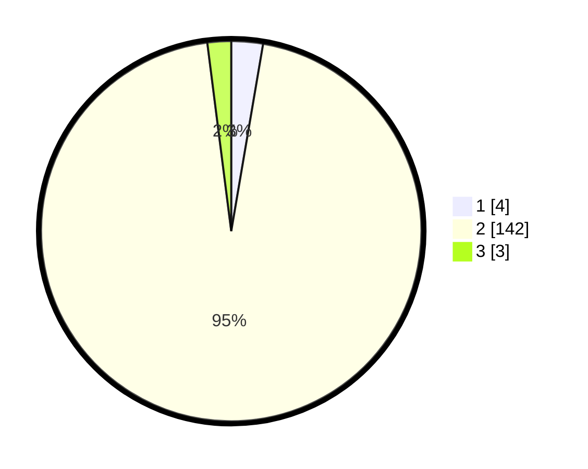

# Hasil

## Grafik

## Tabel

| No. | Nama Paslon    | Suara | Suara (raw) | Persentase |
|:--- |:-------------- | -----:| -----------:| ----------:|
| 1   | ANIES MUHAIMIN | 4     | [4][p-1]    | 2,68       |
| 2   | PRABOWO GIBRAN | 142   | [142][p-2]  | 95,30      |
| 3   | GANJAR MAHFUD  | 3     | [3][p-3]    | 2,01       |

[p-1]: https://github.com/gigit-pemilu/pemilu-2024/blob/main/pilpres/hitung-suara/sub/64-kalimantan-timur/sub/03-berau/sub/11-maratua/sub/2003-teluk-alulu/sub/001-tps/sub/paslon-1.txt
[p-2]: https://github.com/gigit-pemilu/pemilu-2024/blob/main/pilpres/hitung-suara/sub/64-kalimantan-timur/sub/03-berau/sub/11-maratua/sub/2003-teluk-alulu/sub/001-tps/sub/paslon-2.txt
[p-3]: https://github.com/gigit-pemilu/pemilu-2024/blob/main/pilpres/hitung-suara/sub/64-kalimantan-timur/sub/03-berau/sub/11-maratua/sub/2003-teluk-alulu/sub/001-tps/sub/paslon-3.txt

## Foto C Plano

https://sirekap-obj-formc.kpu.go.id/ecd3/pemilu/ppwp/64/03/11/20/03/6403112003001-20240218-122738--8e6eb581-b95e-4ca5-b427-261bca446988.jpg

https://sirekap-obj-formc.kpu.go.id/ecd3/pemilu/ppwp/64/03/11/20/03/6403112003001-20240215-081112--33844e6a-fa1e-42ed-951b-98202f5dd90e.jpg

https://sirekap-obj-formc.kpu.go.id/ecd3/pemilu/ppwp/64/03/11/20/03/6403112003001-20240215-081134--0cb3bca1-5c9d-4200-92ee-4a848ed16169.jpg

## Metadata

| Key        | Value               |
| ---------- | ------------------- |
| Time Stamp | 2024-02-19 06:16:00 |

