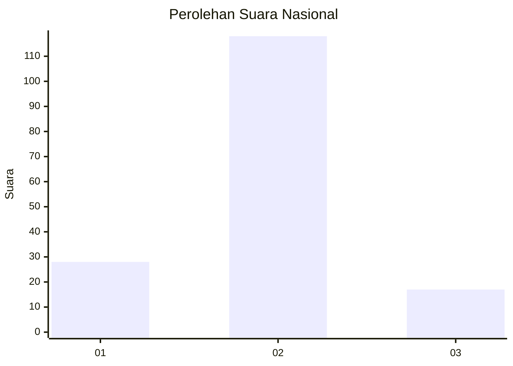
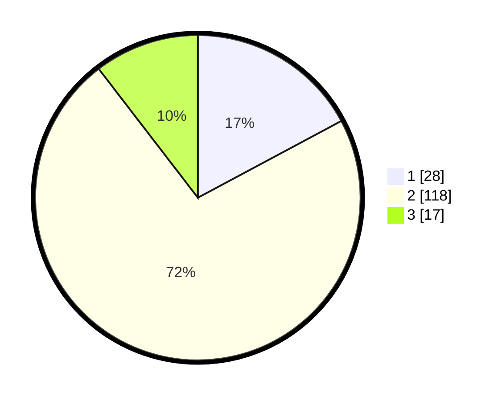

# Hasil

## Grafik

## Tabel

| No. | Nama Paslon    | Suara | Suara (raw) | Persentase |
|:--- |:-------------- | -----:| -----------:| ----------:|
| 1   | ANIES MUHAIMIN | 28    | [28][p-1]   | 17,18      |
| 2   | PRABOWO GIBRAN | 118   | [118][p-2]  | 72,39      |
| 3   | GANJAR MAHFUD  | 17    | [17][p-3]   | 10,43      |

[p-1]: https://github.com/gigit-pemilu/pemilu-2024/blob/main/pilpres/hitung-suara/sub/64-kalimantan-timur/sub/03-berau/sub/12-batu-putih/sub/2001-tembudan/sub/004-tps/sub/paslon-1.txt
[p-2]: https://github.com/gigit-pemilu/pemilu-2024/blob/main/pilpres/hitung-suara/sub/64-kalimantan-timur/sub/03-berau/sub/12-batu-putih/sub/2001-tembudan/sub/004-tps/sub/paslon-2.txt
[p-3]: https://github.com/gigit-pemilu/pemilu-2024/blob/main/pilpres/hitung-suara/sub/64-kalimantan-timur/sub/03-berau/sub/12-batu-putih/sub/2001-tembudan/sub/004-tps/sub/paslon-3.txt

## Foto C Plano

https://sirekap-obj-formc.kpu.go.id/c73f/pemilu/ppwp/64/03/12/20/01/6403122001004-20240219-133331--831a5645-4d90-43a1-92aa-8b2cc8943d7b.jpg

https://sirekap-obj-formc.kpu.go.id/c73f/pemilu/ppwp/64/03/12/20/01/6403122001004-20240219-133427--6fd778b1-1ddd-4122-a619-35728d960545.jpg

https://sirekap-obj-formc.kpu.go.id/c73f/pemilu/ppwp/64/03/12/20/01/6403122001004-20240219-133519--e2ff494b-85dc-4765-98f8-17d50fef2e46.jpg

## Metadata

| Key        | Value               |
| ---------- | ------------------- |
| Time Stamp | 2024-02-20 15:00:00 |

