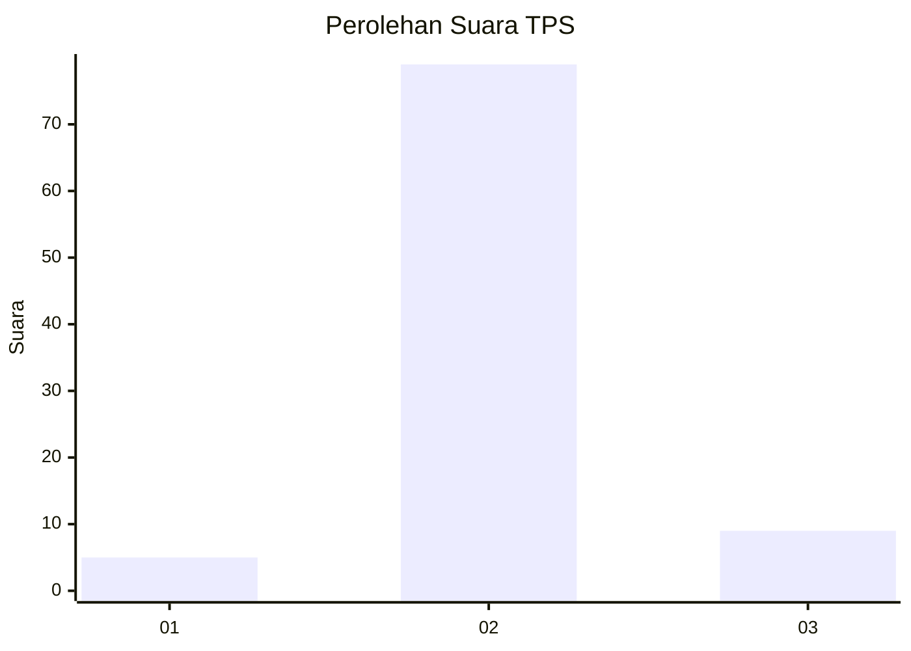
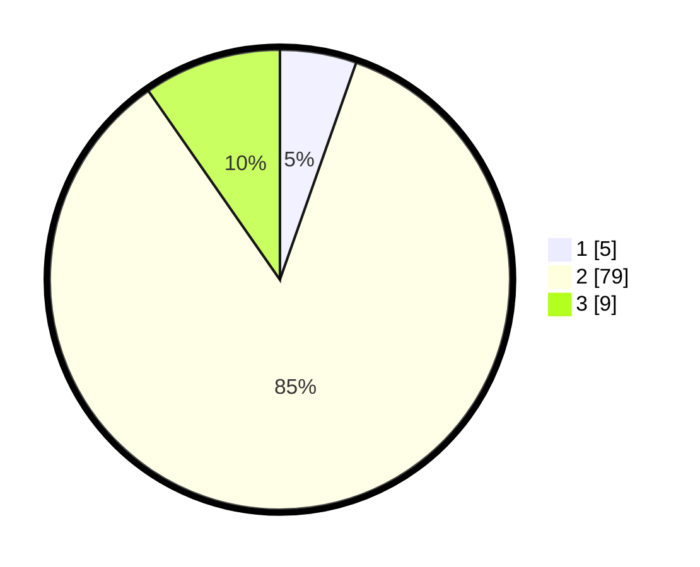

# Hasil

## Grafik

## Tabel

| No. | Nama Paslon    | Suara | Suara (raw) | Persentase |
|:--- |:-------------- | -----:| -----------:| ----------:|
| 1   | ANIES MUHAIMIN | 5     | [5][p-1]    | 5,38       |
| 2   | PRABOWO GIBRAN | 79    | [79][p-2]   | 84,95      |
| 3   | GANJAR MAHFUD  | 9     | [9][p-3]    | 9,68       |

[p-1]: https://github.com/gigit-pemilu/pemilu-2024-64-kalimantan-timur/blob/main/pilpres/hitung-suara/sub/64-kalimantan-timur/sub/07-kutai-barat/sub/12-bongan/sub/2004-deraya/sub/001-tps/sub/paslon-1.txt
[p-2]: https://github.com/gigit-pemilu/pemilu-2024-64-kalimantan-timur/blob/main/pilpres/hitung-suara/sub/64-kalimantan-timur/sub/07-kutai-barat/sub/12-bongan/sub/2004-deraya/sub/001-tps/sub/paslon-2.txt
[p-3]: https://github.com/gigit-pemilu/pemilu-2024-64-kalimantan-timur/blob/main/pilpres/hitung-suara/sub/64-kalimantan-timur/sub/07-kutai-barat/sub/12-bongan/sub/2004-deraya/sub/001-tps/sub/paslon-3.txt

## Foto C Plano

https://sirekap-obj-formc.kpu.go.id/cb1e/pemilu/ppwp/64/07/12/20/04/6407122004001-20240218-135336--0c55cf3c-c8b0-42e0-9c61-9be7df4ebdc3.jpg

https://sirekap-obj-formc.kpu.go.id/cb1e/pemilu/ppwp/64/07/12/20/04/6407122004001-20240218-135531--a91402f2-e87d-4f4f-ad74-d723eeeba347.jpg

https://sirekap-obj-formc.kpu.go.id/cb1e/pemilu/ppwp/64/07/12/20/04/6407122004001-20240218-135612--8a7b4ce1-1a1e-4c4a-9cc5-f8098139ff66.jpg

## Metadata

| Key        | Value               |
| ---------- | ------------------- |
| Time Stamp | 2024-02-25 17:00:00 |

