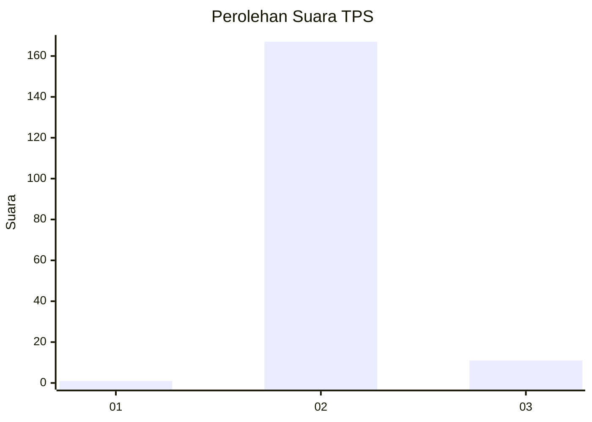
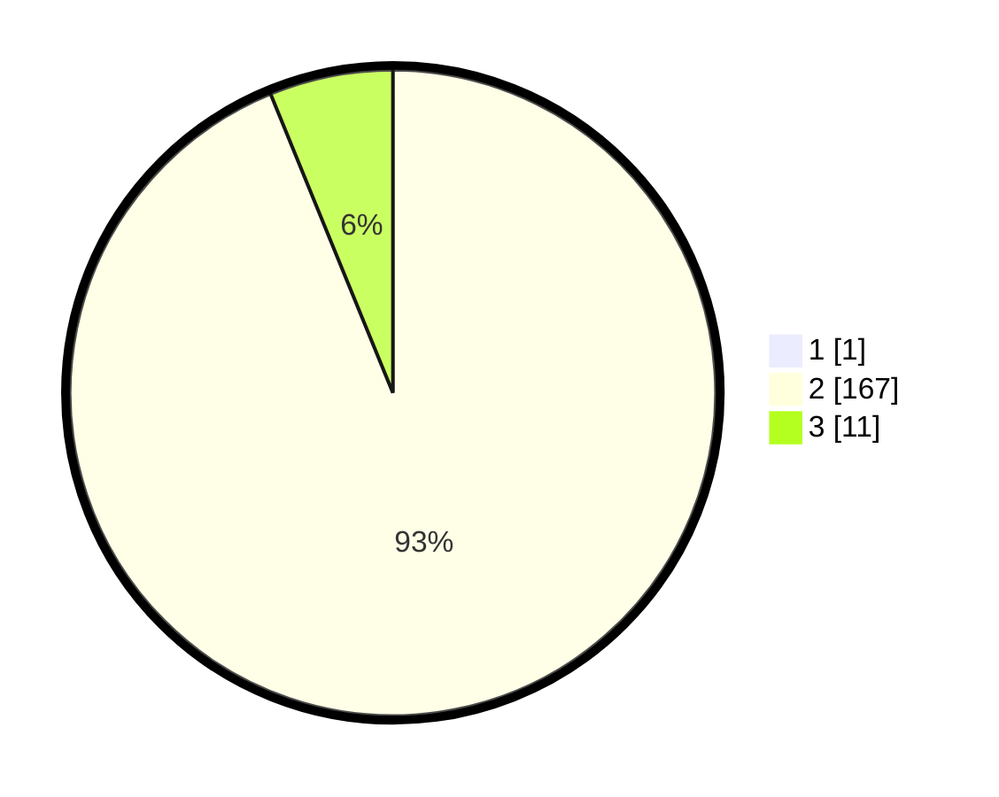

# Hasil

## Grafik

## Tabel

| No. | Nama Paslon    | Suara | Suara (raw) | Persentase |
|:--- |:-------------- | -----:| -----------:| ----------:|
| 1   | ANIES MUHAIMIN | 1     | [1][p-1]    | 0,56       |
| 2   | PRABOWO GIBRAN | 167   | [167][p-2]  | 93,30      |
| 3   | GANJAR MAHFUD  | 11    | [11][p-3]   | 6,15       |

[p-1]: https://github.com/gigit-pemilu/pemilu-2024-64-kalimantan-timur/blob/main/pilpres/hitung-suara/sub/64-kalimantan-timur/sub/07-kutai-barat/sub/18-mook-manaar-bulatn/sub/2002-sakaq-tada/sub/001-tps/sub/paslon-1.txt
[p-2]: https://github.com/gigit-pemilu/pemilu-2024-64-kalimantan-timur/blob/main/pilpres/hitung-suara/sub/64-kalimantan-timur/sub/07-kutai-barat/sub/18-mook-manaar-bulatn/sub/2002-sakaq-tada/sub/001-tps/sub/paslon-2.txt
[p-3]: https://github.com/gigit-pemilu/pemilu-2024-64-kalimantan-timur/blob/main/pilpres/hitung-suara/sub/64-kalimantan-timur/sub/07-kutai-barat/sub/18-mook-manaar-bulatn/sub/2002-sakaq-tada/sub/001-tps/sub/paslon-3.txt

## Foto C Plano

https://sirekap-obj-formc.kpu.go.id/7f4a/pemilu/ppwp/64/07/18/20/02/6407182002001-20240221-173044--eb508c7a-b639-46c1-9cfb-2fb555d4702c.jpg

https://sirekap-obj-formc.kpu.go.id/7f4a/pemilu/ppwp/64/07/18/20/02/6407182002001-20240221-173234--dcf302cc-7da9-4ef5-bf14-c96d3f9f599c.jpg

https://sirekap-obj-formc.kpu.go.id/7f4a/pemilu/ppwp/64/07/18/20/02/6407182002001-20240221-173458--c1718923-09d7-4d13-ba79-0b5dbf723338.jpg

## Metadata

| Key        | Value               |
| ---------- | ------------------- |
| Time Stamp | 2024-02-24 22:31:28 |

