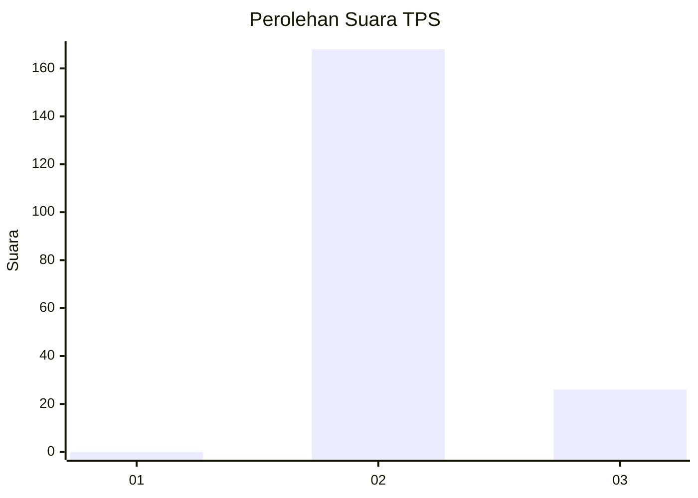
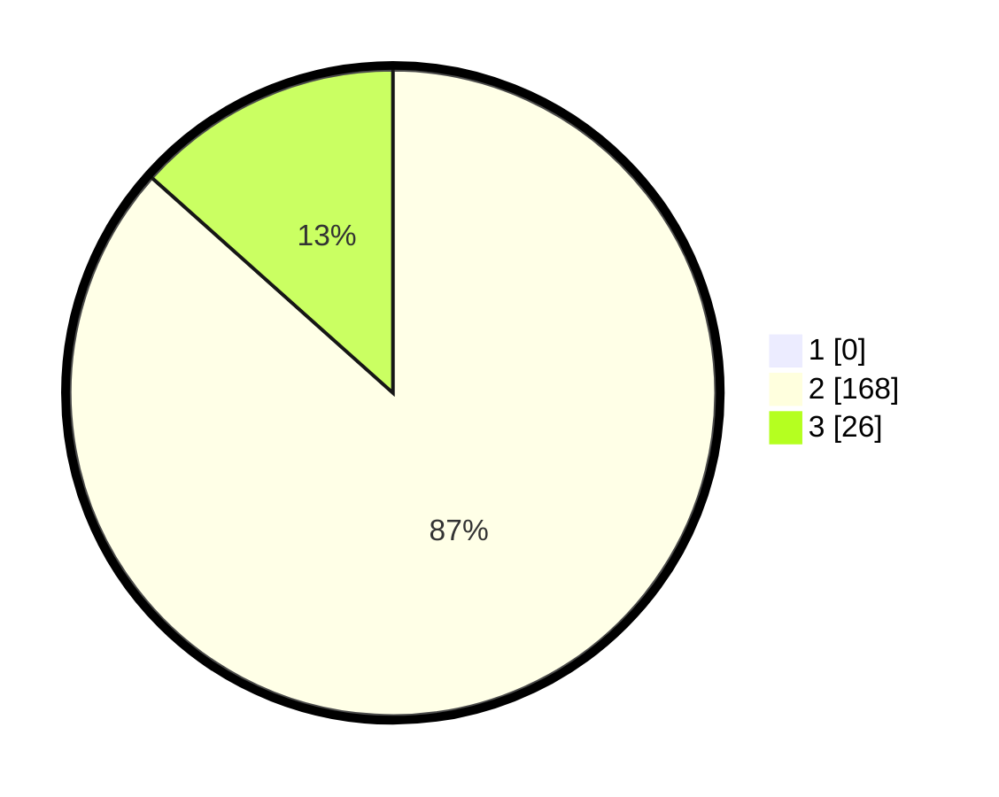

# Hasil

## Grafik

## Tabel

| No. | Nama Paslon    | Suara | Suara (raw) | Persentase |
|:--- |:-------------- | -----:| -----------:| ----------:|
| 1   | ANIES MUHAIMIN | 0     | [0][p-1]    | 0,00       |
| 2   | PRABOWO GIBRAN | 168   | [168][p-2]  | 86,60      |
| 3   | GANJAR MAHFUD  | 26    | [26][p-3]   | 13,40      |

[p-1]: https://github.com/gigit-pemilu/pemilu-2024-64-kalimantan-timur/blob/main/pilpres/hitung-suara/sub/64-kalimantan-timur/sub/07-kutai-barat/sub/18-mook-manaar-bulatn/sub/2002-sakaq-tada/sub/002-tps/sub/paslon-1.txt
[p-2]: https://github.com/gigit-pemilu/pemilu-2024-64-kalimantan-timur/blob/main/pilpres/hitung-suara/sub/64-kalimantan-timur/sub/07-kutai-barat/sub/18-mook-manaar-bulatn/sub/2002-sakaq-tada/sub/002-tps/sub/paslon-2.txt
[p-3]: https://github.com/gigit-pemilu/pemilu-2024-64-kalimantan-timur/blob/main/pilpres/hitung-suara/sub/64-kalimantan-timur/sub/07-kutai-barat/sub/18-mook-manaar-bulatn/sub/2002-sakaq-tada/sub/002-tps/sub/paslon-3.txt

## Foto C Plano

https://sirekap-obj-formc.kpu.go.id/d0c2/pemilu/ppwp/64/07/18/20/02/6407182002002-20240221-174058--f51877b2-c0f1-41ae-86cc-1a9d668571b3.jpg

https://sirekap-obj-formc.kpu.go.id/d0c2/pemilu/ppwp/64/07/18/20/02/6407182002002-20240221-174637--11e2eb32-4f51-4333-8ee7-3adf303fe4bd.jpg

https://sirekap-obj-formc.kpu.go.id/d0c2/pemilu/ppwp/64/07/18/20/02/6407182002002-20240221-174904--b20a5b0c-d3a6-40ba-ae71-e84089c3e8bf.jpg

## Metadata

| Key        | Value               |
| ---------- | ------------------- |
| Time Stamp | 2024-02-25 13:00:00 |

