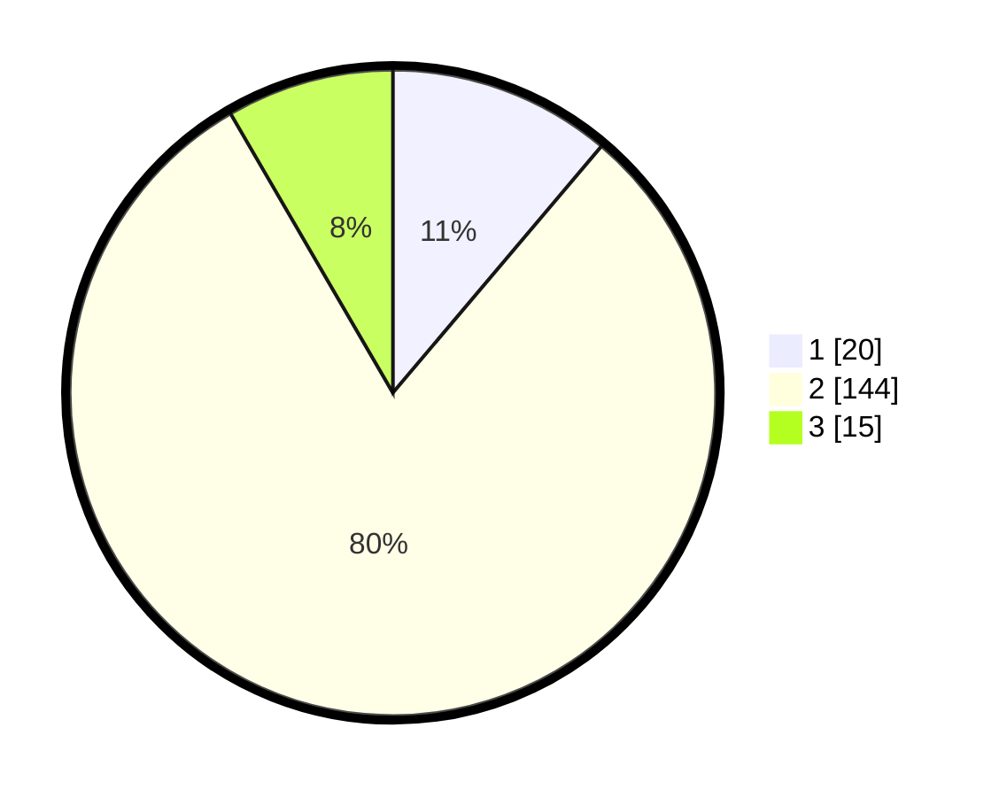

# Hasil

## Grafik

## Tabel

| No. | Nama Paslon    | Suara | Suara (raw) | Persentase |
|:--- |:-------------- | -----:| -----------:| ----------:|
| 1   | ANIES MUHAIMIN | 20    | [20][p-1]   | 11,17      |
| 2   | PRABOWO GIBRAN | 144   | [144][p-2]  | 80,45      |
| 3   | GANJAR MAHFUD  | 15    | [15][p-3]   | 8,38       |

[p-1]: https://github.com/gigit-pemilu/pemilu-2024-64-kalimantan-timur/blob/main/pilpres/hitung-suara/sub/64-kalimantan-timur/sub/08-kutai-timur/sub/01-muara-ancalong/sub/2002-kelinjau-ilir/sub/004-tps/sub/paslon-1.txt
[p-2]: https://github.com/gigit-pemilu/pemilu-2024-64-kalimantan-timur/blob/main/pilpres/hitung-suara/sub/64-kalimantan-timur/sub/08-kutai-timur/sub/01-muara-ancalong/sub/2002-kelinjau-ilir/sub/004-tps/sub/paslon-2.txt
[p-3]: https://github.com/gigit-pemilu/pemilu-2024-64-kalimantan-timur/blob/main/pilpres/hitung-suara/sub/64-kalimantan-timur/sub/08-kutai-timur/sub/01-muara-ancalong/sub/2002-kelinjau-ilir/sub/004-tps/sub/paslon-3.txt

## Foto C Plano

https://sirekap-obj-formc.kpu.go.id/553f/pemilu/ppwp/64/08/01/20/02/6408012002004-20240214-221814--f2f8edb0-b9c0-4b1b-a9c2-ffba0457bec9.jpg

https://sirekap-obj-formc.kpu.go.id/553f/pemilu/ppwp/64/08/01/20/02/6408012002004-20240214-221941--b8d6ee77-a4cb-492f-9859-c0d8e429f72f.jpg

https://sirekap-obj-formc.kpu.go.id/553f/pemilu/ppwp/64/08/01/20/02/6408012002004-20240214-221911--665c749c-838e-4083-ad51-060eb09e80e2.jpg

## Metadata

| Key        | Value               |
| ---------- | ------------------- |
| Time Stamp | 2024-02-15 22:40:13 |

