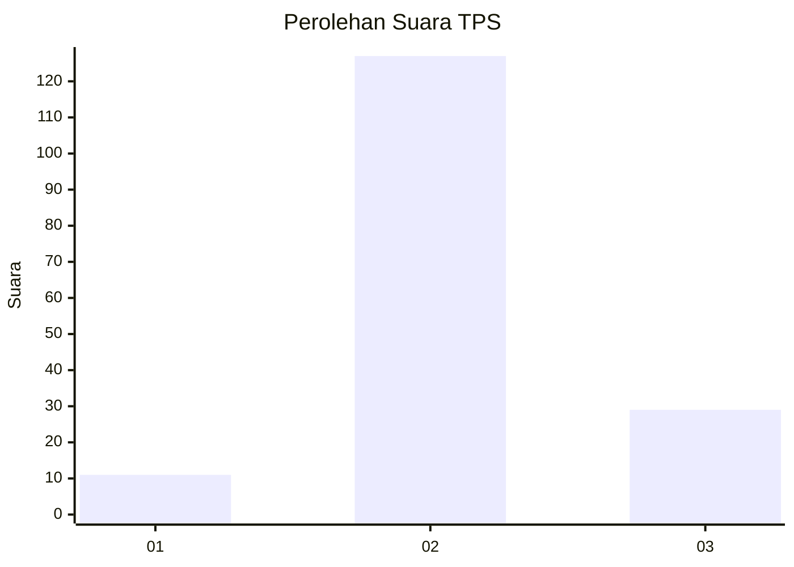

# Hasil

## Grafik

## Tabel

| No. | Nama Paslon    | Suara | Suara (raw) | Persentase |
|:--- |:-------------- | -----:| -----------:| ----------:|
| 1   | ANIES MUHAIMIN | 11    | [11][p-1]   | 6,59       |
| 2   | PRABOWO GIBRAN | 127   | [127][p-2]  | 76,05      |
| 3   | GANJAR MAHFUD  | 29    | [29][p-3]   | 17,37      |

[p-1]: https://github.com/gigit-pemilu/pemilu-2024-64-kalimantan-timur/blob/main/pilpres/hitung-suara/sub/64-kalimantan-timur/sub/08-kutai-timur/sub/02-muara-wahau/sub/2002-nehes-liah-bing/sub/009-tps/sub/paslon-1.txt
[p-2]: https://github.com/gigit-pemilu/pemilu-2024-64-kalimantan-timur/blob/main/pilpres/hitung-suara/sub/64-kalimantan-timur/sub/08-kutai-timur/sub/02-muara-wahau/sub/2002-nehes-liah-bing/sub/009-tps/sub/paslon-2.txt
[p-3]: https://github.com/gigit-pemilu/pemilu-2024-64-kalimantan-timur/blob/main/pilpres/hitung-suara/sub/64-kalimantan-timur/sub/08-kutai-timur/sub/02-muara-wahau/sub/2002-nehes-liah-bing/sub/009-tps/sub/paslon-3.txt

## Foto C Plano

https://sirekap-obj-formc.kpu.go.id/47ad/pemilu/ppwp/64/08/02/20/02/6408022002009-20240215-001044--d9a7f5b5-299a-483e-8e72-e780e118ea5a.jpg

https://sirekap-obj-formc.kpu.go.id/47ad/pemilu/ppwp/64/08/02/20/02/6408022002009-20240215-001101--69b0c353-4bbb-4c15-a8fb-53a44b330a38.jpg

https://sirekap-obj-formc.kpu.go.id/47ad/pemilu/ppwp/64/08/02/20/02/6408022002009-20240215-001134--5d1afda4-df50-4c7e-9188-3d6f20eaea99.jpg

## Metadata

| Key        | Value               |
| ---------- | ------------------- |
| Time Stamp | 2024-02-15 12:00:28 |

