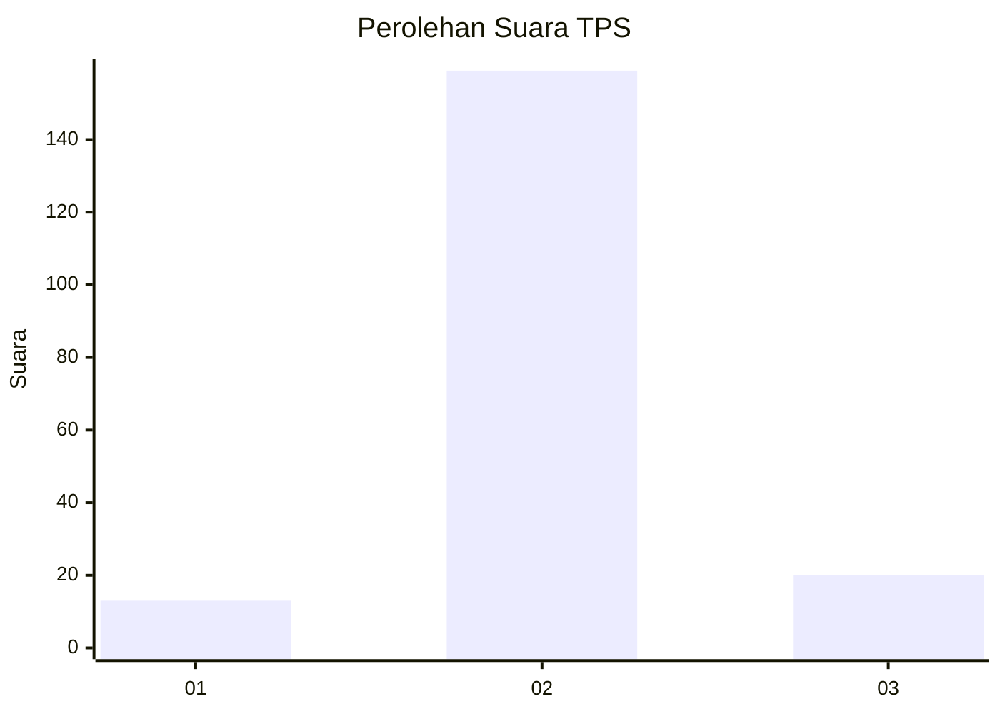
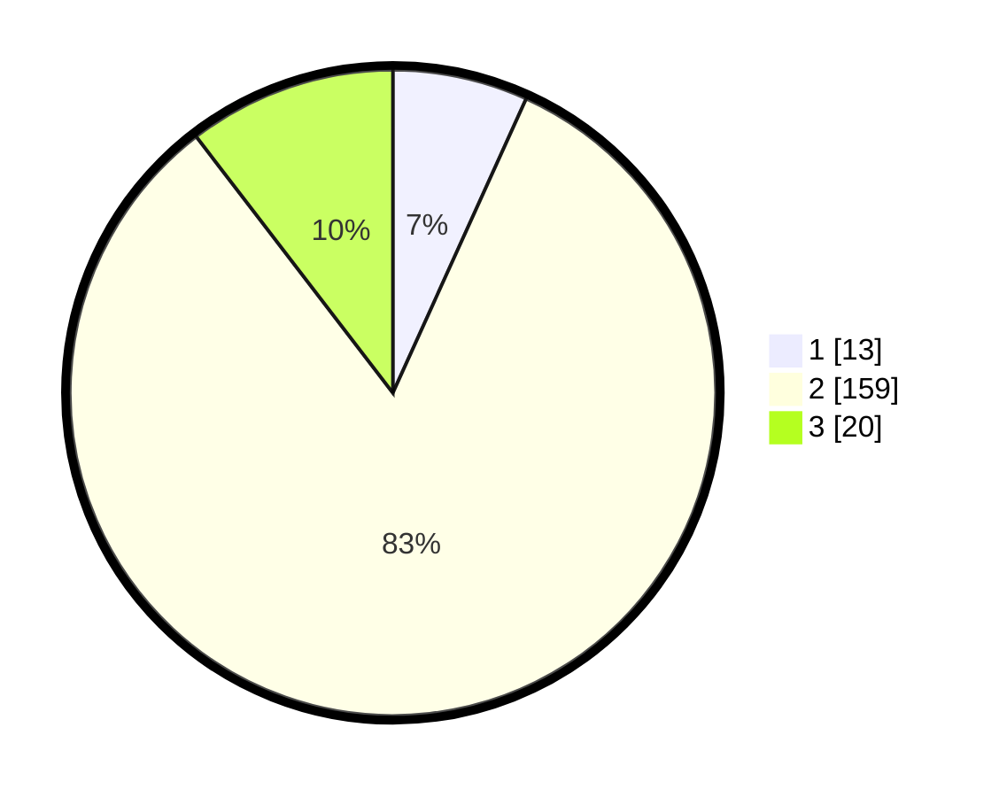

# Hasil

## Grafik

## Tabel

| No. | Nama Paslon    | Suara | Suara (raw) | Persentase |
|:--- |:-------------- | -----:| -----------:| ----------:|
| 1   | ANIES MUHAIMIN | 13    | [13][p-1]   | 6,77       |
| 2   | PRABOWO GIBRAN | 159   | [159][p-2]  | 82,81      |
| 3   | GANJAR MAHFUD  | 20    | [20][p-3]   | 10,42      |

[p-1]: https://github.com/gigit-pemilu/pemilu-2024-64-kalimantan-timur/blob/main/pilpres/hitung-suara/sub/64-kalimantan-timur/sub/08-kutai-timur/sub/03-muara-bengkal/sub/2005-benua-baru/sub/002-tps/sub/paslon-1.txt
[p-2]: https://github.com/gigit-pemilu/pemilu-2024-64-kalimantan-timur/blob/main/pilpres/hitung-suara/sub/64-kalimantan-timur/sub/08-kutai-timur/sub/03-muara-bengkal/sub/2005-benua-baru/sub/002-tps/sub/paslon-2.txt
[p-3]: https://github.com/gigit-pemilu/pemilu-2024-64-kalimantan-timur/blob/main/pilpres/hitung-suara/sub/64-kalimantan-timur/sub/08-kutai-timur/sub/03-muara-bengkal/sub/2005-benua-baru/sub/002-tps/sub/paslon-3.txt

## Foto C Plano

https://sirekap-obj-formc.kpu.go.id/6e37/pemilu/ppwp/64/08/03/20/05/6408032005002-20240215-112856--ece6b301-a4c9-4699-80b0-02f9a7ba7e83.jpg

https://sirekap-obj-formc.kpu.go.id/6e37/pemilu/ppwp/64/08/03/20/05/6408032005002-20240215-112959--4c5cce20-811c-429e-84cc-0c4a4d8d4276.jpg

https://sirekap-obj-formc.kpu.go.id/6e37/pemilu/ppwp/64/08/03/20/05/6408032005002-20240215-113049--b4a8b4e8-c2f0-4399-bf2e-a17d091609c6.jpg

## Metadata

| Key        | Value               |
| ---------- | ------------------- |
| Time Stamp | 2024-02-25 12:00:00 |

