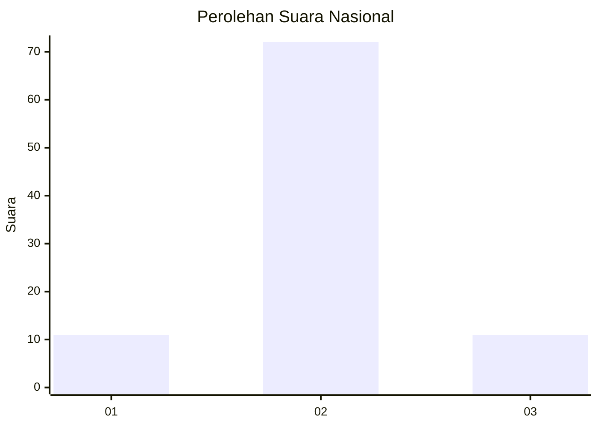
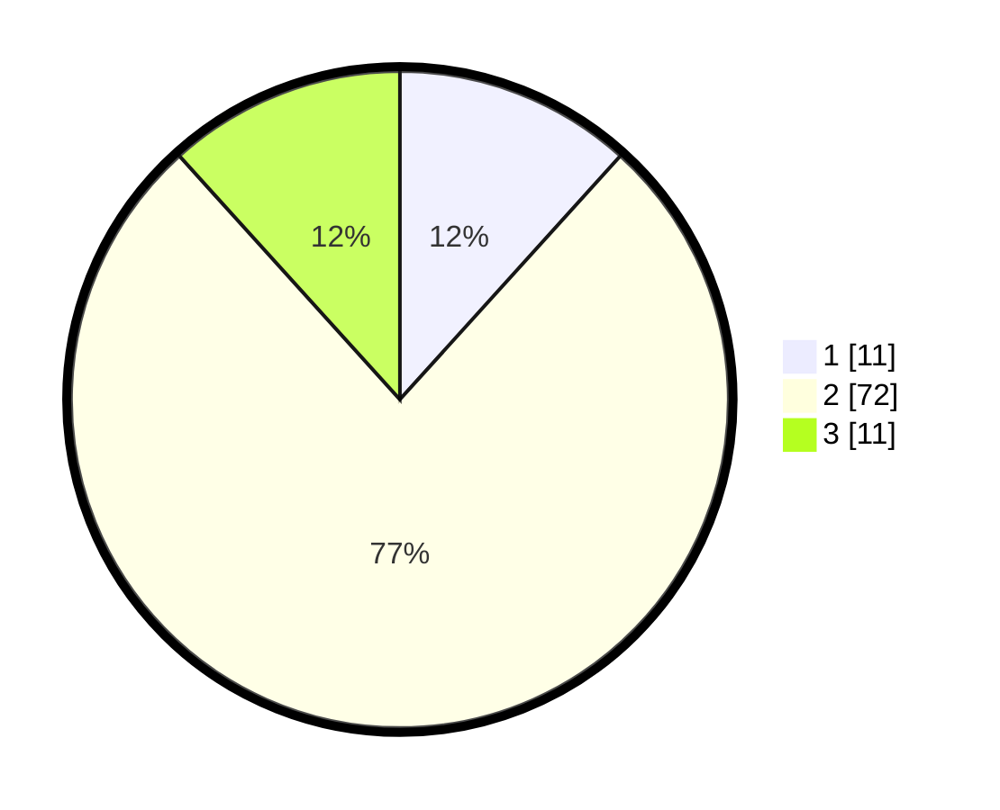

# Hasil

## Grafik

## Tabel

| No. | Nama Paslon    | Suara | Suara (raw) | Persentase |
|:--- |:-------------- | -----:| -----------:| ----------:|
| 1   | ANIES MUHAIMIN | 11    | [11][p-1]   | 11,70      |
| 2   | PRABOWO GIBRAN | 72    | [72][p-2]   | 76,60      |
| 3   | GANJAR MAHFUD  | 11    | [11][p-3]   | 11,70      |

[p-1]: https://github.com/gigit-pemilu/pemilu-2024/blob/main/pilpres/hitung-suara/sub/64-kalimantan-timur/sub/08-kutai-timur/sub/04-sangatta-utara/sub/2011-singa-gembara/sub/004-tps/sub/paslon-1.txt
[p-2]: https://github.com/gigit-pemilu/pemilu-2024/blob/main/pilpres/hitung-suara/sub/64-kalimantan-timur/sub/08-kutai-timur/sub/04-sangatta-utara/sub/2011-singa-gembara/sub/004-tps/sub/paslon-2.txt
[p-3]: https://github.com/gigit-pemilu/pemilu-2024/blob/main/pilpres/hitung-suara/sub/64-kalimantan-timur/sub/08-kutai-timur/sub/04-sangatta-utara/sub/2011-singa-gembara/sub/004-tps/sub/paslon-3.txt

## Foto C Plano

https://sirekap-obj-formc.kpu.go.id/81c9/pemilu/ppwp/64/08/04/20/11/6408042011004-20240215-003117--18283f41-86cc-4591-937f-99c8802a8bc6.jpg

https://sirekap-obj-formc.kpu.go.id/81c9/pemilu/ppwp/64/08/04/20/11/6408042011004-20240215-003231--56e462d0-1c12-4e94-88f9-4941b22da580.jpg

https://sirekap-obj-formc.kpu.go.id/81c9/pemilu/ppwp/64/08/04/20/11/6408042011004-20240215-003326--bafabd17-3219-40ad-a271-8e4e812afb5e.jpg

## Metadata

| Key        | Value               |
| ---------- | ------------------- |
| Time Stamp | 2024-02-15 15:00:29 |

