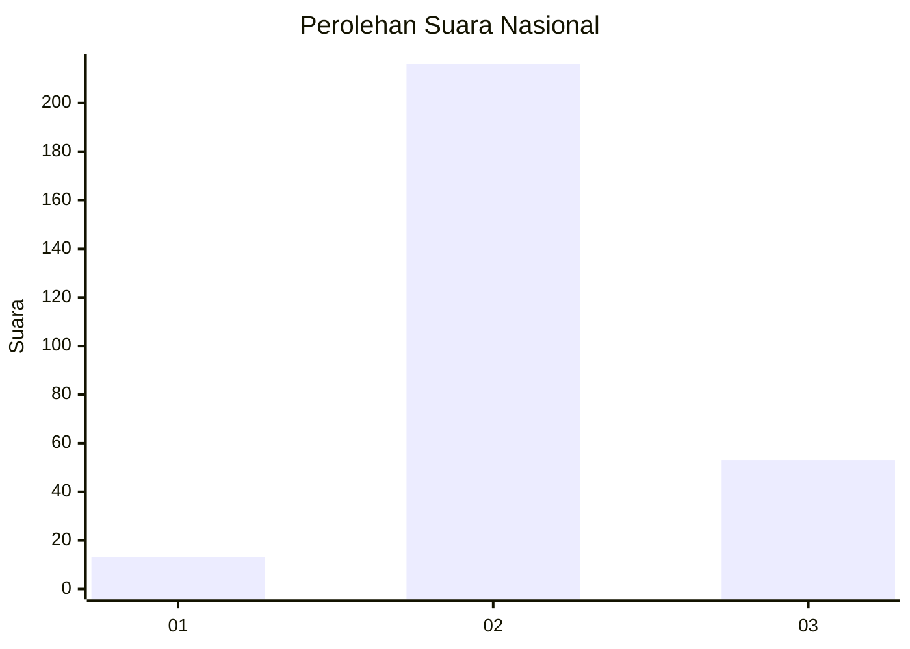
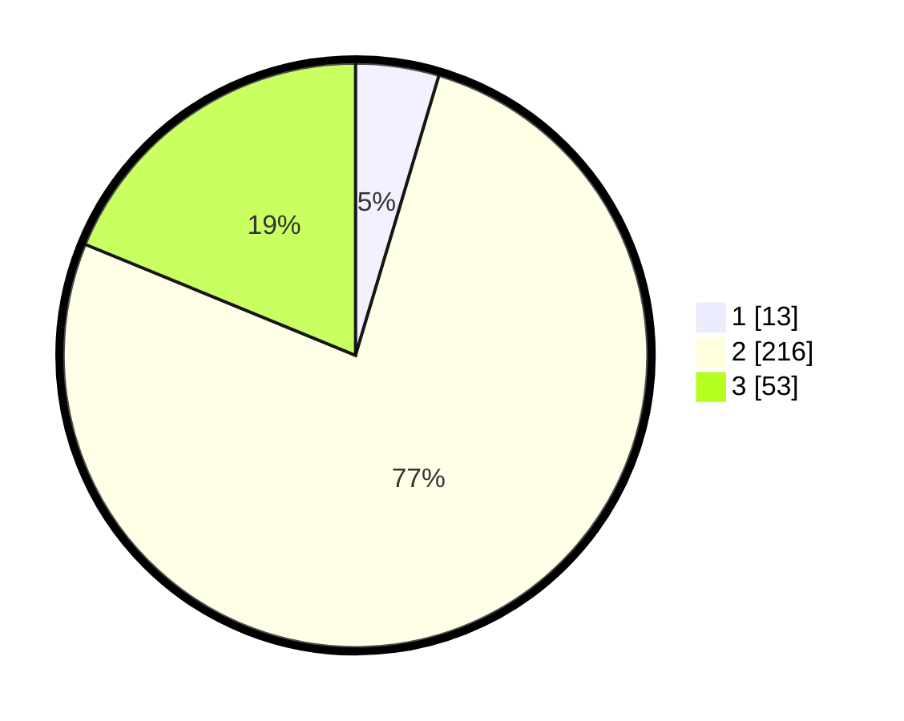

# Hasil

## Grafik

## Tabel

| No. | Nama Paslon    | Suara | Suara (raw) | Persentase |
|:--- |:-------------- | -----:| -----------:| ----------:|
| 1   | ANIES MUHAIMIN | 13    | [13][p-1]   | 4,61       |
| 2   | PRABOWO GIBRAN | 216   | [216][p-2]  | 76,60      |
| 3   | GANJAR MAHFUD  | 53    | [53][p-3]   | 18,79      |

[p-1]: https://github.com/gigit-pemilu/pemilu-2024/blob/main/pilpres/hitung-suara/sub/64-kalimantan-timur/sub/08-kutai-timur/sub/04-sangatta-utara/sub/2011-singa-gembara/sub/030-tps/sub/paslon-1.txt
[p-2]: https://github.com/gigit-pemilu/pemilu-2024/blob/main/pilpres/hitung-suara/sub/64-kalimantan-timur/sub/08-kutai-timur/sub/04-sangatta-utara/sub/2011-singa-gembara/sub/030-tps/sub/paslon-2.txt
[p-3]: https://github.com/gigit-pemilu/pemilu-2024/blob/main/pilpres/hitung-suara/sub/64-kalimantan-timur/sub/08-kutai-timur/sub/04-sangatta-utara/sub/2011-singa-gembara/sub/030-tps/sub/paslon-3.txt

## Foto C Plano

https://sirekap-obj-formc.kpu.go.id/8871/pemilu/ppwp/64/08/04/20/11/6408042011030-20240215-002814--74f64bad-e395-4838-ab76-3b25c28d18e6.jpg

https://sirekap-obj-formc.kpu.go.id/8871/pemilu/ppwp/64/08/04/20/11/6408042011030-20240215-003643--a5e8e5c9-73ed-4fb1-b5a2-8bd652a6cf6d.jpg

https://sirekap-obj-formc.kpu.go.id/8871/pemilu/ppwp/64/08/04/20/11/6408042011030-20240215-043200--bd670e9b-59a8-4fdf-b9b5-ddb08598b52b.jpg

## Metadata

| Key        | Value               |
| ---------- | ------------------- |
| Time Stamp | 2024-02-25 12:00:00 |

