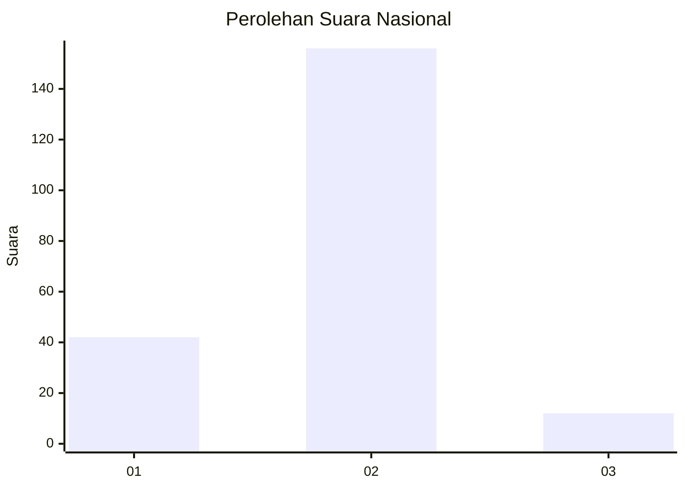
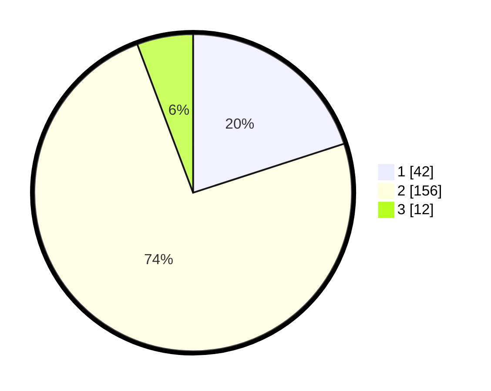

# Hasil

## Grafik

## Tabel

| No. | Nama Paslon    | Suara | Suara (raw) | Persentase |
|:--- |:-------------- | -----:| -----------:| ----------:|
| 1   | ANIES MUHAIMIN | 42    | [42][p-1]   | 20,00      |
| 2   | PRABOWO GIBRAN | 156   | [156][p-2]  | 74,29      |
| 3   | GANJAR MAHFUD  | 12    | [12][p-3]   | 5,71       |

[p-1]: https://github.com/gigit-pemilu/pemilu-2024/blob/main/pilpres/hitung-suara/sub/64-kalimantan-timur/sub/08-kutai-timur/sub/05-sangkulirang/sub/2001-kerayaan/sub/004-tps/sub/paslon-1.txt
[p-2]: https://github.com/gigit-pemilu/pemilu-2024/blob/main/pilpres/hitung-suara/sub/64-kalimantan-timur/sub/08-kutai-timur/sub/05-sangkulirang/sub/2001-kerayaan/sub/004-tps/sub/paslon-2.txt
[p-3]: https://github.com/gigit-pemilu/pemilu-2024/blob/main/pilpres/hitung-suara/sub/64-kalimantan-timur/sub/08-kutai-timur/sub/05-sangkulirang/sub/2001-kerayaan/sub/004-tps/sub/paslon-3.txt

## Foto C Plano

https://sirekap-obj-formc.kpu.go.id/699b/pemilu/ppwp/64/08/05/20/01/6408052001004-20240215-004256--98bda04c-20ba-4c87-b19d-7bae26508547.jpg

https://sirekap-obj-formc.kpu.go.id/699b/pemilu/ppwp/64/08/05/20/01/6408052001004-20240215-004407--be4ba683-dca3-43e8-b50d-58bf352ebcca.jpg

https://sirekap-obj-formc.kpu.go.id/699b/pemilu/ppwp/64/08/05/20/01/6408052001004-20240215-004601--ac022676-7d2d-4031-80a4-4cd5a8c11a7c.jpg

## Metadata

| Key        | Value               |
| ---------- | ------------------- |
| Time Stamp | 2024-02-25 21:00:00 |

