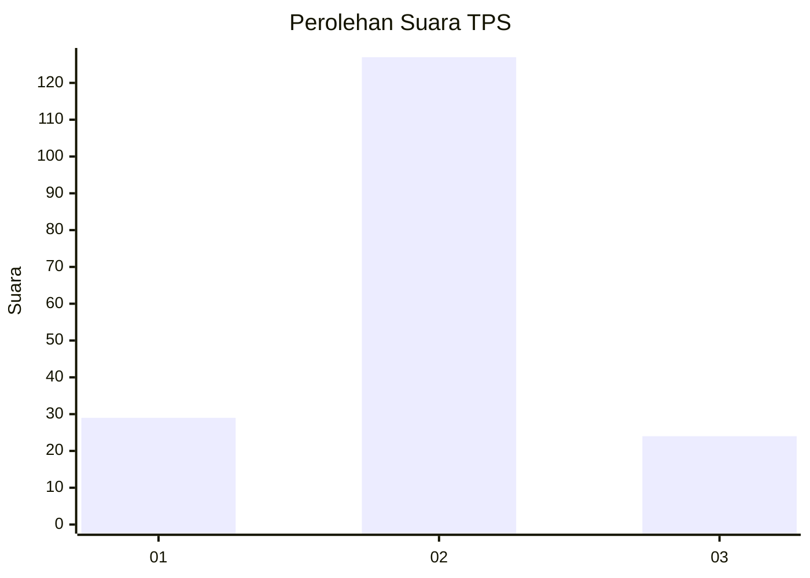
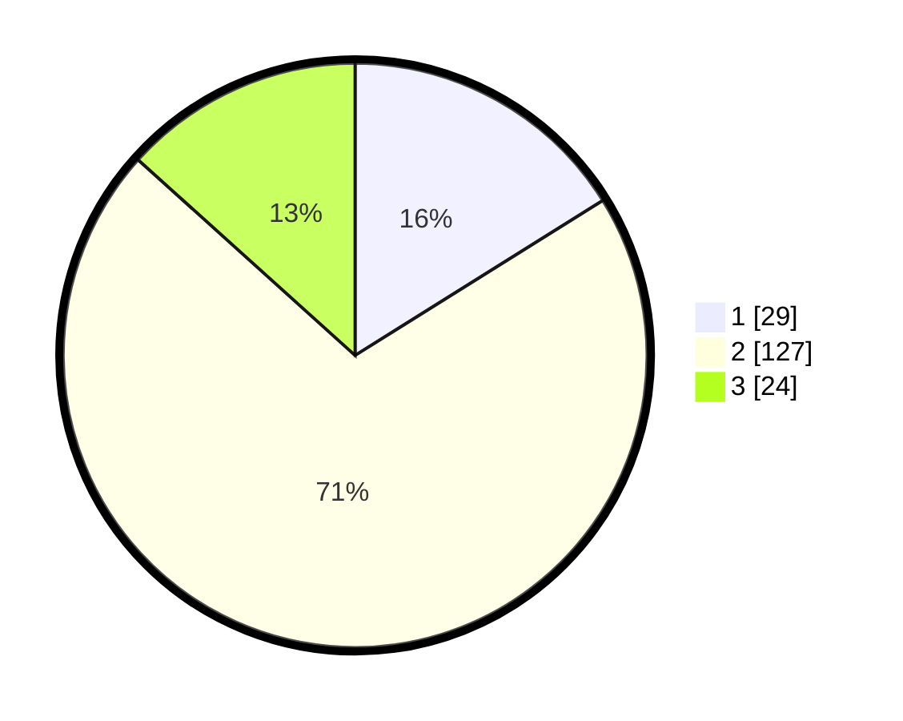

# Hasil

## Grafik

## Tabel

| No. | Nama Paslon    | Suara | Suara (raw) | Persentase |
|:--- |:-------------- | -----:| -----------:| ----------:|
| 1   | ANIES MUHAIMIN | 29    | [29][p-1]   | 16,11      |
| 2   | PRABOWO GIBRAN | 127   | [127][p-2]  | 70,56      |
| 3   | GANJAR MAHFUD  | 24    | [24][p-3]   | 13,33      |

[p-1]: https://github.com/gigit-pemilu/pemilu-2024-64-kalimantan-timur/blob/main/pilpres/hitung-suara/sub/64-kalimantan-timur/sub/08-kutai-timur/sub/05-sangkulirang/sub/2003-peridan/sub/001-tps/sub/paslon-1.txt
[p-2]: https://github.com/gigit-pemilu/pemilu-2024-64-kalimantan-timur/blob/main/pilpres/hitung-suara/sub/64-kalimantan-timur/sub/08-kutai-timur/sub/05-sangkulirang/sub/2003-peridan/sub/001-tps/sub/paslon-2.txt
[p-3]: https://github.com/gigit-pemilu/pemilu-2024-64-kalimantan-timur/blob/main/pilpres/hitung-suara/sub/64-kalimantan-timur/sub/08-kutai-timur/sub/05-sangkulirang/sub/2003-peridan/sub/001-tps/sub/paslon-3.txt

## Foto C Plano

https://sirekap-obj-formc.kpu.go.id/4510/pemilu/ppwp/64/08/05/20/03/6408052003001-20240215-121531--831c3a05-4eb4-4c30-8bf5-87cb3cb21354.jpg

https://sirekap-obj-formc.kpu.go.id/4510/pemilu/ppwp/64/08/05/20/03/6408052003001-20240215-121640--0008aab2-400f-4b7a-814f-3bc66bedd852.jpg

https://sirekap-obj-formc.kpu.go.id/4510/pemilu/ppwp/64/08/05/20/03/6408052003001-20240215-121914--46aed7af-349c-44fd-bb9c-af65f2ff81eb.jpg

## Metadata

| Key        | Value               |
| ---------- | ------------------- |
| Time Stamp | 2024-02-15 15:30:25 |

