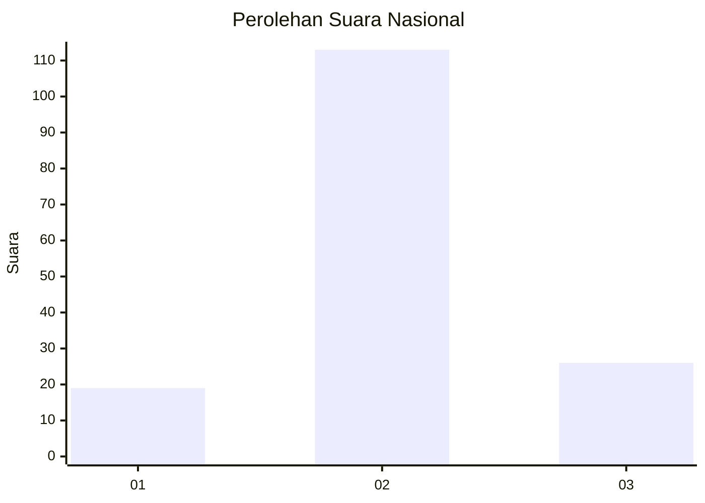
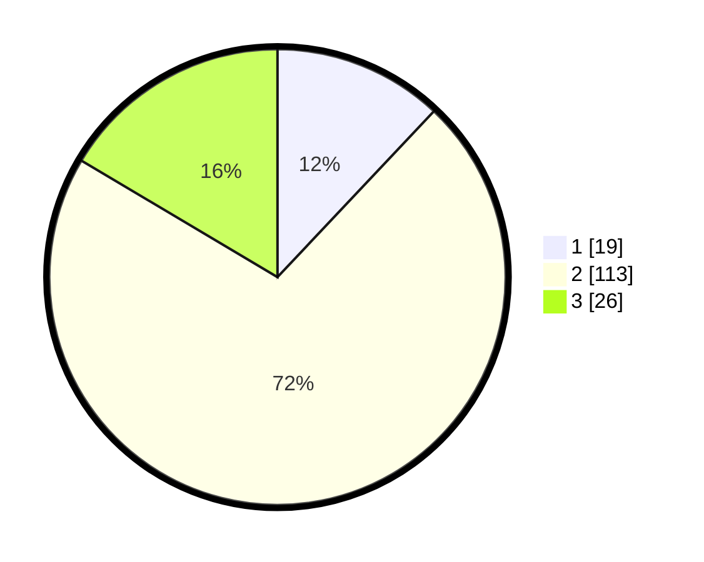

# Hasil

## Grafik

## Tabel

| No. | Nama Paslon    | Suara | Suara (raw) | Persentase |
|:--- |:-------------- | -----:| -----------:| ----------:|
| 1   | ANIES MUHAIMIN | 19    | [19][p-1]   | 12,03      |
| 2   | PRABOWO GIBRAN | 113   | [113][p-2]  | 71,52      |
| 3   | GANJAR MAHFUD  | 26    | [26][p-3]   | 16,46      |

[p-1]: https://github.com/gigit-pemilu/pemilu-2024/blob/main/pilpres/hitung-suara/sub/64-kalimantan-timur/sub/08-kutai-timur/sub/05-sangkulirang/sub/2003-peridan/sub/003-tps/sub/paslon-1.txt
[p-2]: https://github.com/gigit-pemilu/pemilu-2024/blob/main/pilpres/hitung-suara/sub/64-kalimantan-timur/sub/08-kutai-timur/sub/05-sangkulirang/sub/2003-peridan/sub/003-tps/sub/paslon-2.txt
[p-3]: https://github.com/gigit-pemilu/pemilu-2024/blob/main/pilpres/hitung-suara/sub/64-kalimantan-timur/sub/08-kutai-timur/sub/05-sangkulirang/sub/2003-peridan/sub/003-tps/sub/paslon-3.txt

## Foto C Plano

https://sirekap-obj-formc.kpu.go.id/d17e/pemilu/ppwp/64/08/05/20/03/6408052003003-20240215-121918--670dccd3-61b9-420e-af77-db3290c17925.jpg

https://sirekap-obj-formc.kpu.go.id/d17e/pemilu/ppwp/64/08/05/20/03/6408052003003-20240215-122016--7ce05539-d153-45ee-877e-924d0c20e9c2.jpg

https://sirekap-obj-formc.kpu.go.id/d17e/pemilu/ppwp/64/08/05/20/03/6408052003003-20240215-122130--6476f046-ef0b-491f-be81-0af5d71324f9.jpg

## Metadata

| Key        | Value               |
| ---------- | ------------------- |
| Time Stamp | 2024-02-15 16:00:26 |

