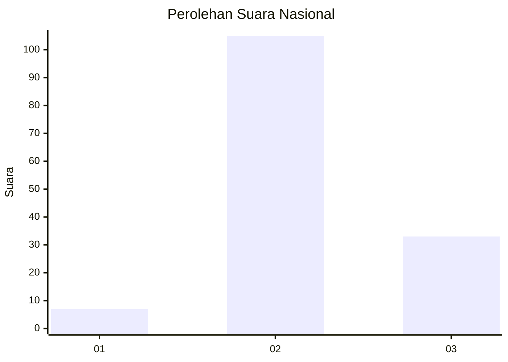
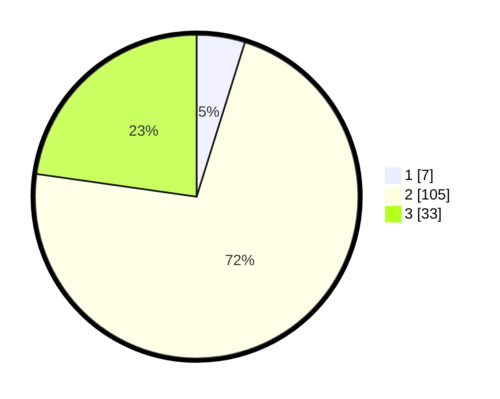

# Hasil

## Grafik

## Tabel

| No. | Nama Paslon    | Suara | Suara (raw) | Persentase |
|:--- |:-------------- | -----:| -----------:| ----------:|
| 1   | ANIES MUHAIMIN | 7     | [7][p-1]    | 4,83       |
| 2   | PRABOWO GIBRAN | 105   | [105][p-2]  | 72,41      |
| 3   | GANJAR MAHFUD  | 33    | [33][p-3]   | 22,76      |

[p-1]: https://github.com/gigit-pemilu/pemilu-2024/blob/main/pilpres/hitung-suara/sub/64-kalimantan-timur/sub/08-kutai-timur/sub/05-sangkulirang/sub/2003-peridan/sub/004-tps/sub/paslon-1.txt
[p-2]: https://github.com/gigit-pemilu/pemilu-2024/blob/main/pilpres/hitung-suara/sub/64-kalimantan-timur/sub/08-kutai-timur/sub/05-sangkulirang/sub/2003-peridan/sub/004-tps/sub/paslon-2.txt
[p-3]: https://github.com/gigit-pemilu/pemilu-2024/blob/main/pilpres/hitung-suara/sub/64-kalimantan-timur/sub/08-kutai-timur/sub/05-sangkulirang/sub/2003-peridan/sub/004-tps/sub/paslon-3.txt

## Foto C Plano

https://sirekap-obj-formc.kpu.go.id/72a2/pemilu/ppwp/64/08/05/20/03/6408052003004-20240215-095942--37ca63ae-bf82-4ba4-8172-23da0132820b.jpg

https://sirekap-obj-formc.kpu.go.id/72a2/pemilu/ppwp/64/08/05/20/03/6408052003004-20240215-095909--3e6c0c4f-32c2-46da-b15b-de36a77c1c4b.jpg

https://sirekap-obj-formc.kpu.go.id/72a2/pemilu/ppwp/64/08/05/20/03/6408052003004-20240215-095950--2a2e887b-bbb4-4e73-ac67-f0e2d43ecf69.jpg

## Metadata

| Key        | Value               |
| ---------- | ------------------- |
| Time Stamp | 2024-02-15 16:00:26 |

