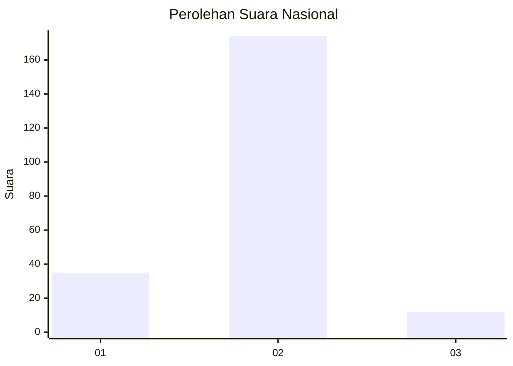
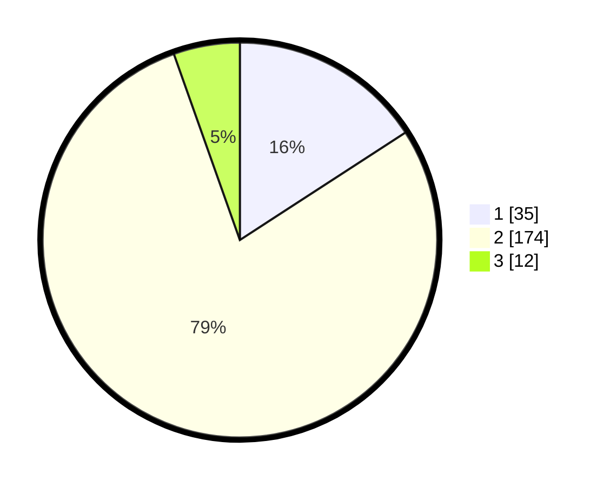

# Hasil

## Grafik

## Tabel

| No. | Nama Paslon    | Suara | Suara (raw) | Persentase |
|:--- |:-------------- | -----:| -----------:| ----------:|
| 1   | ANIES MUHAIMIN | 35    | [35][p-1]   | 15,84      |
| 2   | PRABOWO GIBRAN | 174   | [174][p-2]  | 78,73      |
| 3   | GANJAR MAHFUD  | 12    | [12][p-3]   | 5,43       |

[p-1]: https://github.com/gigit-pemilu/pemilu-2024/blob/main/pilpres/hitung-suara/sub/64-kalimantan-timur/sub/08-kutai-timur/sub/08-kombeng/sub/2001-makmur-jaya/sub/001-tps/sub/paslon-1.txt
[p-2]: https://github.com/gigit-pemilu/pemilu-2024/blob/main/pilpres/hitung-suara/sub/64-kalimantan-timur/sub/08-kutai-timur/sub/08-kombeng/sub/2001-makmur-jaya/sub/001-tps/sub/paslon-2.txt
[p-3]: https://github.com/gigit-pemilu/pemilu-2024/blob/main/pilpres/hitung-suara/sub/64-kalimantan-timur/sub/08-kutai-timur/sub/08-kombeng/sub/2001-makmur-jaya/sub/001-tps/sub/paslon-3.txt

## Foto C Plano

https://sirekap-obj-formc.kpu.go.id/616b/pemilu/ppwp/64/08/08/20/01/6408082001001-20240215-041816--08948686-b6b5-459c-82f9-1dd456b6de20.jpg

https://sirekap-obj-formc.kpu.go.id/616b/pemilu/ppwp/64/08/08/20/01/6408082001001-20240215-042012--c7965c4e-ac5c-4ac4-ad9c-826adc398d9d.jpg

https://sirekap-obj-formc.kpu.go.id/616b/pemilu/ppwp/64/08/08/20/01/6408082001001-20240215-042314--69ab7e5c-8cbe-4c64-8daa-fe3760b0c133.jpg

## Metadata

| Key        | Value               |
| ---------- | ------------------- |
| Time Stamp | 2024-02-15 15:00:29 |

