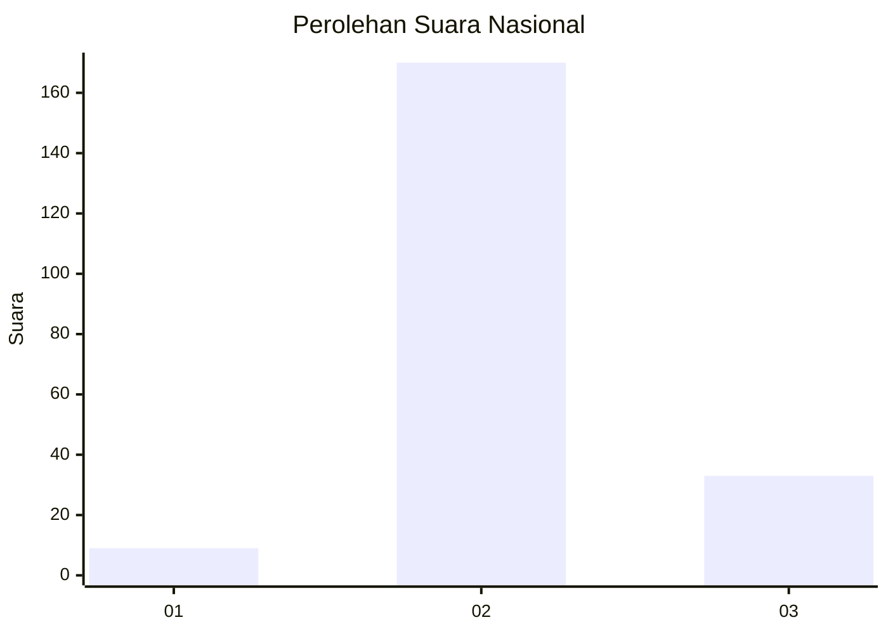
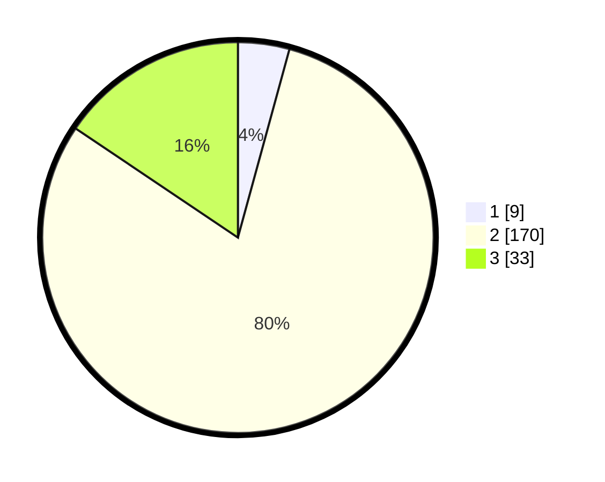

# Hasil

## Grafik

## Tabel

| No. | Nama Paslon    | Suara | Suara (raw) | Persentase |
|:--- |:-------------- | -----:| -----------:| ----------:|
| 1   | ANIES MUHAIMIN | 9     | [9][p-1]    | 4,25       |
| 2   | PRABOWO GIBRAN | 170   | [170][p-2]  | 80,19      |
| 3   | GANJAR MAHFUD  | 33    | [33][p-3]   | 15,57      |

[p-1]: https://github.com/gigit-pemilu/pemilu-2024/blob/main/pilpres/hitung-suara/sub/64-kalimantan-timur/sub/08-kutai-timur/sub/08-kombeng/sub/2001-makmur-jaya/sub/006-tps/sub/paslon-1.txt
[p-2]: https://github.com/gigit-pemilu/pemilu-2024/blob/main/pilpres/hitung-suara/sub/64-kalimantan-timur/sub/08-kutai-timur/sub/08-kombeng/sub/2001-makmur-jaya/sub/006-tps/sub/paslon-2.txt
[p-3]: https://github.com/gigit-pemilu/pemilu-2024/blob/main/pilpres/hitung-suara/sub/64-kalimantan-timur/sub/08-kutai-timur/sub/08-kombeng/sub/2001-makmur-jaya/sub/006-tps/sub/paslon-3.txt

## Foto C Plano

https://sirekap-obj-formc.kpu.go.id/0cf9/pemilu/ppwp/64/08/08/20/01/6408082001006-20240216-132950--4114644d-2559-4ab8-b56e-3e2472a8875d.jpg

https://sirekap-obj-formc.kpu.go.id/0cf9/pemilu/ppwp/64/08/08/20/01/6408082001006-20240216-133009--329cdf40-5293-4e18-a3e2-12c2ca7effdd.jpg

https://sirekap-obj-formc.kpu.go.id/0cf9/pemilu/ppwp/64/08/08/20/01/6408082001006-20240216-133026--e0f62c74-79f3-44d2-a750-84d65b43c57a.jpg

## Metadata

| Key        | Value               |
| ---------- | ------------------- |
| Time Stamp | 2024-02-25 13:00:00 |

