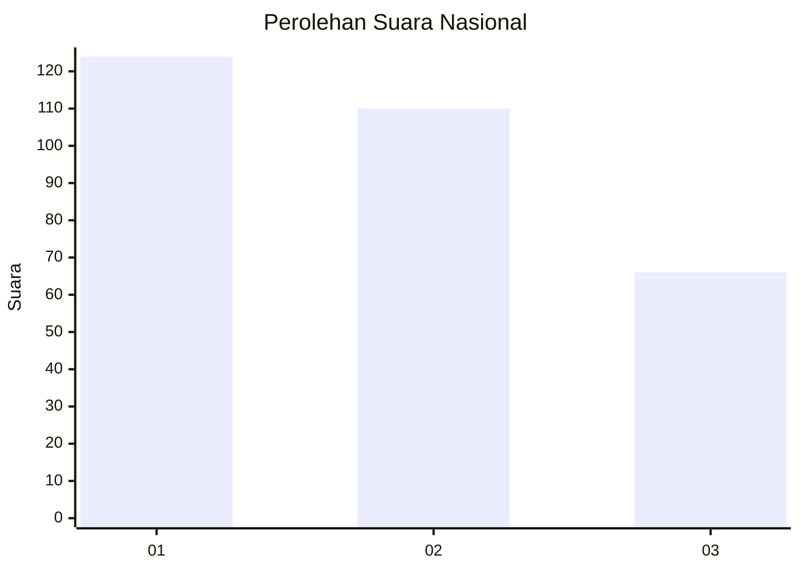
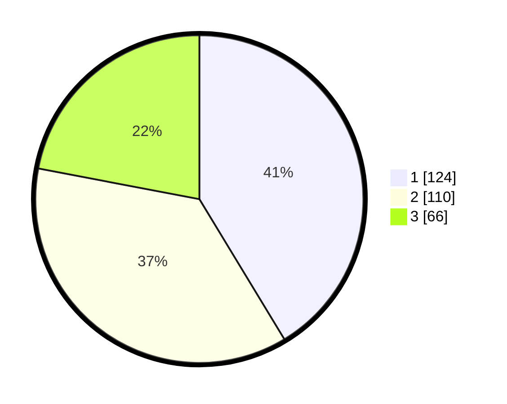

# Hasil

## Grafik

## Tabel

| No. | Nama Paslon    | Suara | Suara (raw) | Persentase |
|:--- |:-------------- | -----:| -----------:| ----------:|
| 1   | ANIES MUHAIMIN | 124   | [124][p-1]  | 41,33      |
| 2   | PRABOWO GIBRAN | 110   | [110][p-2]  | 36,67      |
| 3   | GANJAR MAHFUD  | 66    | [66][p-3]   | 22,00      |

[p-1]: https://github.com/gigit-pemilu/pemilu-2024/blob/main/pilpres/hitung-suara/sub/64-kalimantan-timur/sub/08-kutai-timur/sub/08-kombeng/sub/2003-sukamaju/sub/011-tps/sub/paslon-1.txt
[p-2]: https://github.com/gigit-pemilu/pemilu-2024/blob/main/pilpres/hitung-suara/sub/64-kalimantan-timur/sub/08-kutai-timur/sub/08-kombeng/sub/2003-sukamaju/sub/011-tps/sub/paslon-2.txt
[p-3]: https://github.com/gigit-pemilu/pemilu-2024/blob/main/pilpres/hitung-suara/sub/64-kalimantan-timur/sub/08-kutai-timur/sub/08-kombeng/sub/2003-sukamaju/sub/011-tps/sub/paslon-3.txt

## Foto C Plano

https://sirekap-obj-formc.kpu.go.id/23e2/pemilu/ppwp/64/08/08/20/03/6408082003011-20240214-204739--5021ff8e-800b-4c2d-8310-c578a5536ccb.jpg

https://sirekap-obj-formc.kpu.go.id/23e2/pemilu/ppwp/64/08/08/20/03/6408082003011-20240214-205200--30e4284a-4d37-494b-a87a-060bcaa665a6.jpg

https://sirekap-obj-formc.kpu.go.id/23e2/pemilu/ppwp/64/08/08/20/03/6408082003011-20240214-205437--37bd6e95-5462-4bf5-87b3-fa57a8de4d4f.jpg

## Metadata

| Key        | Value               |
| ---------- | ------------------- |
| Time Stamp | 2024-02-19 13:00:00 |

