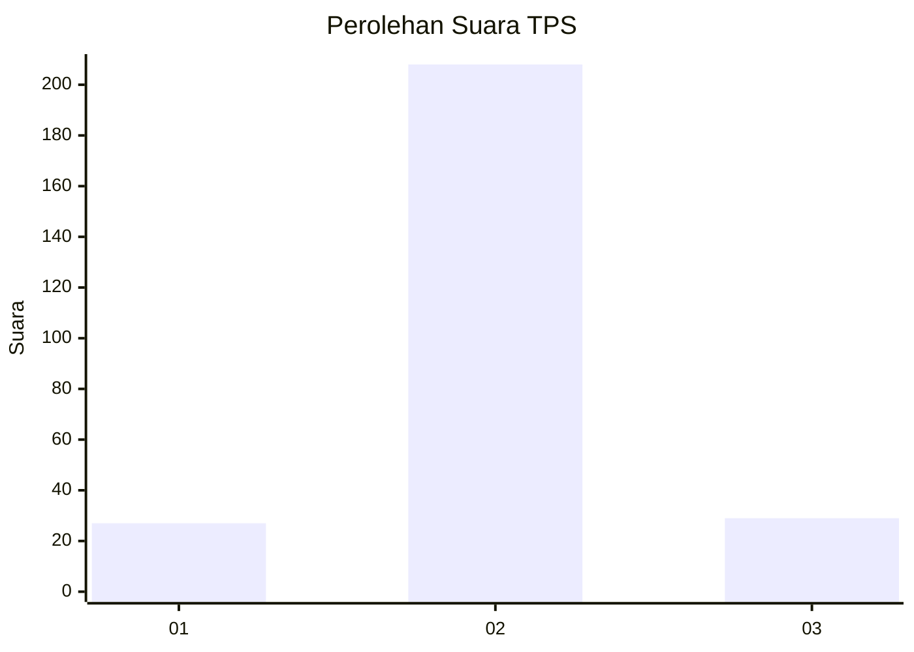
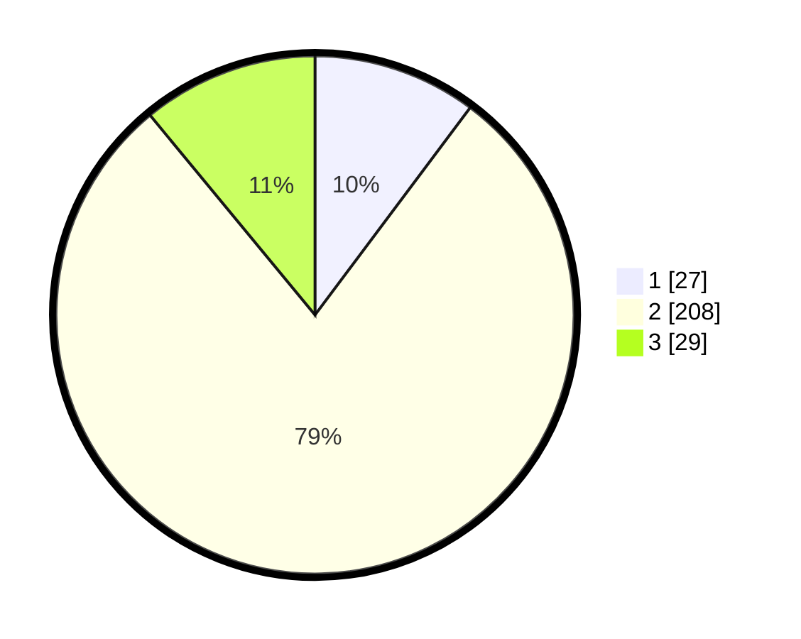

# Hasil

## Grafik

## Tabel

| No. | Nama Paslon    | Suara | Suara (raw) | Persentase |
|:--- |:-------------- | -----:| -----------:| ----------:|
| 1   | ANIES MUHAIMIN | 27    | [27][p-1]   | 10,23      |
| 2   | PRABOWO GIBRAN | 208   | [208][p-2]  | 78,79      |
| 3   | GANJAR MAHFUD  | 29    | [29][p-3]   | 10,98      |

[p-1]: https://github.com/gigit-pemilu/pemilu-2024-64-kalimantan-timur/blob/main/pilpres/hitung-suara/sub/64-kalimantan-timur/sub/08-kutai-timur/sub/09-bengalon/sub/2001-sepaso/sub/001-tps/sub/paslon-1.txt
[p-2]: https://github.com/gigit-pemilu/pemilu-2024-64-kalimantan-timur/blob/main/pilpres/hitung-suara/sub/64-kalimantan-timur/sub/08-kutai-timur/sub/09-bengalon/sub/2001-sepaso/sub/001-tps/sub/paslon-2.txt
[p-3]: https://github.com/gigit-pemilu/pemilu-2024-64-kalimantan-timur/blob/main/pilpres/hitung-suara/sub/64-kalimantan-timur/sub/08-kutai-timur/sub/09-bengalon/sub/2001-sepaso/sub/001-tps/sub/paslon-3.txt

## Foto C Plano

https://sirekap-obj-formc.kpu.go.id/ee63/pemilu/ppwp/64/08/09/20/01/6408092001001-20240214-221853--2bc9b77f-dcad-4dbe-bd08-28a4fc6fe801.jpg

https://sirekap-obj-formc.kpu.go.id/ee63/pemilu/ppwp/64/08/09/20/01/6408092001001-20240214-202622--d8790a85-8740-442b-ae98-d00f1674233d.jpg

https://sirekap-obj-formc.kpu.go.id/ee63/pemilu/ppwp/64/08/09/20/01/6408092001001-20240214-205742--0be54ffe-6efe-4580-ad31-b818151b75b2.jpg

## Metadata

| Key        | Value               |
| ---------- | ------------------- |
| Time Stamp | 2024-02-15 07:00:44 |

