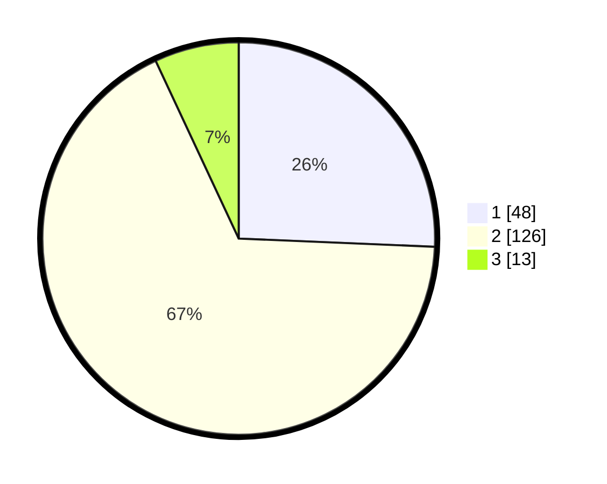

# Hasil

## Grafik

## Tabel

| No. | Nama Paslon    | Suara | Suara (raw) | Persentase |
|:--- |:-------------- | -----:| -----------:| ----------:|
| 1   | ANIES MUHAIMIN | 48    | [48][p-1]   | 25,67      |
| 2   | PRABOWO GIBRAN | 126   | [126][p-2]  | 67,38      |
| 3   | GANJAR MAHFUD  | 13    | [13][p-3]   | 6,95       |

[p-1]: https://github.com/gigit-pemilu/pemilu-2024-64-kalimantan-timur/blob/main/pilpres/hitung-suara/sub/64-kalimantan-timur/sub/08-kutai-timur/sub/09-bengalon/sub/2001-sepaso/sub/003-tps/sub/paslon-1.txt
[p-2]: https://github.com/gigit-pemilu/pemilu-2024-64-kalimantan-timur/blob/main/pilpres/hitung-suara/sub/64-kalimantan-timur/sub/08-kutai-timur/sub/09-bengalon/sub/2001-sepaso/sub/003-tps/sub/paslon-2.txt
[p-3]: https://github.com/gigit-pemilu/pemilu-2024-64-kalimantan-timur/blob/main/pilpres/hitung-suara/sub/64-kalimantan-timur/sub/08-kutai-timur/sub/09-bengalon/sub/2001-sepaso/sub/003-tps/sub/paslon-3.txt

## Foto C Plano

https://sirekap-obj-formc.kpu.go.id/fca0/pemilu/ppwp/64/08/09/20/01/6408092001003-20240215-040532--947d3ba5-0d7c-4d5a-b801-97a1fb0a62a2.jpg

https://sirekap-obj-formc.kpu.go.id/fca0/pemilu/ppwp/64/08/09/20/01/6408092001003-20240215-040622--f4337483-9834-4221-ac16-923e899f2d3c.jpg

https://sirekap-obj-formc.kpu.go.id/fca0/pemilu/ppwp/64/08/09/20/01/6408092001003-20240215-040703--77954b69-5902-4bba-87f0-09136ccf1e7e.jpg

## Metadata

| Key        | Value               |
| ---------- | ------------------- |
| Time Stamp | 2024-02-24 22:31:28 |

