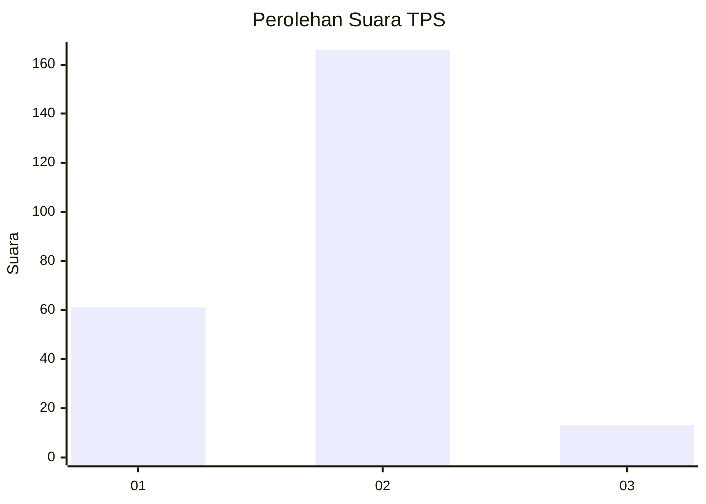
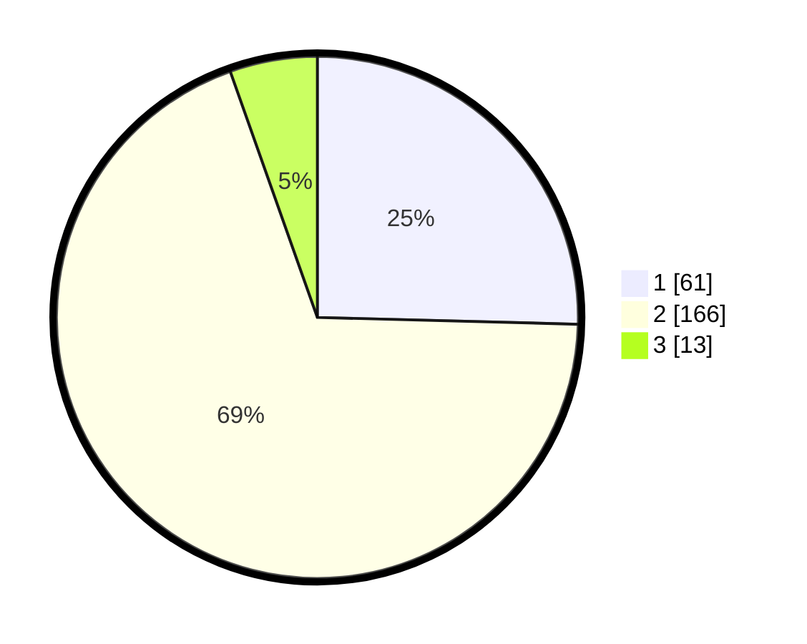

# Hasil

## Grafik

## Tabel

| No. | Nama Paslon    | Suara | Suara (raw) | Persentase |
|:--- |:-------------- | -----:| -----------:| ----------:|
| 1   | ANIES MUHAIMIN | 61    | [61][p-1]   | 25,42      |
| 2   | PRABOWO GIBRAN | 166   | [166][p-2]  | 69,17      |
| 3   | GANJAR MAHFUD  | 13    | [13][p-3]   | 5,42       |

[p-1]: https://github.com/gigit-pemilu/pemilu-2024-64-kalimantan-timur/blob/main/pilpres/hitung-suara/sub/64-kalimantan-timur/sub/08-kutai-timur/sub/09-bengalon/sub/2001-sepaso/sub/005-tps/sub/paslon-1.txt
[p-2]: https://github.com/gigit-pemilu/pemilu-2024-64-kalimantan-timur/blob/main/pilpres/hitung-suara/sub/64-kalimantan-timur/sub/08-kutai-timur/sub/09-bengalon/sub/2001-sepaso/sub/005-tps/sub/paslon-2.txt
[p-3]: https://github.com/gigit-pemilu/pemilu-2024-64-kalimantan-timur/blob/main/pilpres/hitung-suara/sub/64-kalimantan-timur/sub/08-kutai-timur/sub/09-bengalon/sub/2001-sepaso/sub/005-tps/sub/paslon-3.txt

## Foto C Plano

https://sirekap-obj-formc.kpu.go.id/fa6e/pemilu/ppwp/64/08/09/20/01/6408092001005-20240216-212403--98ca867c-84ad-432d-a491-4d629bca5db0.jpg

https://sirekap-obj-formc.kpu.go.id/fa6e/pemilu/ppwp/64/08/09/20/01/6408092001005-20240216-212143--6fd2d0b7-92e4-47bb-919c-ce7c99379b9d.jpg

https://sirekap-obj-formc.kpu.go.id/fa6e/pemilu/ppwp/64/08/09/20/01/6408092001005-20240216-211828--036cd12c-aad5-4342-9ef9-e371c67dcf6e.jpg

## Metadata

| Key        | Value               |
| ---------- | ------------------- |
| Time Stamp | 2024-02-24 22:31:28 |

