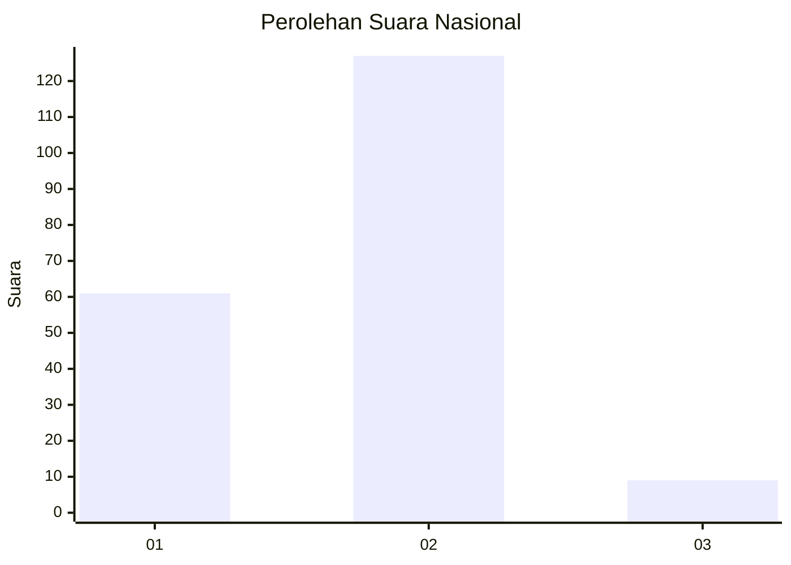
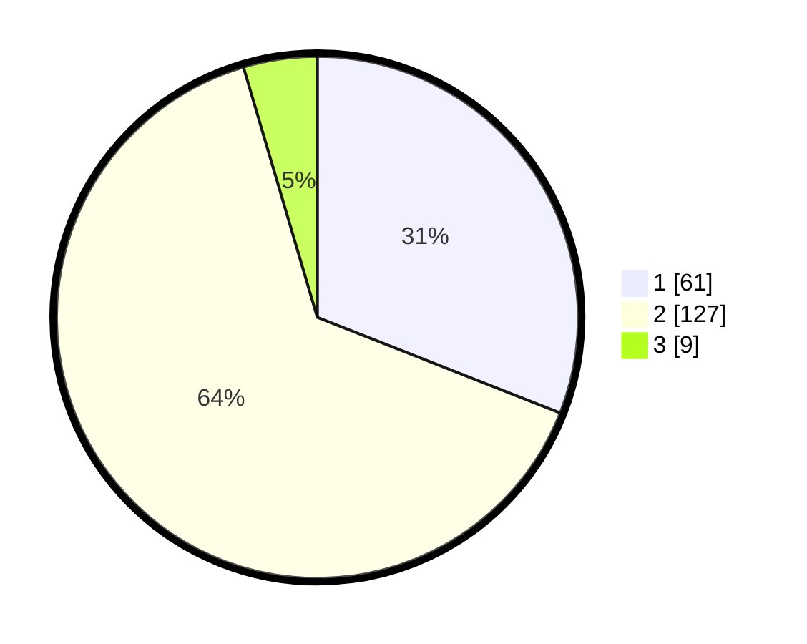

# Hasil

## Grafik

## Tabel

| No. | Nama Paslon    | Suara | Suara (raw) | Persentase |
|:--- |:-------------- | -----:| -----------:| ----------:|
| 1   | ANIES MUHAIMIN | 61    | [61][p-1]   | 30,96      |
| 2   | PRABOWO GIBRAN | 127   | [127][p-2]  | 64,47      |
| 3   | GANJAR MAHFUD  | 9     | [9][p-3]    | 4,57       |

[p-1]: https://github.com/gigit-pemilu/pemilu-2024/blob/main/pilpres/hitung-suara/sub/64-kalimantan-timur/sub/08-kutai-timur/sub/10-kaliorang/sub/2001-kaliorang/sub/002-tps/sub/paslon-1.txt
[p-2]: https://github.com/gigit-pemilu/pemilu-2024/blob/main/pilpres/hitung-suara/sub/64-kalimantan-timur/sub/08-kutai-timur/sub/10-kaliorang/sub/2001-kaliorang/sub/002-tps/sub/paslon-2.txt
[p-3]: https://github.com/gigit-pemilu/pemilu-2024/blob/main/pilpres/hitung-suara/sub/64-kalimantan-timur/sub/08-kutai-timur/sub/10-kaliorang/sub/2001-kaliorang/sub/002-tps/sub/paslon-3.txt

## Foto C Plano

https://sirekap-obj-formc.kpu.go.id/8217/pemilu/ppwp/64/08/10/20/01/6408102001002-20240214-160059--5a3d7ead-2bd8-4649-bd41-2f4bcd2b4be7.jpg

https://sirekap-obj-formc.kpu.go.id/8217/pemilu/ppwp/64/08/10/20/01/6408102001002-20240215-182303--0e57fa00-6aeb-47ed-9f9a-7182867ea0e3.jpg

https://sirekap-obj-formc.kpu.go.id/8217/pemilu/ppwp/64/08/10/20/01/6408102001002-20240215-173938--37dfe5e1-fb02-4ad9-8c23-342f6fa85a8b.jpg

## Metadata

| Key        | Value               |
| ---------- | ------------------- |
| Time Stamp | 2024-02-15 19:00:26 |

