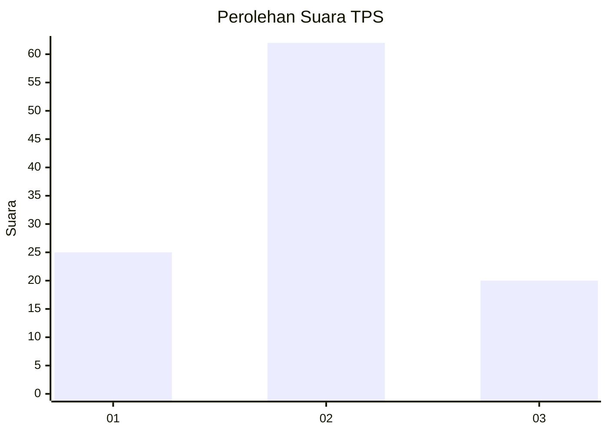
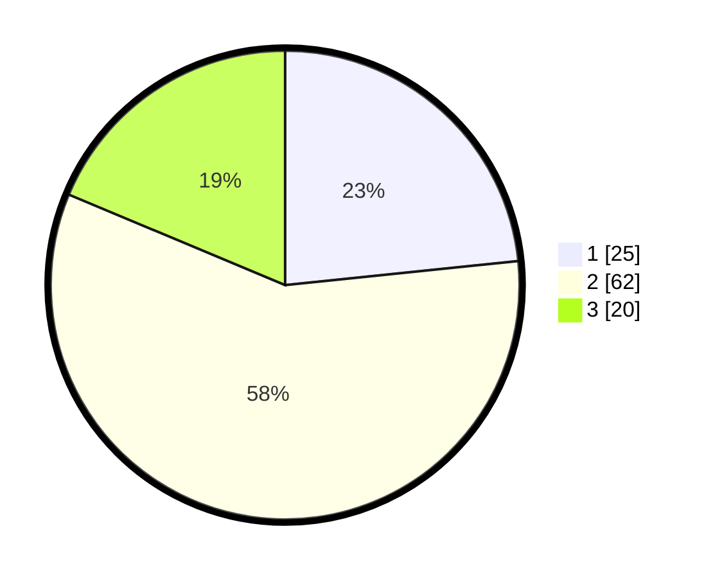

# Hasil

## Grafik

## Tabel

| No. | Nama Paslon    | Suara | Suara (raw) | Persentase |
|:--- |:-------------- | -----:| -----------:| ----------:|
| 1   | ANIES MUHAIMIN | 25    | [25][p-1]   | 23,36      |
| 2   | PRABOWO GIBRAN | 62    | [62][p-2]   | 57,94      |
| 3   | GANJAR MAHFUD  | 20    | [20][p-3]   | 18,69      |

[p-1]: https://github.com/gigit-pemilu/pemilu-2024-64-kalimantan-timur/blob/main/pilpres/hitung-suara/sub/64-kalimantan-timur/sub/08-kutai-timur/sub/10-kaliorang/sub/2001-kaliorang/sub/904-tps/sub/paslon-1.txt
[p-2]: https://github.com/gigit-pemilu/pemilu-2024-64-kalimantan-timur/blob/main/pilpres/hitung-suara/sub/64-kalimantan-timur/sub/08-kutai-timur/sub/10-kaliorang/sub/2001-kaliorang/sub/904-tps/sub/paslon-2.txt
[p-3]: https://github.com/gigit-pemilu/pemilu-2024-64-kalimantan-timur/blob/main/pilpres/hitung-suara/sub/64-kalimantan-timur/sub/08-kutai-timur/sub/10-kaliorang/sub/2001-kaliorang/sub/904-tps/sub/paslon-3.txt

## Foto C Plano

https://sirekap-obj-formc.kpu.go.id/882c/pemilu/ppwp/64/08/10/20/01/6408102001904-20240214-141235--5411f1b5-6d8f-4c6d-8a5c-e30e789e8d08.jpg

https://sirekap-obj-formc.kpu.go.id/882c/pemilu/ppwp/64/08/10/20/01/6408102001904-20240214-141143--f9339615-9322-469f-9557-3bca492a3b5b.jpg

https://sirekap-obj-formc.kpu.go.id/882c/pemilu/ppwp/64/08/10/20/01/6408102001904-20240214-141854--11001930-0407-43ce-b390-6a316c163269.jpg

## Metadata

| Key        | Value               |
| ---------- | ------------------- |
| Time Stamp | 2024-02-15 15:00:29 |

