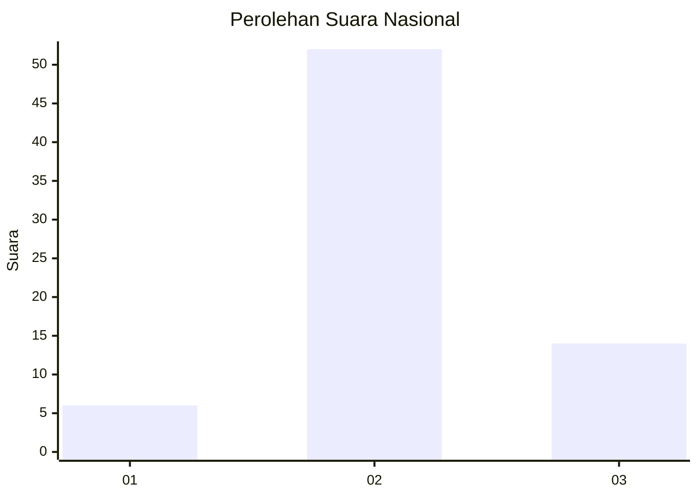
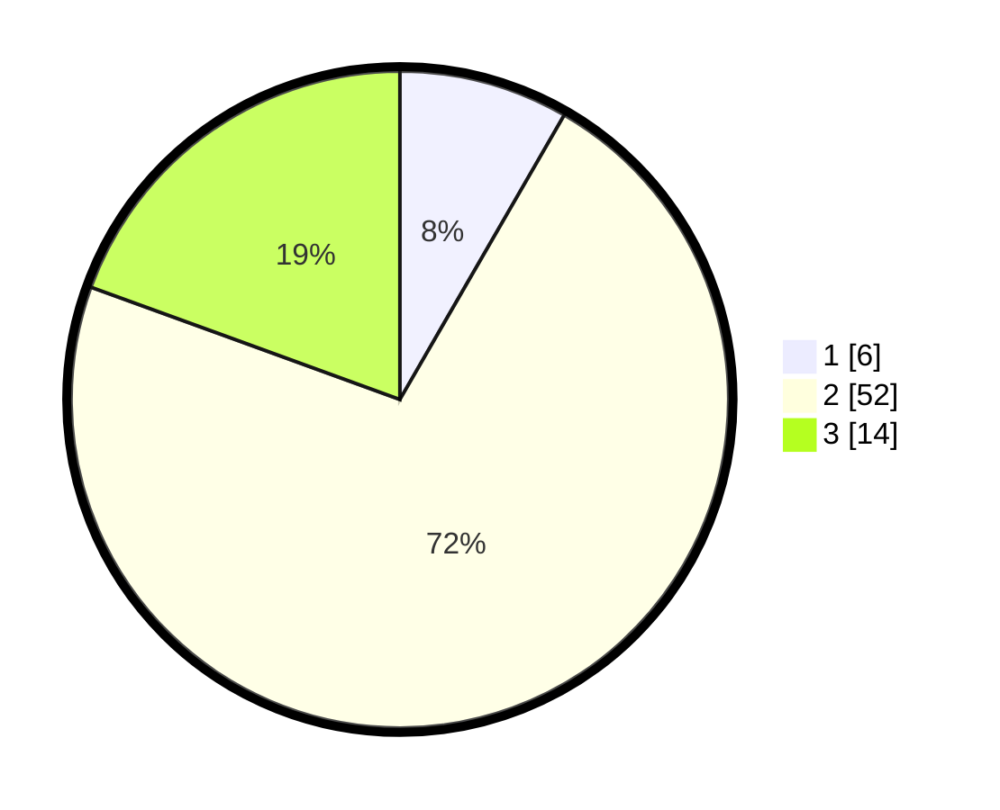

# Hasil

## Grafik

## Tabel

| No. | Nama Paslon    | Suara | Suara (raw) | Persentase |
|:--- |:-------------- | -----:| -----------:| ----------:|
| 1   | ANIES MUHAIMIN | 6     | [6][p-1]    | 8,33       |
| 2   | PRABOWO GIBRAN | 52    | [52][p-2]   | 72,22      |
| 3   | GANJAR MAHFUD  | 14    | [14][p-3]   | 19,44      |

[p-1]: https://github.com/gigit-pemilu/pemilu-2024/blob/main/pilpres/hitung-suara/sub/64-kalimantan-timur/sub/08-kutai-timur/sub/11-sandaran/sub/2004-marukangan/sub/006-tps/sub/paslon-1.txt
[p-2]: https://github.com/gigit-pemilu/pemilu-2024/blob/main/pilpres/hitung-suara/sub/64-kalimantan-timur/sub/08-kutai-timur/sub/11-sandaran/sub/2004-marukangan/sub/006-tps/sub/paslon-2.txt
[p-3]: https://github.com/gigit-pemilu/pemilu-2024/blob/main/pilpres/hitung-suara/sub/64-kalimantan-timur/sub/08-kutai-timur/sub/11-sandaran/sub/2004-marukangan/sub/006-tps/sub/paslon-3.txt

## Foto C Plano

https://sirekap-obj-formc.kpu.go.id/55f0/pemilu/ppwp/64/08/11/20/04/6408112004006-20240214-132702--7a0b5d79-4269-4fdd-a27f-9de4c55c7328.jpg

https://sirekap-obj-formc.kpu.go.id/55f0/pemilu/ppwp/64/08/11/20/04/6408112004006-20240214-132847--7987f90b-48a9-4f50-85c5-097b1706ef5c.jpg

https://sirekap-obj-formc.kpu.go.id/55f0/pemilu/ppwp/64/08/11/20/04/6408112004006-20240214-132909--14fb8631-8bd9-4511-a399-0c225e9e39bf.jpg

## Metadata

| Key        | Value               |
| ---------- | ------------------- |
| Time Stamp | 2024-02-25 12:00:00 |

