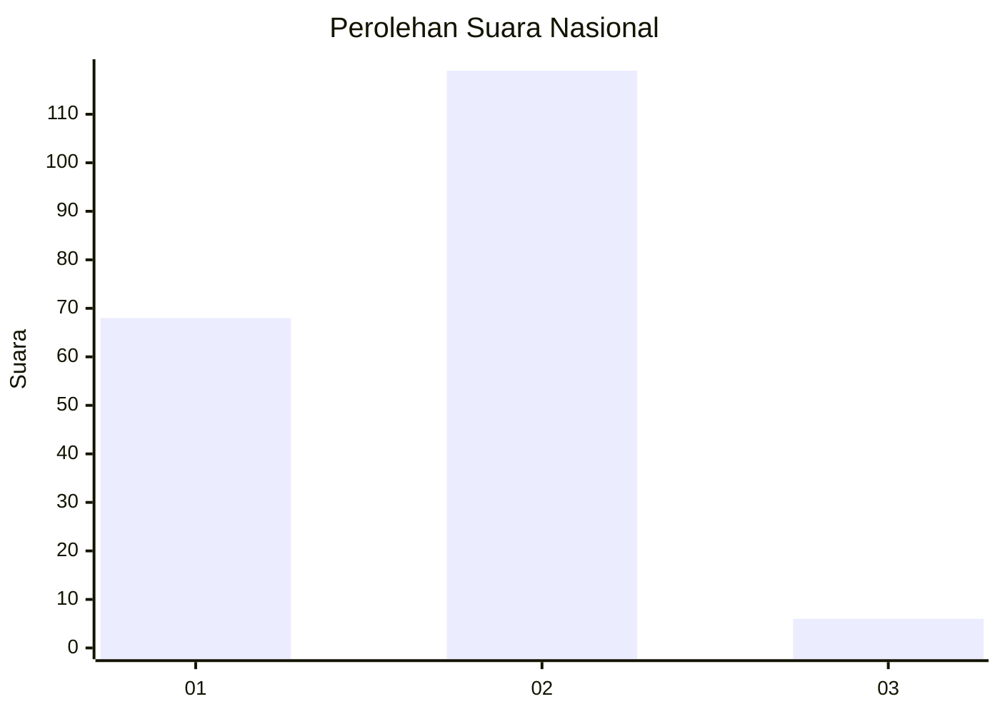
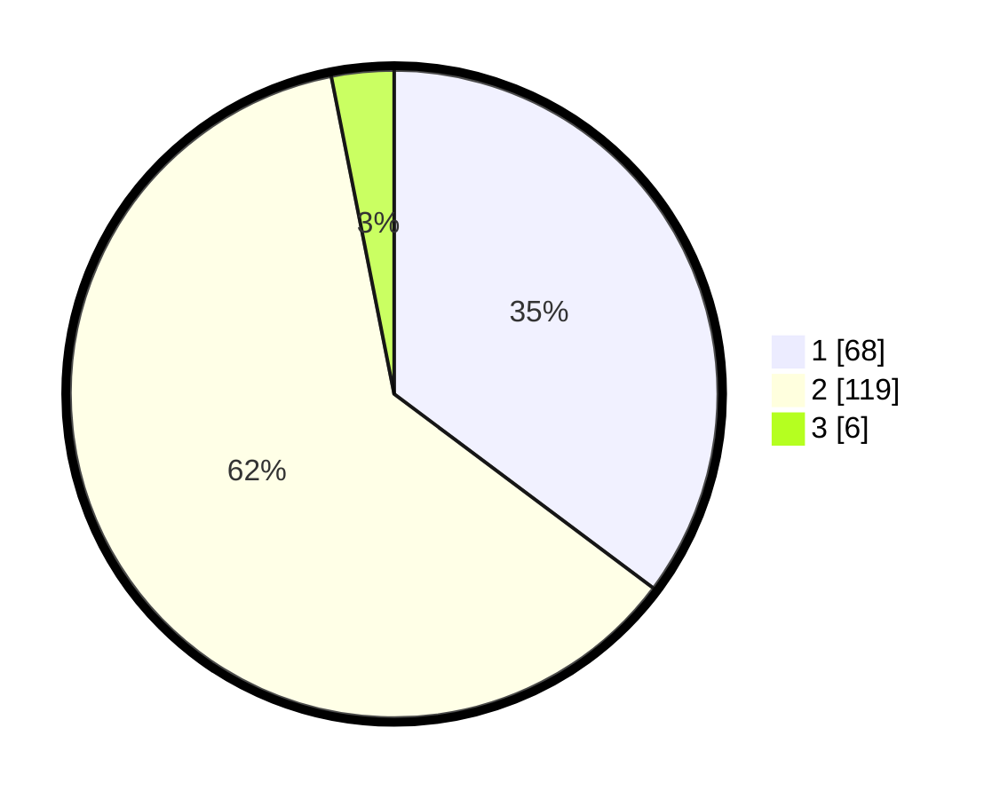

# Hasil

## Grafik

## Tabel

| No. | Nama Paslon    | Suara | Suara (raw) | Persentase |
|:--- |:-------------- | -----:| -----------:| ----------:|
| 1   | ANIES MUHAIMIN | 68    | [68][p-1]   | 35,23      |
| 2   | PRABOWO GIBRAN | 119   | [119][p-2]  | 61,66      |
| 3   | GANJAR MAHFUD  | 6     | [6][p-3]    | 3,11       |

[p-1]: https://github.com/gigit-pemilu/pemilu-2024/blob/main/pilpres/hitung-suara/sub/64-kalimantan-timur/sub/08-kutai-timur/sub/13-teluk-pandan/sub/2001-teluk-pandan/sub/002-tps/sub/paslon-1.txt
[p-2]: https://github.com/gigit-pemilu/pemilu-2024/blob/main/pilpres/hitung-suara/sub/64-kalimantan-timur/sub/08-kutai-timur/sub/13-teluk-pandan/sub/2001-teluk-pandan/sub/002-tps/sub/paslon-2.txt
[p-3]: https://github.com/gigit-pemilu/pemilu-2024/blob/main/pilpres/hitung-suara/sub/64-kalimantan-timur/sub/08-kutai-timur/sub/13-teluk-pandan/sub/2001-teluk-pandan/sub/002-tps/sub/paslon-3.txt

## Foto C Plano

https://sirekap-obj-formc.kpu.go.id/9824/pemilu/ppwp/64/08/13/20/01/6408132001002-20240215-022802--45a8cec9-3205-45ea-ab01-b9ed45574d7f.jpg

https://sirekap-obj-formc.kpu.go.id/9824/pemilu/ppwp/64/08/13/20/01/6408132001002-20240215-023002--1720a42d-b9c9-44db-af75-5585d881de4d.jpg

https://sirekap-obj-formc.kpu.go.id/9824/pemilu/ppwp/64/08/13/20/01/6408132001002-20240214-192158--1e63a4ac-724c-4353-908d-7ac06a2ec2cc.jpg

## Metadata

| Key        | Value               |
| ---------- | ------------------- |
| Time Stamp | 2024-02-15 15:00:29 |

