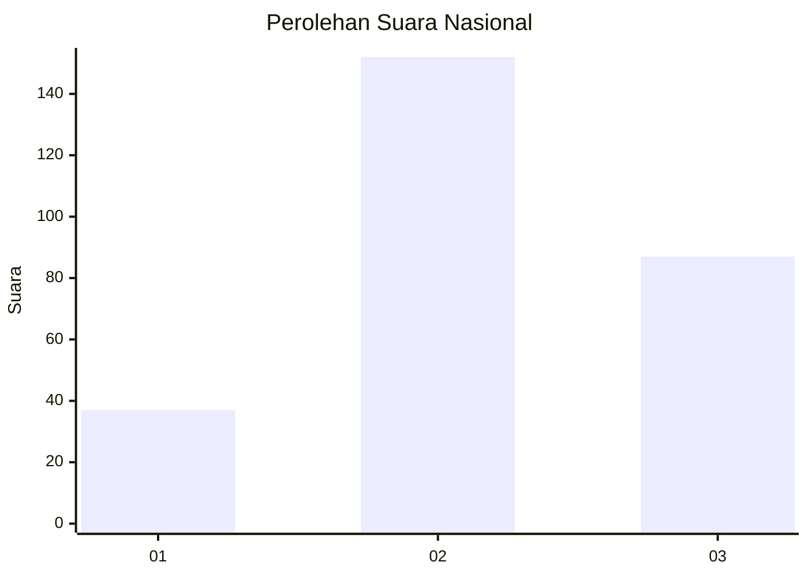
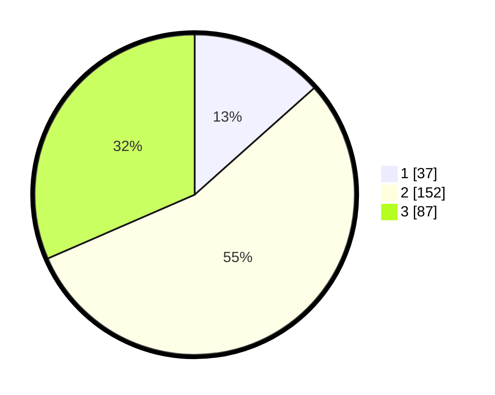

# Hasil

## Grafik

## Tabel

| No. | Nama Paslon    | Suara | Suara (raw) | Persentase |
|:--- |:-------------- | -----:| -----------:| ----------:|
| 1   | ANIES MUHAIMIN | 37    | [37][p-1]   | 13,41      |
| 2   | PRABOWO GIBRAN | 152   | [152][p-2]  | 55,07      |
| 3   | GANJAR MAHFUD  | 87    | [87][p-3]   | 31,52      |

[p-1]: https://github.com/gigit-pemilu/pemilu-2024/blob/main/pilpres/hitung-suara/sub/64-kalimantan-timur/sub/08-kutai-timur/sub/13-teluk-pandan/sub/2005-danau-redan/sub/002-tps/sub/paslon-1.txt
[p-2]: https://github.com/gigit-pemilu/pemilu-2024/blob/main/pilpres/hitung-suara/sub/64-kalimantan-timur/sub/08-kutai-timur/sub/13-teluk-pandan/sub/2005-danau-redan/sub/002-tps/sub/paslon-2.txt
[p-3]: https://github.com/gigit-pemilu/pemilu-2024/blob/main/pilpres/hitung-suara/sub/64-kalimantan-timur/sub/08-kutai-timur/sub/13-teluk-pandan/sub/2005-danau-redan/sub/002-tps/sub/paslon-3.txt

## Foto C Plano

https://sirekap-obj-formc.kpu.go.id/766b/pemilu/ppwp/64/08/13/20/05/6408132005002-20240215-072308--84448d77-d426-446c-9a4c-344ce584a978.jpg

https://sirekap-obj-formc.kpu.go.id/766b/pemilu/ppwp/64/08/13/20/05/6408132005002-20240215-072351--b8926ca4-2ed4-4107-9436-65273fa25082.jpg

https://sirekap-obj-formc.kpu.go.id/766b/pemilu/ppwp/64/08/13/20/05/6408132005002-20240215-072431--b558fe41-f6d8-4a3f-b612-d670e32399e4.jpg

## Metadata

| Key        | Value               |
| ---------- | ------------------- |
| Time Stamp | 2024-02-16 09:30:28 |

## DATA PEMILIH TETAP

Jumlah pemilih dalam DPT: **231**.
 * L: **120**.
 * P: **111**.

## DATA PENGGUNA HAK PILIH

Jumlah pengguna hak pilih dalam DPT: **182**.
 * L: **809**.
 * P: **290**.

Jumlah pengguna hak pilih dalam DPTb: **2**.
 * L: **828**.
 * P: **2**.

Jumlah pengguna hak pilih dalam DPK: **16**.
 * L: **8**.
 * P: **8**.

Jumlah pengguna hak pilih: **200**.
 * L: **100**.
 * P: **100**.

## JUMLAH SUARA SAH DAN TIDAK SAH

JUMLAH SELURUH SUARA SAH: **136**.

JUMLAH SUARA TIDAK SAH: **279**.

JUMLAH SELURUH SUARA SAH DAN SUARA TIDAK SAH: **555**.

