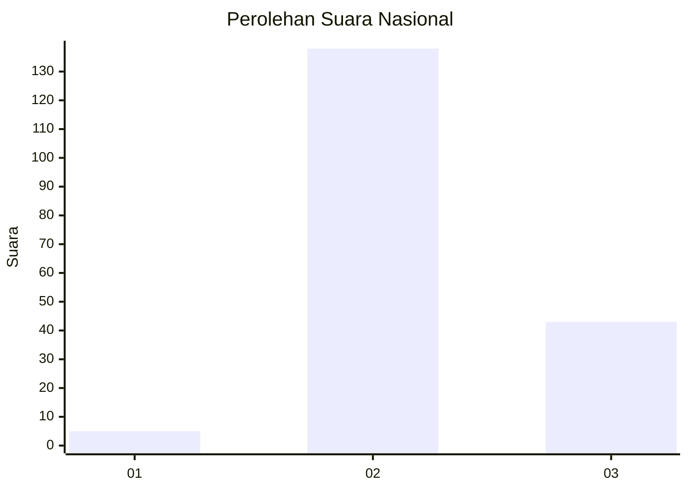
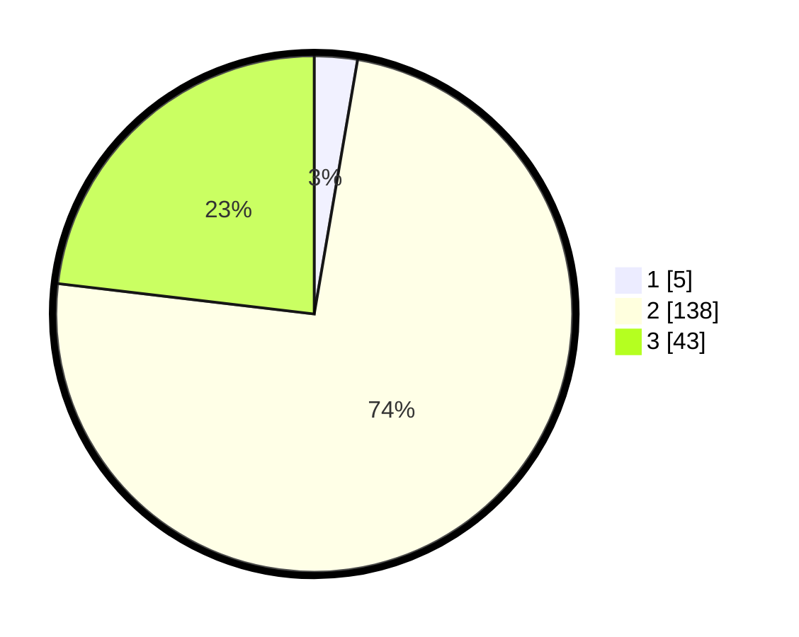

# Hasil

## Grafik

## Tabel

| No. | Nama Paslon    | Suara | Suara (raw) | Persentase |
|:--- |:-------------- | -----:| -----------:| ----------:|
| 1   | ANIES MUHAIMIN | 5     | [5][p-1]    | 2,69       |
| 2   | PRABOWO GIBRAN | 138   | [138][p-2]  | 74,19      |
| 3   | GANJAR MAHFUD  | 43    | [43][p-3]   | 23,12      |

[p-1]: https://github.com/gigit-pemilu/pemilu-2024/blob/main/pilpres/hitung-suara/sub/64-kalimantan-timur/sub/08-kutai-timur/sub/14-rantau-pulung/sub/2001-mukti-jaya/sub/004-tps/sub/paslon-1.txt
[p-2]: https://github.com/gigit-pemilu/pemilu-2024/blob/main/pilpres/hitung-suara/sub/64-kalimantan-timur/sub/08-kutai-timur/sub/14-rantau-pulung/sub/2001-mukti-jaya/sub/004-tps/sub/paslon-2.txt
[p-3]: https://github.com/gigit-pemilu/pemilu-2024/blob/main/pilpres/hitung-suara/sub/64-kalimantan-timur/sub/08-kutai-timur/sub/14-rantau-pulung/sub/2001-mukti-jaya/sub/004-tps/sub/paslon-3.txt

## Foto C Plano

https://sirekap-obj-formc.kpu.go.id/37ec/pemilu/ppwp/64/08/14/20/01/6408142001004-20240215-051607--77beadc8-2799-44be-bf50-3f5c7228166e.jpg

https://sirekap-obj-formc.kpu.go.id/37ec/pemilu/ppwp/64/08/14/20/01/6408142001004-20240215-041020--d73a17d7-93b3-4133-ae7f-d6bf27922003.jpg

https://sirekap-obj-formc.kpu.go.id/37ec/pemilu/ppwp/64/08/14/20/01/6408142001004-20240215-041216--bc2b8b37-24b4-449b-b732-3af5678655ca.jpg

## Metadata

| Key        | Value               |
| ---------- | ------------------- |
| Time Stamp | 2024-02-15 16:00:26 |

