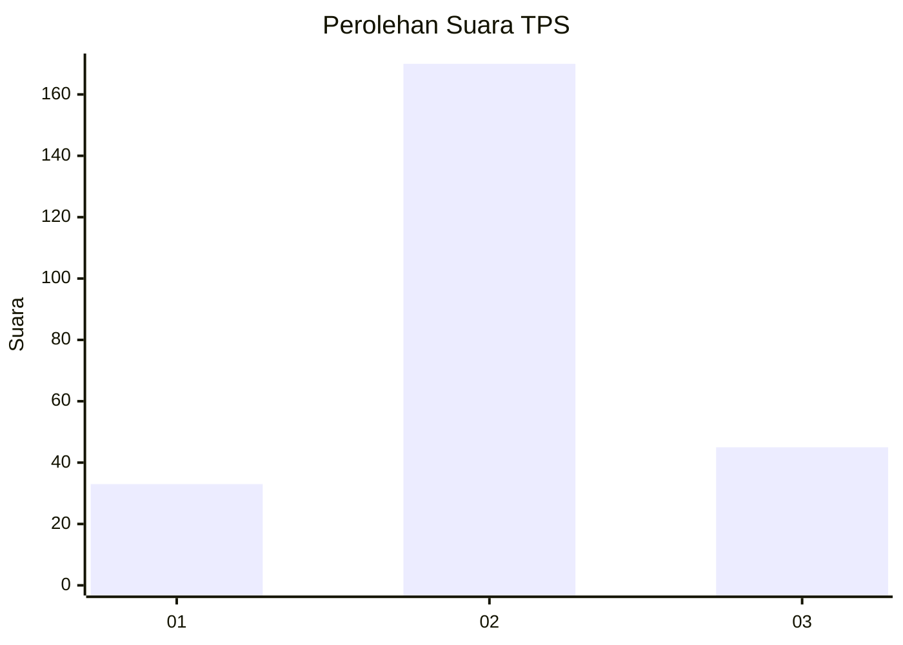
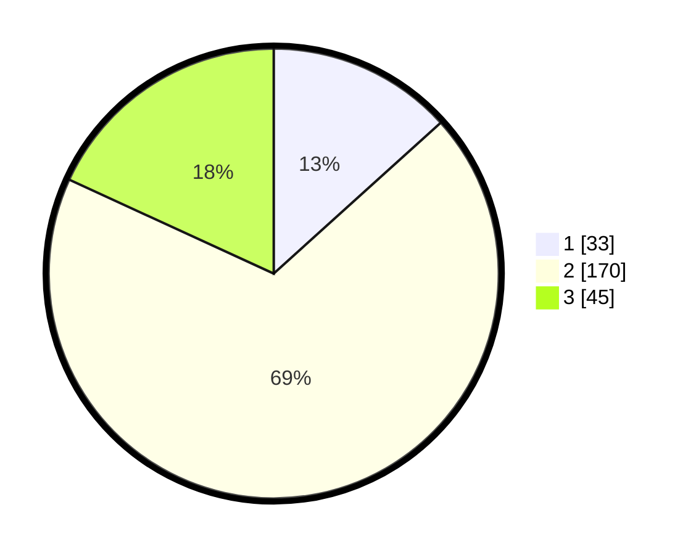

# Hasil

## Grafik

## Tabel

| No. | Nama Paslon    | Suara | Suara (raw) | Persentase |
|:--- |:-------------- | -----:| -----------:| ----------:|
| 1   | ANIES MUHAIMIN | 33    | [33][p-1]   | 13,31      |
| 2   | PRABOWO GIBRAN | 170   | [170][p-2]  | 68,55      |
| 3   | GANJAR MAHFUD  | 45    | [45][p-3]   | 18,15      |

[p-1]: https://github.com/gigit-pemilu/pemilu-2024-64-kalimantan-timur/blob/main/pilpres/hitung-suara/sub/64-kalimantan-timur/sub/08-kutai-timur/sub/15-kaubun/sub/2002-bumi-rapak/sub/002-tps/sub/paslon-1.txt
[p-2]: https://github.com/gigit-pemilu/pemilu-2024-64-kalimantan-timur/blob/main/pilpres/hitung-suara/sub/64-kalimantan-timur/sub/08-kutai-timur/sub/15-kaubun/sub/2002-bumi-rapak/sub/002-tps/sub/paslon-2.txt
[p-3]: https://github.com/gigit-pemilu/pemilu-2024-64-kalimantan-timur/blob/main/pilpres/hitung-suara/sub/64-kalimantan-timur/sub/08-kutai-timur/sub/15-kaubun/sub/2002-bumi-rapak/sub/002-tps/sub/paslon-3.txt

## Foto C Plano

https://sirekap-obj-formc.kpu.go.id/3f60/pemilu/ppwp/64/08/15/20/02/6408152002002-20240215-202418--8392e451-d182-4706-a2a8-8774e84b0ce4.jpg

https://sirekap-obj-formc.kpu.go.id/3f60/pemilu/ppwp/64/08/15/20/02/6408152002002-20240215-045334--84850eab-cc04-4bbc-b1e2-3e3d3f114b9e.jpg

https://sirekap-obj-formc.kpu.go.id/3f60/pemilu/ppwp/64/08/15/20/02/6408152002002-20240215-045429--7942add6-c80c-4bd0-9e91-1db278a7e1c8.jpg

## Metadata

| Key        | Value               |
| ---------- | ------------------- |
| Time Stamp | 2024-02-15 20:30:46 |

