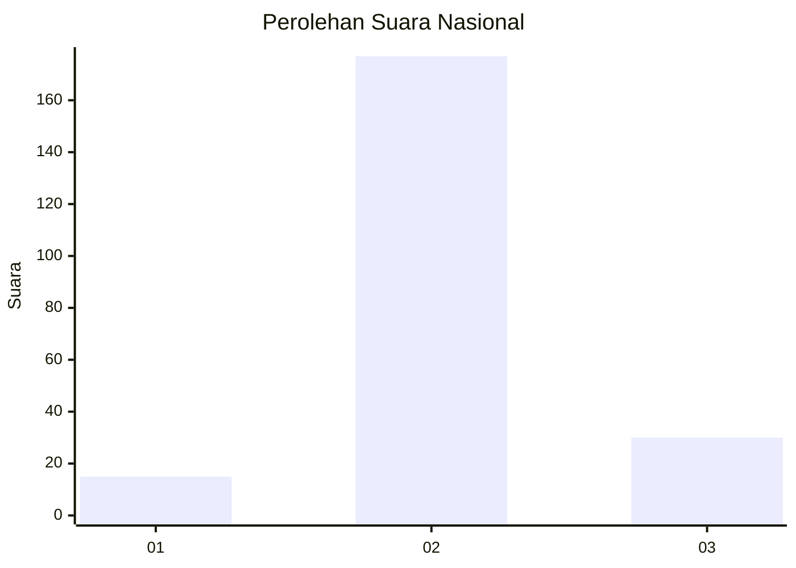
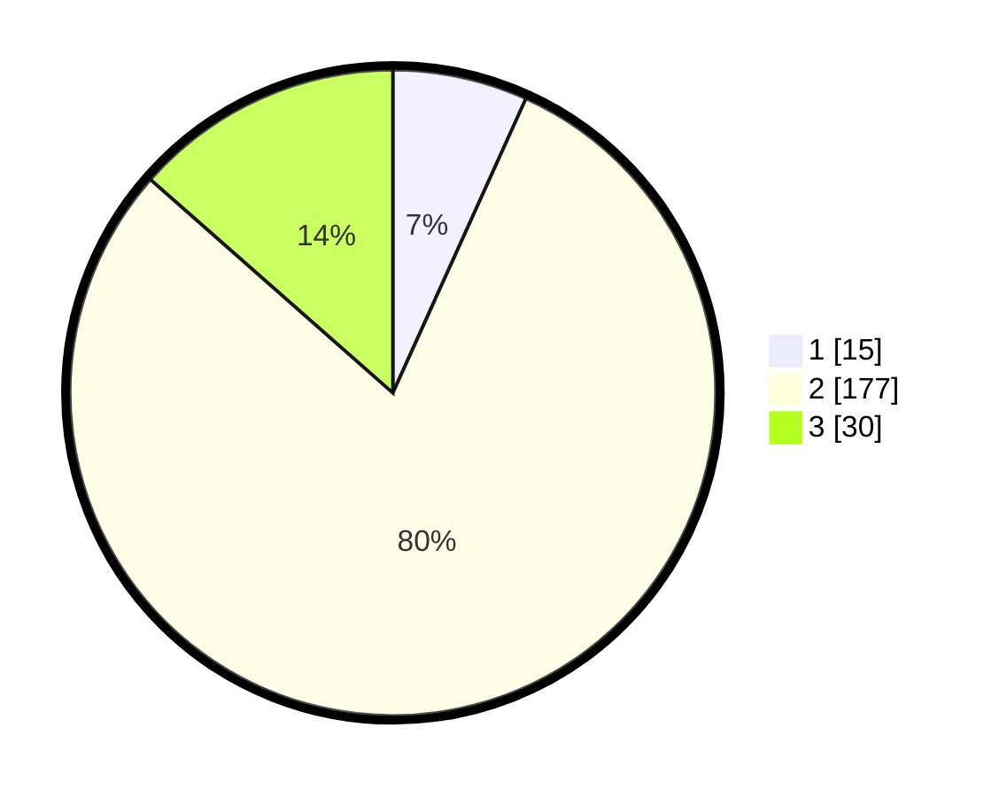

# Hasil

## Grafik

## Tabel

| No. | Nama Paslon    | Suara | Suara (raw) | Persentase |
|:--- |:-------------- | -----:| -----------:| ----------:|
| 1   | ANIES MUHAIMIN | 15    | [15][p-1]   | 6,76       |
| 2   | PRABOWO GIBRAN | 177   | [177][p-2]  | 79,73      |
| 3   | GANJAR MAHFUD  | 30    | [30][p-3]   | 13,51      |

[p-1]: https://github.com/gigit-pemilu/pemilu-2024/blob/main/pilpres/hitung-suara/sub/64-kalimantan-timur/sub/08-kutai-timur/sub/16-karangan/sub/2002-batu-lepoq/sub/003-tps/sub/paslon-1.txt
[p-2]: https://github.com/gigit-pemilu/pemilu-2024/blob/main/pilpres/hitung-suara/sub/64-kalimantan-timur/sub/08-kutai-timur/sub/16-karangan/sub/2002-batu-lepoq/sub/003-tps/sub/paslon-2.txt
[p-3]: https://github.com/gigit-pemilu/pemilu-2024/blob/main/pilpres/hitung-suara/sub/64-kalimantan-timur/sub/08-kutai-timur/sub/16-karangan/sub/2002-batu-lepoq/sub/003-tps/sub/paslon-3.txt

## Foto C Plano

https://sirekap-obj-formc.kpu.go.id/f6d4/pemilu/ppwp/64/08/16/20/02/6408162002003-20240215-080927--b7abf1f2-38a9-4639-96dd-f8f467293202.jpg

https://sirekap-obj-formc.kpu.go.id/f6d4/pemilu/ppwp/64/08/16/20/02/6408162002003-20240215-081047--10ea6205-730b-4a3d-8377-3f4f7008fb3a.jpg

https://sirekap-obj-formc.kpu.go.id/f6d4/pemilu/ppwp/64/08/16/20/02/6408162002003-20240215-081206--241dfbd4-e29f-4112-aaf4-f88f018f7caa.jpg

## Metadata

| Key        | Value               |
| ---------- | ------------------- |
| Time Stamp | 2024-02-15 15:00:29 |

