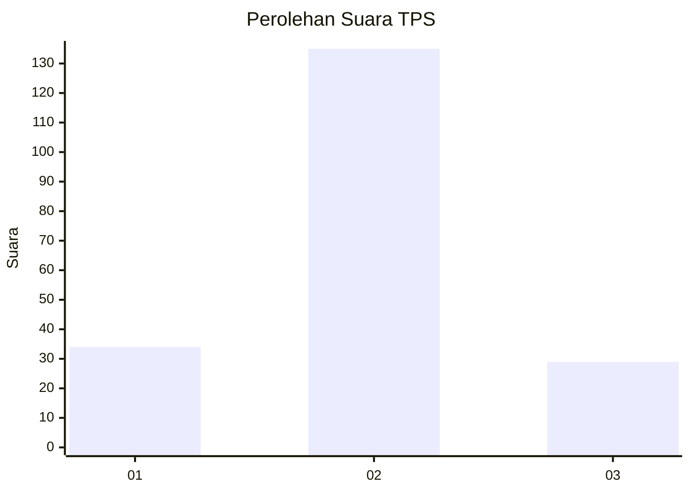
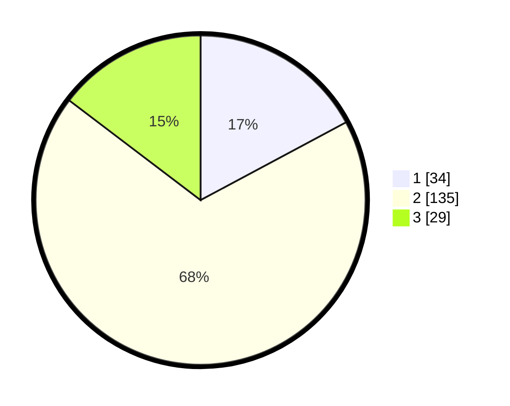

# Hasil

## Grafik

## Tabel

| No. | Nama Paslon    | Suara | Suara (raw) | Persentase |
|:--- |:-------------- | -----:| -----------:| ----------:|
| 1   | ANIES MUHAIMIN | 34    | [34][p-1]   | 17,17      |
| 2   | PRABOWO GIBRAN | 135   | [135][p-2]  | 68,18      |
| 3   | GANJAR MAHFUD  | 29    | [29][p-3]   | 14,65      |

[p-1]: https://github.com/gigit-pemilu/pemilu-2024-64-kalimantan-timur/blob/main/pilpres/hitung-suara/sub/64-kalimantan-timur/sub/08-kutai-timur/sub/16-karangan/sub/2003-pengadan/sub/004-tps/sub/paslon-1.txt
[p-2]: https://github.com/gigit-pemilu/pemilu-2024-64-kalimantan-timur/blob/main/pilpres/hitung-suara/sub/64-kalimantan-timur/sub/08-kutai-timur/sub/16-karangan/sub/2003-pengadan/sub/004-tps/sub/paslon-2.txt
[p-3]: https://github.com/gigit-pemilu/pemilu-2024-64-kalimantan-timur/blob/main/pilpres/hitung-suara/sub/64-kalimantan-timur/sub/08-kutai-timur/sub/16-karangan/sub/2003-pengadan/sub/004-tps/sub/paslon-3.txt

## Foto C Plano

https://sirekap-obj-formc.kpu.go.id/85ce/pemilu/ppwp/64/08/16/20/03/6408162003004-20240215-045101--a94f2bbc-7ff4-4a88-8541-95db8034da6a.jpg

https://sirekap-obj-formc.kpu.go.id/85ce/pemilu/ppwp/64/08/16/20/03/6408162003004-20240215-045146--35069f0e-9ffc-4bef-ba5c-ddd74eaefd1b.jpg

https://sirekap-obj-formc.kpu.go.id/85ce/pemilu/ppwp/64/08/16/20/03/6408162003004-20240215-045254--2855dc3e-b8c7-40c0-af99-35c91a38ba4d.jpg

## Metadata

| Key        | Value               |
| ---------- | ------------------- |
| Time Stamp | 2024-02-25 19:00:00 |

