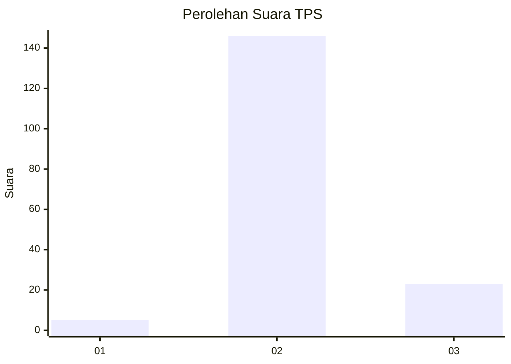
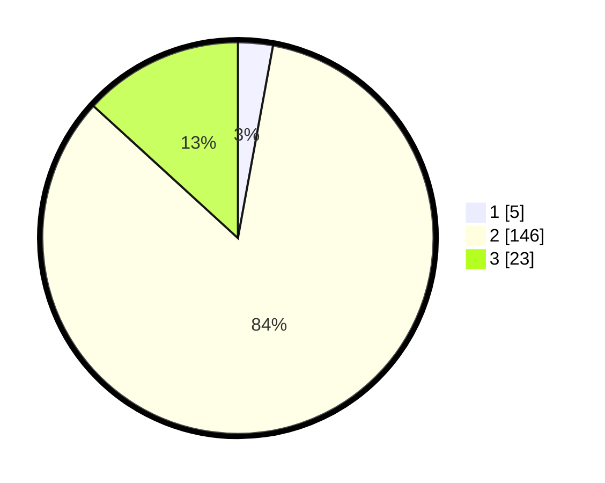

# Hasil

## Grafik

## Tabel

| No. | Nama Paslon    | Suara | Suara (raw) | Persentase |
|:--- |:-------------- | -----:| -----------:| ----------:|
| 1   | ANIES MUHAIMIN | 5     | [5][p-1]    | 2,87       |
| 2   | PRABOWO GIBRAN | 146   | [146][p-2]  | 83,91      |
| 3   | GANJAR MAHFUD  | 23    | [23][p-3]   | 13,22      |

[p-1]: https://github.com/gigit-pemilu/pemilu-2024-64-kalimantan-timur/blob/main/pilpres/hitung-suara/sub/64-kalimantan-timur/sub/08-kutai-timur/sub/18-long-mesangat/sub/2005-melan/sub/001-tps/sub/paslon-1.txt
[p-2]: https://github.com/gigit-pemilu/pemilu-2024-64-kalimantan-timur/blob/main/pilpres/hitung-suara/sub/64-kalimantan-timur/sub/08-kutai-timur/sub/18-long-mesangat/sub/2005-melan/sub/001-tps/sub/paslon-2.txt
[p-3]: https://github.com/gigit-pemilu/pemilu-2024-64-kalimantan-timur/blob/main/pilpres/hitung-suara/sub/64-kalimantan-timur/sub/08-kutai-timur/sub/18-long-mesangat/sub/2005-melan/sub/001-tps/sub/paslon-3.txt

## Foto C Plano

https://sirekap-obj-formc.kpu.go.id/f3b3/pemilu/ppwp/64/08/18/20/05/6408182005001-20240216-154041--31633cf0-b571-4bb0-898c-82f418878649.jpg

https://sirekap-obj-formc.kpu.go.id/f3b3/pemilu/ppwp/64/08/18/20/05/6408182005001-20240216-154435--0d83ea4f-6a36-4712-9eef-55a0ad04da94.jpg

https://sirekap-obj-formc.kpu.go.id/f3b3/pemilu/ppwp/64/08/18/20/05/6408182005001-20240216-154318--bc828428-4b60-4e22-baeb-d6ed1717ab08.jpg

## Metadata

| Key        | Value               |
| ---------- | ------------------- |
| Time Stamp | 2024-02-25 18:00:00 |

