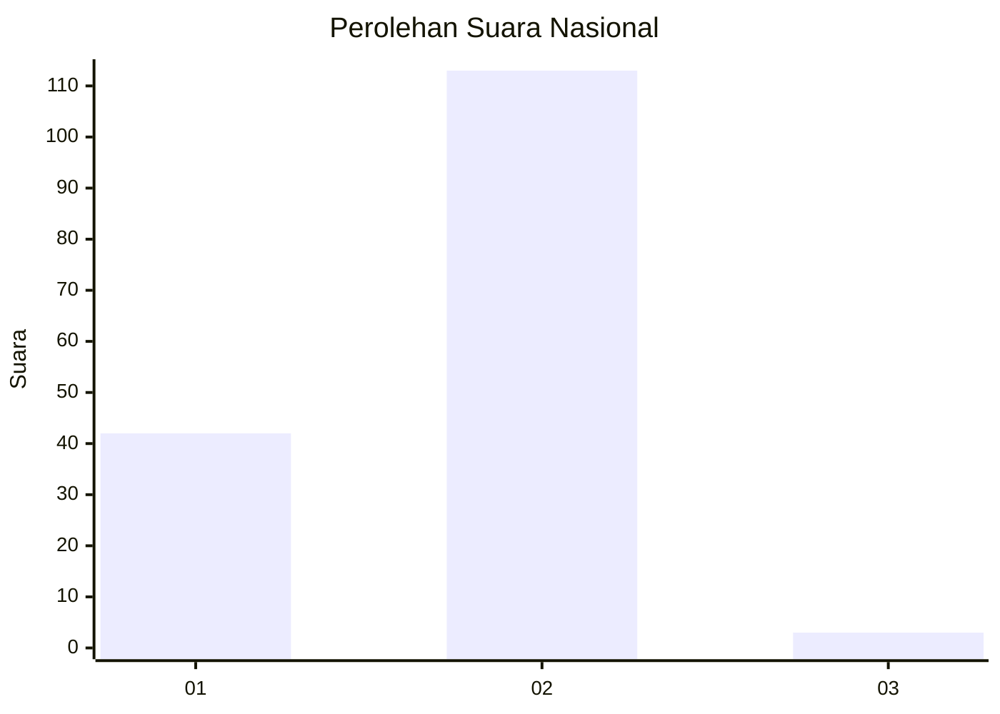
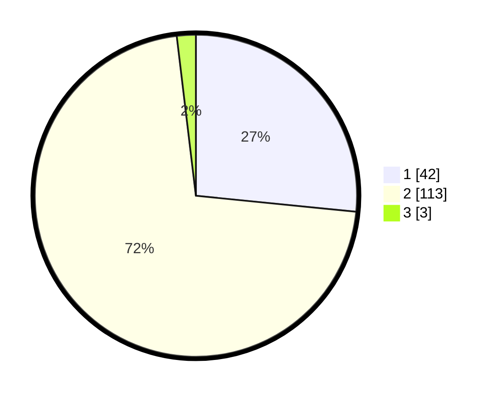

# Hasil

## Grafik

## Tabel

| No. | Nama Paslon    | Suara | Suara (raw) | Persentase |
|:--- |:-------------- | -----:| -----------:| ----------:|
| 1   | ANIES MUHAIMIN | 42    | [42][p-1]   | 26,58      |
| 2   | PRABOWO GIBRAN | 113   | [113][p-2]  | 71,52      |
| 3   | GANJAR MAHFUD  | 3     | [3][p-3]    | 1,90       |

[p-1]: https://github.com/gigit-pemilu/pemilu-2024/blob/main/pilpres/hitung-suara/sub/64-kalimantan-timur/sub/09-penajam-paser-utara/sub/01-penajam/sub/1001-tanjung-tengah/sub/001-tps/sub/paslon-1.txt
[p-2]: https://github.com/gigit-pemilu/pemilu-2024/blob/main/pilpres/hitung-suara/sub/64-kalimantan-timur/sub/09-penajam-paser-utara/sub/01-penajam/sub/1001-tanjung-tengah/sub/001-tps/sub/paslon-2.txt
[p-3]: https://github.com/gigit-pemilu/pemilu-2024/blob/main/pilpres/hitung-suara/sub/64-kalimantan-timur/sub/09-penajam-paser-utara/sub/01-penajam/sub/1001-tanjung-tengah/sub/001-tps/sub/paslon-3.txt

## Foto C Plano

https://sirekap-obj-formc.kpu.go.id/10a2/pemilu/ppwp/64/09/01/10/01/6409011001001-20240218-100155--8e5944c3-9072-468d-a310-53b9c43bc99b.jpg

https://sirekap-obj-formc.kpu.go.id/10a2/pemilu/ppwp/64/09/01/10/01/6409011001001-20240218-100446--4d8a7451-a943-4d43-927d-99e7b2a81402.jpg

https://sirekap-obj-formc.kpu.go.id/10a2/pemilu/ppwp/64/09/01/10/01/6409011001001-20240218-100527--061dbbeb-1284-46a5-82db-5482f3be8997.jpg

## Metadata

| Key        | Value               |
| ---------- | ------------------- |
| Time Stamp | 2024-02-25 15:00:00 |

